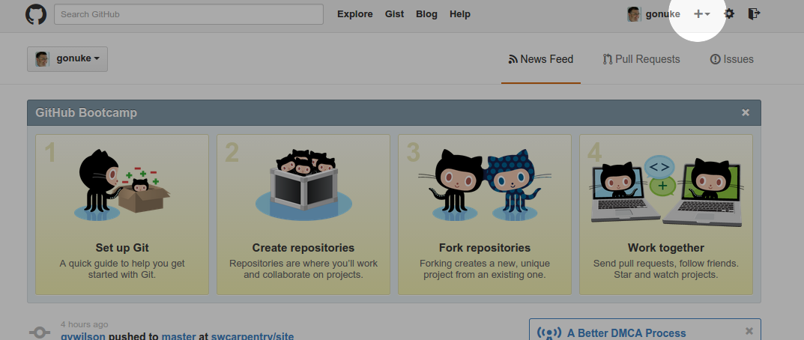

Setup a new code repository based on Cycstub
==============================================

In this lesson, we will:

1. Clone the Cycstub repository to your local machine
2. Rename the templates in your Cycstub repository
3. Create a new respository on Github
4. Connect this repository with your new Github repository
5. Push the Cycstub repository to your new Github repository

Clone the Cycstub repository to your local machine
---------------------------------------------------

First, you need to get the ``cycstub`` code.  Cycstub is a skeleton code base
that you can use to quick-start new |cyclus| module development projects.  We
will grab cycstub by using git to `clone the repository
<https://github.com/cyclus/cycstub.git>`_.  Let's put this code in a
``TutorialStorage`` directory and go into it.

.. code-block:: bash

    $ git clone https://github.com/cyclus/cycstub.git TutorialStorage
    $ cd TutorialStorage

Rename the templates in the Cycstub clone
------------------------------------------

Since cycstub is a template project everything is named ``stub``. We need to
change this to reflect the name we want our new project to be called -
``tutorial_storage`` here.  Cycstub comes with a renaming tool to do just
this!  From the command line, run Python in the following way:

.. code-block:: bash

    $ python rename.py tutorial_storage

We will now commit the changes to this local repository.  The first step is to
stop tracking the original stub files:

.. code-block:: bash

    $ git rm src/stub_*

We will then add the files that were modified::

    $ git add CMakeLists.txt input/example.xml src/CMakeLists.txt src/tutorial_storage_*

Finally, we can commit these changes:

.. code-block:: bash

    $ git commit -m "Changed cycstub files from stub to tutorial_storage"

Create a New Repository on Github
----------------------------------

Log in to your Github account and start a new repository by clicking on the
'+' symbol next to your account name.

Enter the name for your repository, "TutorialStorage", and click the "Create
repository" button.

Connect this repository with your new Github repository
--------------------------------------------------------

The clone of ``cycstub`` that you just made is connected to the original
`cycstub repository <https://github.com/cyclus/cycstub.git>`_.  You can see
this using the ``git remote`` command:

.. code-block:: bash

    $ git remote -v
    origin	https://github.com/cyclus/cycstub.git (fetch)
    origin	https://github.com/cyclus/cycstub.git (push)

We would like to sever this connection since and instead connect this local
repository to our new Github repository:

.. code-block:: bash

    $ git remote set-url origin https://github.com/<your_github_username>/TutorialStorage.git
    $ git remote -v
    origin	https://github.com/<your_github_username>/TutorialStorage.git (fetch)
    origin	https://github.com/<your_github_username>/TutorialStorage.git (push)

Push the Cycstub repository to your new Github repository
-----------------------------------------------------------

You are now ready to push this renamed clone of ``cycstub`` to your new
repository and begin development.  Since the primary branch of this repository
is the ``develop`` branch, you will need to connect this branch 

.. code-block:: bash

    $ git push origin

