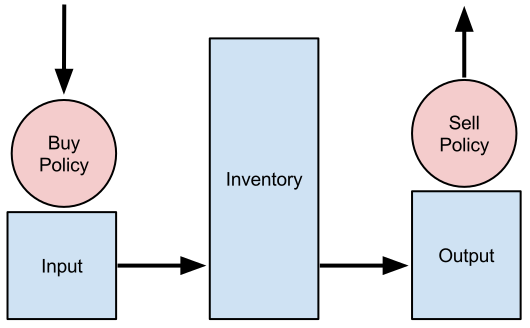

Adding Buffers and Policies from the Toolkit
=================================================

Cyclus has a growing Toolkit of standard patterns that can be used by
archetype developers.  There are many advantages to using the Toolkit patterns
vs developing similar functionality yourself, typical of most code reuse
situations:

* robustness - Toolkit patterns have been subjected to the Cyclus QA process
* time savings - it will take less time to learn how to use a Toolkit than it takes to develop your own
* improvements - You can benefit immediately from any improvements in the performance of the Toolkit pattern

Code reuse is a critical best practice in all software development.

One of the Toolkit patterns is a ``ResBuf``, providing a way to track an
inventory of ``Resoure`` objects. There are also ``MatlBuyPolicy`` and
``MatlSellPolicy`` for managing the trading of ``Material`` objects.

In this lesson, we will:

1. Add ResBufs to use as material inventories
2. Add Policies to manage the trading of material
3. Add inventory management logic
4. Change our log information to show the info about the inventories

Adding State Variables
------------------------

All state variable additions should be included in ``src/storage.h`` below the
other state variables added previously.

A ``ResBuf`` is available as a data type for another state variable, so we simply have to add the following:

.. code-block:: c++

    /// this facility holds material in storage.
    #pragma cyclus var {}
    cyclus::toolkit::ResBuf<cyclus::Material> inventory;

This creates a state variable named ``inventory`` that is based on the
``cyclus::toolkit::ResBuf`` class.  A ResBuf object has special
handling by the preprocessor, so it will not appear in the schema and
therefore will not appear in the Cycic UI either.

Next, add two additional buffers

.. code-block:: c++

    /// an buffer for incoming material
    #pragma cyclus var {}
    cyclus::toolkit::ResBuf<cyclus::Material> input;

    /// an buffer for outgoing material
    #pragma cyclus var {}
    cyclus::toolkit::ResBuf<cyclus::Material> output;

After, add the policies. Policies do not require any special handling, and
thus do not need a pragma

.. code-block:: c++

    /// a policy for requesting material
    cyclus::toolkit::MatlBuyPolicy buy_policy;

    /// a policy for sending material
    cyclus::toolkit::MatlSellPolicy sell_policy;

There needs to be a mechansim for keeping track of when materials enter the
inventory. An appropriate data structure is a `queue
<http://www.cplusplus.com/reference/queue/queue/>`_. Accordingly, add one

.. code-block:: c++

    /// queue for material entry times
    std::queue<int> time_q;

This requires another header file, so at the top of file, after ``#include
<string>``, add another include

.. code-block:: c++

    #include <queue>

Finally, check that everything works by installing and testing

.. code-block:: bash

    $ ./install.py
    $ Storage_unit_tests

Adding Implementation Logic
-----------------------------

The goal of a storage facility is to ask for material up to some limit, store it
for some amount of time, and then send it on to any interested parties. This can
be implemented in Cyclus by utilizing the Toolkit objects stated above. A
concept of material flow through the facility is shown below.

    **Figure:** Storage Material Flow

Connecting Buffers and Policies
++++++++++++++++++++++++++++++++

In order to utilize policies, they must be connected to their respective
buffers. The storage facility would like them always connected; accordingly,
that operation should happen whenever the facility enters a simulation. The
kernel will let agents know that they are entering a simulation via the
``EnterNotify()`` function.

Add the following to ``src/storage.h`` before the ``Tick()`` function

.. code-block:: c++

    /// set up policies and buffers
    virtual void EnterNotify();

And add the following to ``src/storage.cc`` before the ``Tick()`` function

.. code-block:: c++

    void Storage::EnterNotify() {
      cyclus::Facility::EnterNotify(); // call base function first
      buy_policy.Init(this, &input, std::string("input")).Set(incommod).Start();
      sell_policy.Init(this, &output, std::string("output")).Set(outcommod).Start(); 
    }

Buffer Transfer Logic
++++++++++++++++++++++++++++++++

The buy and sell policies will automatically fill and empty the input and output
buffers, respectively. The job of the ``Storage`` archetype developer is to
determine and implement the logic related to transfering material between these
buffers and the middle inventory buffer. Two rules govern buffer transfer logic
in this model:

1. All material in the input buffer is transfered to the inventory buffer
2. Material in the inventory buffer that has been stored for long enough is
   transferred to the output buffer

Because the input buffer transfer should occur *after* the DRE, it must happen
in the ``Tock()`` method. Similarly, because the output buffer transfer should
occur *before* the DRE, it must happen in the ``Tick()`` method. For each
transfer, care must be taken to update the ``time_q`` queue appropriately.

The input buffer transfer requires the following operation for every object in
the buffer:

1. *Pop* the object from the input buffer
2. *Push* the object to the inventory buffer
3. *Push* the current time to the ``time_q``

In order to implement this, replace the current ``Tock()`` implementation in
``src/storage.cc`` with

.. code-block:: c++

    void Storage::Tock() {
      int t = context()->time();
      while (!input.empty()) {
        inventory.Push(input.Pop());
        time_q.push(t);
      }
    }

The output buffer transfer requires the following operation until the first
condition is not met:

1. Check if enough time has passed since the time at the front of ``time_q``
   *and* the inventory is not empty. If so
2. *Pop* an object from the inventory buffer
3. *Push* that object to the output buffer
4. *Pop* an time from the  ``time_q``

In order to implement this, replace the current ``Tick()`` implementation in
``src/storage.cc`` with

.. code-block:: c++

    void Storage::Tick() {
      int finished_storing = context()->time() - storage_time;
      while (!inventory.empty() && time_q.front() <= finished_storing) {
        output.Push(inventory.Pop());
   	time_q.pop();
      }     
    }

Add Some Logging
---------------------------------------------

Now that all of the required logic is there, it would be nice to know some
information about what is happening to a facility during a simulation. This is
accomplished in Cyclus through :ref:`logging`, which is implemented as a stream
operation.

Information about the current inventory can be added by updating the ``Tock()``
function (after any pushing/popping) with

.. code-block:: c++

    LOG(cyclus::LEV_INFO1, "tutorial_storage") << "The current inventory is " << inventory.quantity() + output.quantity()
                                               << " kg of material.";

After updating the function should look something like 

.. code-block:: c++

    void Storage::Tock() {
      int t = context()->time();
      while (!input.empty()) {
        inventory.Push(input.Pop());
        time_q.push(t);
      }

      LOG(cyclus::LEV_INFO1, "storage") << "The total inventory at time " 
                                        << t << " is " 
                                        << inventory.quantity() + output.quantity()
                                        << " kg.";
    }

Notice that this uses the built in ``quantity()`` method of a ResBuf
object and that both the ``inventory`` and ``output`` buffers are queried. While
the implementation logic requires multiple buffers, the model assumes the
facility acts as a single cohesive unit.

Let's build, install and test this:

.. code-block:: bash

    $ python install.py --prefix=../install
    $ cyclus -v 2 input/example.xml
              :                                                               
          .CL:CC CC             _Q     _Q  _Q_Q    _Q    _Q              _Q   
        CC;CCCCCCCC:C;         /_\)   /_\)/_/\\)  /_\)  /_\)            /_\)  
        CCCCCCCCCCCCCl       __O|/O___O|/O_OO|/O__O|/O__O|/O____________O|/O__
     CCCCCCf     iCCCLCC     /////////////////////////////////////////////////
     iCCCt  ;;;;;.  CCCC                                                      
    CCCC  ;;;;;;;;;. CClL.                          c                         
   CCCC ,;;       ;;: CCCC  ;                   : CCCCi                       
    CCC ;;         ;;  CC   ;;:                CCC`   `C;                     
  lCCC ;;              CCCC  ;;;:             :CC .;;. C;   ;    :   ;  :;;   
  CCCC ;.              CCCC    ;;;,           CC ;    ; Ci  ;    :   ;  :  ;  
   iCC :;               CC       ;;;,        ;C ;       CC  ;    :   ; .      
  CCCi ;;               CCC        ;;;.      .C ;       tf  ;    :   ;  ;.    
  CCC  ;;               CCC          ;;;;;;; fC :       lC  ;    :   ;    ;:  
   iCf ;;               CC         :;;:      tC ;       CC  ;    :   ;     ;  
  fCCC :;              LCCf      ;;;:         LC :.  ,: C   ;    ;   ; ;   ;  
  CCCC  ;;             CCCC    ;;;:           CCi `;;` CC.  ;;;; :;.;.  ; ,;  
    CCl ;;             CC    ;;;;              CCC    CCL                     
   tCCC  ;;        ;; CCCL  ;;;                  tCCCCC.                      
    CCCC  ;;     :;; CCCCf  ;                     ,L                          
     lCCC   ;;;;;;  CCCL                                                      
     CCCCCC  :;;  fCCCCC                                                      
      . CCCC     CCCC .                                                       
       .CCCCCCCCCCCCCi                                                        
          iCCCCCLCf                                                           
           .  C. ,                                                            
              :                                                               
 INFO1(core  ):Simulation set to run from start=0 to end=10
 INFO1(core  ):Beginning simulation
 INFO1(tutori):The current inventory is 0 kg of material with 1.79769e+308 kg of space remaining.
 INFO1(tutori):The current inventory is 0 kg of material with 1.79769e+308 kg of space remaining.
 INFO1(tutori):The current inventory is 0 kg of material with 1.79769e+308 kg of space remaining.
 INFO1(tutori):The current inventory is 0 kg of material with 1.79769e+308 kg of space remaining.
 INFO1(tutori):The current inventory is 0 kg of material with 1.79769e+308 kg of space remaining.
 INFO1(tutori):The current inventory is 0 kg of material with 1.79769e+308 kg of space remaining.
 INFO1(tutori):The current inventory is 0 kg of material with 1.79769e+308 kg of space remaining.
 INFO1(tutori):The current inventory is 0 kg of material with 1.79769e+308 kg of space remaining.
 INFO1(tutori):The current inventory is 0 kg of material with 1.79769e+308 kg of space remaining.
 INFO1(tutori):The current inventory is 0 kg of material with 1.79769e+308 kg of space remaining.

 Status: Cyclus run successful!
 Output location: cyclus.sqlite
 Simulation ID: f26913d0-c743-4e2f-9859-20cbcb916498

Add a State Variable to Define the Size of the ResBuf
-------------------------------------------------------------

You will note that the space remaining is a very large number and that we have
no way to specify it in the input.  We can do this by adding another state variable:

.. code-block:: c++

    #pragma cyclus var { \
      'doc': 'Maximum storage capacity (including all material in the facility)', \
      'tooltip': 'Maximum storage capacity', \
      'units': 'kg', \
      'uilabel': 'Maximum Storage Capacity' \
    }
    double capacity;

As a special (read, undocumented) feature of a ResBuf, you also use the
pragma to initialize its size from another state variable.  Change the pragma
for the ResourceBuf to be:

.. code-block:: c++

    #pragma cyclus var {'capacity' : 'max_inv_size'}
    

Finally, we need to change our sample input file to include the additional
state variable.  Insert the following element into the
``<Tutorial_storageFacility>`` element:

.. code-block:: xml

     <max_inv_size>10000</max_inv_size>

Let's build, install and try it:

.. code-block:: bash

    $ python install.py --prefix=../install
    $ cyclus -v 2 input/example.xml
              :                                                               
          .CL:CC CC             _Q     _Q  _Q_Q    _Q    _Q              _Q   
        CC;CCCCCCCC:C;         /_\)   /_\)/_/\\)  /_\)  /_\)            /_\)  
        CCCCCCCCCCCCCl       __O|/O___O|/O_OO|/O__O|/O__O|/O____________O|/O__
     CCCCCCf     iCCCLCC     /////////////////////////////////////////////////
     iCCCt  ;;;;;.  CCCC                                                      
    CCCC  ;;;;;;;;;. CClL.                          c                         
   CCCC ,;;       ;;: CCCC  ;                   : CCCCi                       
    CCC ;;         ;;  CC   ;;:                CCC`   `C;                     
  lCCC ;;              CCCC  ;;;:             :CC .;;. C;   ;    :   ;  :;;   
  CCCC ;.              CCCC    ;;;,           CC ;    ; Ci  ;    :   ;  :  ;  
   iCC :;               CC       ;;;,        ;C ;       CC  ;    :   ; .      
  CCCi ;;               CCC        ;;;.      .C ;       tf  ;    :   ;  ;.    
  CCC  ;;               CCC          ;;;;;;; fC :       lC  ;    :   ;    ;:  
   iCf ;;               CC         :;;:      tC ;       CC  ;    :   ;     ;  
  fCCC :;              LCCf      ;;;:         LC :.  ,: C   ;    ;   ; ;   ;  
  CCCC  ;;             CCCC    ;;;:           CCi `;;` CC.  ;;;; :;.;.  ; ,;  
    CCl ;;             CC    ;;;;              CCC    CCL                     
   tCCC  ;;        ;; CCCL  ;;;                  tCCCCC.                      
    CCCC  ;;     :;; CCCCf  ;                     ,L                          
     lCCC   ;;;;;;  CCCL                                                      
     CCCCCC  :;;  fCCCCC                                                      
      . CCCC     CCCC .                                                       
       .CCCCCCCCCCCCCi                                                        
          iCCCCCLCf                                                           
           .  C. ,                                                            
              :                                                               
 INFO1(core  ):Simulation set to run from start=0 to end=10
 INFO1(core  ):Beginning simulation
 INFO1(tutori):The current inventory is 0 kg of material with 10000 kg of space remaining.
 INFO1(tutori):The current inventory is 0 kg of material with 10000 kg of space remaining.
 INFO1(tutori):The current inventory is 0 kg of material with 10000 kg of space remaining.
 INFO1(tutori):The current inventory is 0 kg of material with 10000 kg of space remaining.
 INFO1(tutori):The current inventory is 0 kg of material with 10000 kg of space remaining.
 INFO1(tutori):The current inventory is 0 kg of material with 10000 kg of space remaining.
 INFO1(tutori):The current inventory is 0 kg of material with 10000 kg of space remaining.
 INFO1(tutori):The current inventory is 0 kg of material with 10000 kg of space remaining.
 INFO1(tutori):The current inventory is 0 kg of material with 10000 kg of space remaining.
 INFO1(tutori):The current inventory is 0 kg of material with 10000 kg of space remaining.

 Status: Cyclus run successful!
 Output location: cyclus.sqlite
 Simulation ID: 7bf4a93e-e719-41d3-a468-9e596e725529
