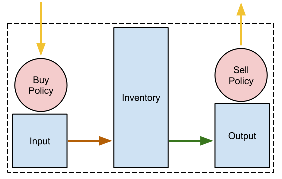

Adding Buffers and Policies from the Toolkit
=================================================

In this lesson, we will:

1. Add ResBufs to track material inventories
2. Add Policies to manage the trading of material
3. Add inventory management logic
4. Change our log information to show the info about the inventories
5. Add a notion of total storage capacity

Overview
--------------

Cyclus has a growing Toolkit of standard patterns that can be used by
archetype developers.  There are many advantages to using the Toolkit patterns
rather than developing similar functionality yourself, typical of most code
reuse situations:

* robustness - Toolkit patterns have been subjected to the Cyclus QA process
* time savings - It will take less time to learn how to use a Toolkit than it takes to develop your own
* improvements - You can benefit immediately from any improvements in the performance of the Toolkit pattern

Code reuse is a critical best practice in all software development.

One of the Toolkit patterns is a ``ResBuf``, providing a way to track an
inventory of ``Resource`` objects. There are also ``MatlBuyPolicy`` and
``MatlSellPolicy`` for managing the trading of ``Material`` objects.

Add State Variables, Buffers, and Policies
------------------------------------------

All state variable additions should be included in ``src/storage.h`` below the
other state variables added previously. 

 A ``ResBuf`` is available as a data type for another state variable, so we
 simply have to add the following:

.. code-block:: c++

    /// this facility holds material in storage.
    #pragma cyclus var {}
    cyclus::toolkit::ResBuf<cyclus::Material> inventory;

This creates a state variable named ``inventory`` that is based on the
``cyclus::toolkit::ResBuf`` class.  We'll explain how buffers and policies
work in just a moment.  A ResBuf object has special handling by the
preprocessor, so it will not appear in the schema and therefore will not
appear in the Cycic UI either.

Next, add two additional buffers

.. code-block:: c++

    /// a buffer for incoming material
    #pragma cyclus var {}
    cyclus::toolkit::ResBuf<cyclus::Material> input;

    /// a buffer for outgoing material
    #pragma cyclus var {}
    cyclus::toolkit::ResBuf<cyclus::Material> output;

Now add the policies. Policies do not require any special handling, and
thus do not need a pragma

.. code-block:: c++

    /// a policy for requesting material
    cyclus::toolkit::MatlBuyPolicy buy_policy;

    /// a policy for sending material
    cyclus::toolkit::MatlSellPolicy sell_policy;

There needs to be a mechansim for keeping track of when materials enter the
inventory. In order to utilize Cyclus' sophisticated restart capability, we must
choose a data structure that is compatible with the at least one of the Cyclus
output databases (see :ref:`dbtypes`). Given that requirement, an appropriate
data structure is a `list
<http://www.cplusplus.com/reference/list/list/>`_. Accordingly, add the
following

.. code-block:: c++

    /// list for material entry times, providing a default lets this variable be
    /// optional in an input file
    #pragma cyclus var { \
      "default": [] \
    }
    std::list<int> entry_times;

This requires another header file, so at the top of the storage.h file, after
``#include <string>``, add another include

.. code-block:: c++

    #include <list>

Finally, check that everything works by installing and testing

.. code-block:: console

    $ ./install.py
    $ Storage_unit_tests

You can also confirm that everything still works with running the simulation:

.. code-block:: console

    $ cyclus -v 3 input/storage.xml
                  :                                                               
              .CL:CC CC             _Q     _Q  _Q_Q    _Q    _Q              _Q   
            CC;CCCCCCCC:C;         /_\)   /_\)/_/\\)  /_\)  /_\)            /_\)  
            CCCCCCCCCCCCCl       __O|/O___O|/O_OO|/O__O|/O__O|/O____________O|/O__
         CCCCCCf     iCCCLCC     /////////////////////////////////////////////////
         iCCCt  ;;;;;.  CCCC                                                      
        CCCC  ;;;;;;;;;. CClL.                          c                         
       CCCC ,;;       ;;: CCCC  ;                   : CCCCi                       
        CCC ;;         ;;  CC   ;;:                CCC`   `C;                     
      lCCC ;;              CCCC  ;;;:             :CC .;;. C;   ;    :   ;  :;;   
      CCCC ;.              CCCC    ;;;,           CC ;    ; Ci  ;    :   ;  :  ;  
       iCC :;               CC       ;;;,        ;C ;       CC  ;    :   ; .      
      CCCi ;;               CCC        ;;;.      .C ;       tf  ;    :   ;  ;.    
      CCC  ;;               CCC          ;;;;;;; fC :       lC  ;    :   ;    ;:  
       iCf ;;               CC         :;;:      tC ;       CC  ;    :   ;     ;  
      fCCC :;              LCCf      ;;;:         LC :.  ,: C   ;    ;   ; ;   ;  
      CCCC  ;;             CCCC    ;;;:           CCi `;;` CC.  ;;;; :;.;.  ; ,;  
        CCl ;;             CC    ;;;;              CCC    CCL                     
       tCCC  ;;        ;; CCCL  ;;;                  tCCCCC.                      
        CCCC  ;;     :;; CCCCf  ;                     ,L                          
         lCCC   ;;;;;;  CCCL                                                      
         CCCCCC  :;;  fCCCCC                                                      
          . CCCC     CCCC .                                                       
           .CCCCCCCCCCCCCi                                                        
              iCCCCCLCf                                                           
               .  C. ,                                                            
                  :                                                               
    Experimental Warning: ResBuf is experimental and its API may be subject to change
    Experimental Warning: ResBuf is experimental and its API may be subject to change
    Experimental Warning: ResBuf is experimental and its API may be subject to change
    Experimental Warning: MatlBuyPolicy is experimental and its API may be subject to change
    Experimental Warning: MatlSellPolicy is experimental and its API may be subject to change
    Experimental Warning: ResBuf is experimental and its API may be subject to change
    Experimental Warning: ResBuf is experimental and its API may be subject to change
    Experimental Warning: ResBuf is experimental and its API may be subject to change
    Experimental Warning: MatlBuyPolicy is experimental and its API may be subject to change
    Experimental Warning: MatlSellPolicy is experimental and its API may be subject to change
    Experimental Warning: ResBuf is experimental and its API may be subject to change
    Experimental Warning: ResBuf is experimental and its API may be subject to change
    Experimental Warning: ResBuf is experimental and its API may be subject to change
    Experimental Warning: MatlBuyPolicy is experimental and its API may be subject to change
    Experimental Warning: MatlSellPolicy is experimental and its API may be subject to change
    Experimental Warning: ResBuf is experimental and its API may be subject to change
    Experimental Warning: ResBuf is experimental and its API may be subject to change
    Experimental Warning: ResBuf is experimental and its API may be subject to change
    Experimental Warning: MatlBuyPolicy is experimental and its API may be subject to change
    Experimental Warning: MatlSellPolicy is experimental and its API may be subject to change
    Experimental Warning: ResBuf is experimental and its API may be subject to change
    Experimental Warning: ResBuf is experimental and its API may be subject to change
    Experimental Warning: ResBuf is experimental and its API may be subject to change
    Experimental Warning: MatlBuyPolicy is experimental and its API may be subject to change
    Experimental Warning: MatlSellPolicy is experimental and its API may be subject to change
    INFO1(core  ):Simulation set to run from start=0 to end=10
    INFO1(core  ):Beginning simulation
    INFO1(tutori):Hello
    INFO1(tutori):World!
    INFO1(tutori):Hello
    INFO1(tutori):World!
    INFO1(tutori):Hello
    INFO1(tutori):World!
    INFO1(tutori):Hello
    INFO1(tutori):World!
    INFO1(tutori):Hello
    INFO1(tutori):World!
    INFO1(tutori):Hello
    INFO1(tutori):World!
    INFO1(tutori):Hello
    INFO1(tutori):World!
    INFO1(tutori):Hello
    INFO1(tutori):World!
    INFO1(tutori):Hello
    INFO1(tutori):World!
    INFO1(tutori):Hello
    INFO1(tutori):World!

    Status: Cyclus run successful!
    Output location: cyclus.sqlite
    Simulation ID: 9f15b93c-9ab2-49bb-a14f-fef872e64ce8

Add Implementation Logic
-----------------------------

The goal of a storage facility is to ask for material up to some limit, store it
for an amount of time, and then send it on to any interested parties. This can
be implemented in Cyclus by utilizing the Toolkit objects stated above. The buy
and sell policies will automatically fill and empty the input and output
buffers, respectively.  A concept of material flow through the facility is
shown below.

    **Figure:** Material flow through a Storage facility. Green arrows occur
    **before** the DRE (during the Tick). Yellow arrows occur during the
    DRE. Brown arrows occur **after** the DRE (during the Tock).

Connect Buffers and Policies
++++++++++++++++++++++++++++++++

In order for policies to be utilized, they must be connected to their respective
buffers. The storage facility would like them always connected; accordingly,
that operation should happen at the time when the facility enters a
simulation. The kernel will let agents know that they are entering a simulation
via the ``EnterNotify()`` function.

Add the following to ``src/storage.h`` before the ``Tick()`` function

.. code-block:: c++

    /// set up policies and buffers
    virtual void EnterNotify();

And add the following to ``src/storage.cc`` before the ``Tick()`` function

.. code-block:: c++

    void Storage::EnterNotify() {
      cyclus::Facility::EnterNotify(); // call base function first
      buy_policy.Init(this, &input, std::string("input"), throughput).Set(incommod).Start();
      sell_policy.Init(this, &output, std::string("output"), throughput).Set(outcommod).Start(); 
    }

Buffer Transfer Logic
++++++++++++++++++++++++++++++++

The job of the ``Storage`` archetype developer is to determine and implement
the logic related to transfering material between the input and output buffers
and the middle inventory buffer. Two rules govern buffer transfer logic
in this model:

1. All material in the input buffer is transferred to the inventory buffer
2. Material in the inventory buffer that has been stored for long enough is
   transferred to the output buffer

Because the input buffer transfer should occur *after* the DRE, it must happen
in the ``Tock()`` method. Similarly, because the output buffer transfer should
occur *before* the DRE, it must happen in the ``Tick()`` method. For each
transfer, care must be taken to update the ``entry_times`` list appropriately.

The input buffer transfer requires the following operation for each object in
the buffer:

1. *Pop* the object from the input buffer
2. *Push* the object to the inventory buffer
3. *Push* the current time to the ``entry_times``

In order to implement this, replace the current ``Tock()`` implementation in
``src/storage.cc`` with

.. code-block:: c++

    void Storage::Tock() {
      int t = context()->time();
      while (!input.empty()) {
        inventory.Push(input.Pop());
        entry_times.push_back(t);
      }
    }

The output buffer transfer requires the following operation so long as the
condition in 1. is met:

1. Check whether enough time has passed since the time at the front of
   ``entry_times`` *and* the inventory is not empty. If so:
2. *Pop* an object from the inventory buffer
3. *Push* that object to the output buffer
4. *Pop* a time from the ``entry_times``

In order to implement this, replace the current ``Tick()`` implementation in
``src/storage.cc`` with

.. code-block:: c++

    void Storage::Tick() {
      int finished_storing = context()->time() - storage_time;
      while (!inventory.empty() && entry_times.front() <= finished_storing) {
        output.Push(inventory.Pop());
        entry_times.pop_front();
      }
    }

Build and Test
++++++++++++++++++++++++++++++++

Same as it ever was

.. code-block:: console

    $ ./install.py
    $ Storage_unit_tests

Add Some Logging
---------------------------------------------

Now that all of the required logic is there, it would be nice to know some
information about what is happening to a facility during a simulation. This is
accomplished in Cyclus through :ref:`logging`, which is implemented as a stream
operation.

Information about the current inventory can be added by updating the ``Tock()``
function (after any pushing/popping) with

.. code-block:: c++

    LOG(cyclus::LEV_INFO2, "Storage") << "The total inventory at time " 
                                      << t << " is " 
                                      << inventory.quantity() + output.quantity()
                                      << " kg.";

After updating the function should look something like 

.. code-block:: c++

    void Storage::Tock() {
      int t = context()->time();
      while (!input.empty()) {
        inventory.Push(input.Pop());
        entry_times.push_back(t);
      }

      LOG(cyclus::LEV_INFO2, "Storage") << "The total inventory at time " 
                                        << t << " is " 
                                        << inventory.quantity() + output.quantity()
                                        << " kg.";
    }

Notice that this uses the built in ``quantity()`` method of a ResBuf
object and that both the ``inventory`` and ``output`` buffers are queried. While
the implementation logic requires multiple buffers, the model assumes the
facility acts as a single cohesive unit.

You can also add information about the quantity of material that will be
requested and offered. Since this information is important to know *before* the
DRE, it goes in the ``Tick()``

.. code-block:: c++

    LOG(cyclus::LEV_INFO2, "Storage") << "Quantity to be requested: " << buy_policy.TotalQty() << " kg.";
    LOG(cyclus::LEV_INFO2, "Storage") << "Quantity to be offered: " << sell_policy.Limit() << " kg.";

After updating the function should look something like 

.. code-block:: c++

    void Storage::Tick() {
      int finished_storing = context()->time() - storage_time;
      while (!inventory.empty() && entry_times.front() <= finished_storing) {
        output.Push(inventory.Pop());
   	    entry_times.pop_front();
      }
     
      LOG(cyclus::LEV_INFO2, "Storage") << "Quantity to be requested: " << buy_policy.TotalQty() << " kg.";
      LOG(cyclus::LEV_INFO2, "Storage") << "Quantity to be offered: " << sell_policy.Limit() << " kg.";
    }

To see the logging output, build and rerun the simulation

.. note::

    Increase the verbosity from ``2`` to ``3``.

.. code-block:: console

    $ ./install.py
    $ cyclus -v 3 input/storage.xml
		  :                                                               
	      .CL:CC CC             _Q     _Q  _Q_Q    _Q    _Q              _Q   
	    CC;CCCCCCCC:C;         /_\)   /_\)/_/\\)  /_\)  /_\)            /_\)  
	    CCCCCCCCCCCCCl       __O|/O___O|/O_OO|/O__O|/O__O|/O____________O|/O__
	 CCCCCCf     iCCCLCC     /////////////////////////////////////////////////
	 iCCCt  ;;;;;.  CCCC                                                      
	CCCC  ;;;;;;;;;. CClL.                          c                         
       CCCC ,;;       ;;: CCCC  ;                   : CCCCi                       
	CCC ;;         ;;  CC   ;;:                CCC`   `C;                     
      lCCC ;;              CCCC  ;;;:             :CC .;;. C;   ;    :   ;  :;;   
      CCCC ;.              CCCC    ;;;,           CC ;    ; Ci  ;    :   ;  :  ;  
       iCC :;               CC       ;;;,        ;C ;       CC  ;    :   ; .      
      CCCi ;;               CCC        ;;;.      .C ;       tf  ;    :   ;  ;.    
      CCC  ;;               CCC          ;;;;;;; fC :       lC  ;    :   ;    ;:  
       iCf ;;               CC         :;;:      tC ;       CC  ;    :   ;     ;  
      fCCC :;              LCCf      ;;;:         LC :.  ,: C   ;    ;   ; ;   ;  
      CCCC  ;;             CCCC    ;;;:           CCi `;;` CC.  ;;;; :;.;.  ; ,;  
	CCl ;;             CC    ;;;;              CCC    CCL                     
       tCCC  ;;        ;; CCCL  ;;;                  tCCCCC.                      
	CCCC  ;;     :;; CCCCf  ;                     ,L                          
	 lCCC   ;;;;;;  CCCL                                                      
	 CCCCCC  :;;  fCCCCC                                                      
	  . CCCC     CCCC .                                                       
	   .CCCCCCCCCCCCCi                                                        
	      iCCCCCLCf                                                           
	       .  C. ,                                                            
		  :                                                               
    Experimental Warning: ResBuf is experimental and its API may be subject to change
    Experimental Warning: ResBuf is experimental and its API may be subject to change
    Experimental Warning: ResBuf is experimental and its API may be subject to change
    Experimental Warning: MatlBuyPolicy is experimental and its API may be subject to change
    Experimental Warning: MatlSellPolicy is experimental and its API may be subject to change
    Experimental Warning: ResBuf is experimental and its API may be subject to change
    Experimental Warning: ResBuf is experimental and its API may be subject to change
    Experimental Warning: ResBuf is experimental and its API may be subject to change
    Experimental Warning: MatlBuyPolicy is experimental and its API may be subject to change
    Experimental Warning: MatlSellPolicy is experimental and its API may be subject to change
    Experimental Warning: ResBuf is experimental and its API may be subject to change
    Experimental Warning: ResBuf is experimental and its API may be subject to change
    Experimental Warning: ResBuf is experimental and its API may be subject to change
    Experimental Warning: MatlBuyPolicy is experimental and its API may be subject to change
    Experimental Warning: MatlSellPolicy is experimental and its API may be subject to change
    Experimental Warning: ResBuf is experimental and its API may be subject to change
    Experimental Warning: ResBuf is experimental and its API may be subject to change
    Experimental Warning: ResBuf is experimental and its API may be subject to change
    Experimental Warning: MatlBuyPolicy is experimental and its API may be subject to change
    Experimental Warning: MatlSellPolicy is experimental and its API may be subject to change
    Experimental Warning: ResBuf is experimental and its API may be subject to change
    Experimental Warning: ResBuf is experimental and its API may be subject to change
    Experimental Warning: ResBuf is experimental and its API may be subject to change
    Experimental Warning: MatlBuyPolicy is experimental and its API may be subject to change
    Experimental Warning: MatlSellPolicy is experimental and its API may be subject to change
     INFO1(core  ):Simulation set to run from start=0 to end=10
     INFO1(core  ):Beginning simulation
     INFO1(core  ):Current time: 0
     INFO2(core  ):  Beginning Tick for time: 0
     INFO2(Storag):  Quantity to be requested: 10 kg.
     INFO2(Storag):  Quantity to be offered: 0 kg.
     INFO2(core  ):  Beginning DRE for time: 0
     INFO2(core  ):  Beginning Tock for time: 0
     INFO2(Storag):  The total inventory at time 0 is 0 kg of material.
     INFO1(core  ):Current time: 1
     INFO2(core  ):  Beginning Tick for time: 1
     INFO2(Storag):  Quantity to be requested: 10 kg.
     INFO2(Storag):  Quantity to be offered: 0 kg.
     INFO2(core  ):  Beginning DRE for time: 1
     INFO2(core  ):  Beginning Tock for time: 1
     INFO2(Storag):  The total inventory at time 1 is 0 kg of material.
     INFO1(core  ):Current time: 2
     INFO2(core  ):  Beginning Tick for time: 2
     INFO2(Storag):  Quantity to be requested: 10 kg.
     INFO2(Storag):  Quantity to be offered: 0 kg.
     INFO2(core  ):  Beginning DRE for time: 2
     INFO2(core  ):  Beginning Tock for time: 2
     INFO2(Storag):  The total inventory at time 2 is 0 kg of material.
     INFO1(core  ):Current time: 3
     INFO2(core  ):  Beginning Tick for time: 3
     INFO2(Storag):  Quantity to be requested: 10 kg.
     INFO2(Storag):  Quantity to be offered: 0 kg.
     INFO2(core  ):  Beginning DRE for time: 3
     INFO2(core  ):  Beginning Tock for time: 3
     INFO2(Storag):  The total inventory at time 3 is 0 kg of material.
     INFO1(core  ):Current time: 4
     INFO2(core  ):  Beginning Tick for time: 4
     INFO2(Storag):  Quantity to be requested: 10 kg.
     INFO2(Storag):  Quantity to be offered: 0 kg.
     INFO2(core  ):  Beginning DRE for time: 4
     INFO2(core  ):  Beginning Tock for time: 4
     INFO2(Storag):  The total inventory at time 4 is 0 kg of material.
     INFO1(core  ):Current time: 5
     INFO2(core  ):  Beginning Tick for time: 5
     INFO2(Storag):  Quantity to be requested: 10 kg.
     INFO2(Storag):  Quantity to be offered: 0 kg.
     INFO2(core  ):  Beginning DRE for time: 5
     INFO2(core  ):  Beginning Tock for time: 5
     INFO2(Storag):  The total inventory at time 5 is 0 kg of material.
     INFO1(core  ):Current time: 6
     INFO2(core  ):  Beginning Tick for time: 6
     INFO2(Storag):  Quantity to be requested: 10 kg.
     INFO2(Storag):  Quantity to be offered: 0 kg.
     INFO2(core  ):  Beginning DRE for time: 6
     INFO2(core  ):  Beginning Tock for time: 6
     INFO2(Storag):  The total inventory at time 6 is 0 kg of material.
     INFO1(core  ):Current time: 7
     INFO2(core  ):  Beginning Tick for time: 7
     INFO2(Storag):  Quantity to be requested: 10 kg.
     INFO2(Storag):  Quantity to be offered: 0 kg.
     INFO2(core  ):  Beginning DRE for time: 7
     INFO2(core  ):  Beginning Tock for time: 7
     INFO2(Storag):  The total inventory at time 7 is 0 kg of material.
     INFO1(core  ):Current time: 8
     INFO2(core  ):  Beginning Tick for time: 8
     INFO2(Storag):  Quantity to be requested: 10 kg.
     INFO2(Storag):  Quantity to be offered: 0 kg.
     INFO2(core  ):  Beginning DRE for time: 8
     INFO2(core  ):  Beginning Tock for time: 8
     INFO2(Storag):  The total inventory at time 8 is 0 kg of material.
     INFO1(core  ):Current time: 9
     INFO2(core  ):  Beginning Tick for time: 9
     INFO2(Storag):  Quantity to be requested: 10 kg.
     INFO2(Storag):  Quantity to be offered: 0 kg.
     INFO2(core  ):  Beginning DRE for time: 9
     INFO2(core  ):  Beginning Tock for time: 9
     INFO2(Storag):  The total inventory at time 9 is 0 kg of material.

    Status: Cyclus run successful!
    Output location: cyclus.sqlite
    Simulation ID: 747f6c86-fce8-49be-8c57-8bb38e11761a

Add a State Variable to Define Storage Capcity
-------------------------------------------------------------

A natural extension for the current storage facility implementation is to have a
maximum storage capacity. To do so, first add a capacity state variable to
storage.h . If you still want the input file to work, you have to provide a
``default`` key in the pragma data structure. A sufficiently large value will
do.

.. code-block:: c++

    #pragma cyclus var { \
      'doc': 'Maximum storage capacity (including all material in the facility)', \
      'tooltip': 'Maximum storage capacity', \
      'units': 'kg', \
      'default': 1e200, \
      'uilabel': 'Maximum Storage Capacity' \
    }
    double capacity;
    
The required implementation is nontrivial. The goal of adding a capacity
member is to guarantee that the amount of material in the facility never exceeds
a certain value. The only way for material to enter the facility is through the
``input`` ResBuff via the ``buy_policy``. The ``MatlBuyPolicy`` sets a maximum
buy amount based on both its ``throughput`` and the ``capacity`` of the
connected ``ResBuf``. Accordingly, you can update the ``input`` buffer's
capacity before the DRE occurs to achieve this behavior.

    **Figure:** Storage buffers between two time steps. The total capacity is
    represented by the area of all three boxes. The ``input`` buffer's capacity
    must be updated to reflect how much material is in both the ``inventory``
    and ``output`` buffers. The colored arrows on the right match the material
    flows in the previous figure.

To do so, add the following line to the end of the ``Tick()`` function (in the
implementation file), which updates capacity of the ``input`` through the
``ResBuf`` ``capacity()`` API

.. code-block:: c++

    // only allow requests up to the storage capacity 
    input.capacity(capacity - inventory.quantity() - output.quantity());

So the full ``Tick()`` function now looks like

.. code-block:: c++

    void Storage::Tick() {
      int finished_storing = context()->time() - storage_time;
      while (!inventory.empty() && entry_times.front() <= finished_storing) {
        output.Push(inventory.Pop());
        entry_times.pop_front();
      }

      // only allow requests up to the storage capacity 
      input.capacity(capacity - inventory.quantity() - output.quantity());
     
      LOG(cyclus::LEV_INFO2, "Storage") << "Quantity to be requested: " << buy_policy.TotalQty() << " kg.";
      LOG(cyclus::LEV_INFO2, "Storage") << "Quantity to be offered: " << sell_policy.Limit() << " kg.";
    }

Build and Test
++++++++++++++++++++++++++++++++

Same as it ever was

.. code-block:: console

    $ ./install.py
    $ Storage_unit_tests

Update Input File and Run
++++++++++++++++++++++++++++++++

You can test that your new capacity capability works by adding the following to
the end of the ``config`` block for ``Storage`` (before the close tag
</Storage>) in ``input/storage.xml``

.. code-block:: xml

     <capacity>8</capacity>

Note that this capacity is smaller than the throughput! What do you think you
will see in the output logs?

Try it out (don't forget to delete the old sqlite file first):

.. code-block:: console

    $ rm cyclus.sqlite
    $ cyclus -v 3 input/storage.xml
		  :                                                               
	      .CL:CC CC             _Q     _Q  _Q_Q    _Q    _Q              _Q   
	    CC;CCCCCCCC:C;         /_\)   /_\)/_/\\)  /_\)  /_\)            /_\)  
	    CCCCCCCCCCCCCl       __O|/O___O|/O_OO|/O__O|/O__O|/O____________O|/O__
	 CCCCCCf     iCCCLCC     /////////////////////////////////////////////////
	 iCCCt  ;;;;;.  CCCC                                                      
	CCCC  ;;;;;;;;;. CClL.                          c                         
       CCCC ,;;       ;;: CCCC  ;                   : CCCCi                       
	CCC ;;         ;;  CC   ;;:                CCC`   `C;                     
      lCCC ;;              CCCC  ;;;:             :CC .;;. C;   ;    :   ;  :;;   
      CCCC ;.              CCCC    ;;;,           CC ;    ; Ci  ;    :   ;  :  ;  
       iCC :;               CC       ;;;,        ;C ;       CC  ;    :   ; .      
      CCCi ;;               CCC        ;;;.      .C ;       tf  ;    :   ;  ;.    
      CCC  ;;               CCC          ;;;;;;; fC :       lC  ;    :   ;    ;:  
       iCf ;;               CC         :;;:      tC ;       CC  ;    :   ;     ;  
      fCCC :;              LCCf      ;;;:         LC :.  ,: C   ;    ;   ; ;   ;  
      CCCC  ;;             CCCC    ;;;:           CCi `;;` CC.  ;;;; :;.;.  ; ,;  
	CCl ;;             CC    ;;;;              CCC    CCL                     
       tCCC  ;;        ;; CCCL  ;;;                  tCCCCC.                      
	CCCC  ;;     :;; CCCCf  ;                     ,L                          
	 lCCC   ;;;;;;  CCCL                                                      
	 CCCCCC  :;;  fCCCCC                                                      
	  . CCCC     CCCC .                                                       
	   .CCCCCCCCCCCCCi                                                        
	      iCCCCCLCf                                                           
	       .  C. ,                                                            
		  :                                                               
    Experimental Warning: ResBuf is experimental and its API may be subject to change
    Experimental Warning: ResBuf is experimental and its API may be subject to change
    Experimental Warning: ResBuf is experimental and its API may be subject to change
    Experimental Warning: MatlBuyPolicy is experimental and its API may be subject to change
    Experimental Warning: MatlSellPolicy is experimental and its API may be subject to change
    Experimental Warning: ResBuf is experimental and its API may be subject to change
    Experimental Warning: ResBuf is experimental and its API may be subject to change
    Experimental Warning: ResBuf is experimental and its API may be subject to change
    Experimental Warning: MatlBuyPolicy is experimental and its API may be subject to change
    Experimental Warning: MatlSellPolicy is experimental and its API may be subject to change
    Experimental Warning: ResBuf is experimental and its API may be subject to change
    Experimental Warning: ResBuf is experimental and its API may be subject to change
    Experimental Warning: ResBuf is experimental and its API may be subject to change
    Experimental Warning: MatlBuyPolicy is experimental and its API may be subject to change
    Experimental Warning: MatlSellPolicy is experimental and its API may be subject to change
    Experimental Warning: ResBuf is experimental and its API may be subject to change
    Experimental Warning: ResBuf is experimental and its API may be subject to change
    Experimental Warning: ResBuf is experimental and its API may be subject to change
    Experimental Warning: MatlBuyPolicy is experimental and its API may be subject to change
    Experimental Warning: MatlSellPolicy is experimental and its API may be subject to change
    Experimental Warning: ResBuf is experimental and its API may be subject to change
    Experimental Warning: ResBuf is experimental and its API may be subject to change
    Experimental Warning: ResBuf is experimental and its API may be subject to change
    Experimental Warning: MatlBuyPolicy is experimental and its API may be subject to change
    Experimental Warning: MatlSellPolicy is experimental and its API may be subject to change
     INFO1(core  ):Simulation set to run from start=0 to end=10
     INFO1(core  ):Beginning simulation
     INFO1(core  ):Current time: 0
     INFO2(core  ):  Beginning Tick for time: 0
     INFO2(Storag):  Quantity to be requested: 8 kg.
     INFO2(Storag):  Quantity to be offered: 0 kg.
     INFO2(core  ):  Beginning DRE for time: 0
     INFO2(core  ):  Beginning Tock for time: 0
     INFO2(Storag):  The total inventory at time 0 is 0 kg of material.
     INFO1(core  ):Current time: 1
     INFO2(core  ):  Beginning Tick for time: 1
     INFO2(Storag):  Quantity to be requested: 8 kg.
     INFO2(Storag):  Quantity to be offered: 0 kg.
     INFO2(core  ):  Beginning DRE for time: 1
     INFO2(core  ):  Beginning Tock for time: 1
     INFO2(Storag):  The total inventory at time 1 is 0 kg of material.
     INFO1(core  ):Current time: 2
     INFO2(core  ):  Beginning Tick for time: 2
     INFO2(Storag):  Quantity to be requested: 8 kg.
     INFO2(Storag):  Quantity to be offered: 0 kg.
     INFO2(core  ):  Beginning DRE for time: 2
     INFO2(core  ):  Beginning Tock for time: 2
     INFO2(Storag):  The total inventory at time 2 is 0 kg of material.
     INFO1(core  ):Current time: 3
     INFO2(core  ):  Beginning Tick for time: 3
     INFO2(Storag):  Quantity to be requested: 8 kg.
     INFO2(Storag):  Quantity to be offered: 0 kg.
     INFO2(core  ):  Beginning DRE for time: 3
     INFO2(core  ):  Beginning Tock for time: 3
     INFO2(Storag):  The total inventory at time 3 is 0 kg of material.
     INFO1(core  ):Current time: 4
     INFO2(core  ):  Beginning Tick for time: 4
     INFO2(Storag):  Quantity to be requested: 8 kg.
     INFO2(Storag):  Quantity to be offered: 0 kg.
     INFO2(core  ):  Beginning DRE for time: 4
     INFO2(core  ):  Beginning Tock for time: 4
     INFO2(Storag):  The total inventory at time 4 is 0 kg of material.
     INFO1(core  ):Current time: 5
     INFO2(core  ):  Beginning Tick for time: 5
     INFO2(Storag):  Quantity to be requested: 8 kg.
     INFO2(Storag):  Quantity to be offered: 0 kg.
     INFO2(core  ):  Beginning DRE for time: 5
     INFO2(core  ):  Beginning Tock for time: 5
     INFO2(Storag):  The total inventory at time 5 is 0 kg of material.
     INFO1(core  ):Current time: 6
     INFO2(core  ):  Beginning Tick for time: 6
     INFO2(Storag):  Quantity to be requested: 8 kg.
     INFO2(Storag):  Quantity to be offered: 0 kg.
     INFO2(core  ):  Beginning DRE for time: 6
     INFO2(core  ):  Beginning Tock for time: 6
     INFO2(Storag):  The total inventory at time 6 is 0 kg of material.
     INFO1(core  ):Current time: 7
     INFO2(core  ):  Beginning Tick for time: 7
     INFO2(Storag):  Quantity to be requested: 8 kg.
     INFO2(Storag):  Quantity to be offered: 0 kg.
     INFO2(core  ):  Beginning DRE for time: 7
     INFO2(core  ):  Beginning Tock for time: 7
     INFO2(Storag):  The total inventory at time 7 is 0 kg of material.
     INFO1(core  ):Current time: 8
     INFO2(core  ):  Beginning Tick for time: 8
     INFO2(Storag):  Quantity to be requested: 8 kg.
     INFO2(Storag):  Quantity to be offered: 0 kg.
     INFO2(core  ):  Beginning DRE for time: 8
     INFO2(core  ):  Beginning Tock for time: 8
     INFO2(Storag):  The total inventory at time 8 is 0 kg of material.
     INFO1(core  ):Current time: 9
     INFO2(core  ):  Beginning Tick for time: 9
     INFO2(Storag):  Quantity to be requested: 8 kg.
     INFO2(Storag):  Quantity to be offered: 0 kg.
     INFO2(core  ):  Beginning DRE for time: 9
     INFO2(core  ):  Beginning Tock for time: 9
     INFO2(Storag):  The total inventory at time 9 is 0 kg of material.

    Status: Cyclus run successful!
    Output location: cyclus.sqlite
    Simulation ID: 1ce98e9b-bd89-402b-8bd6-c8266e293dba
