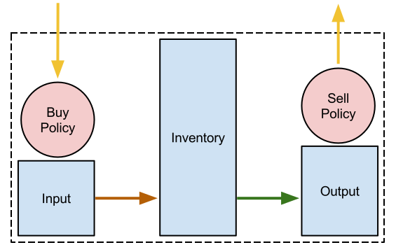
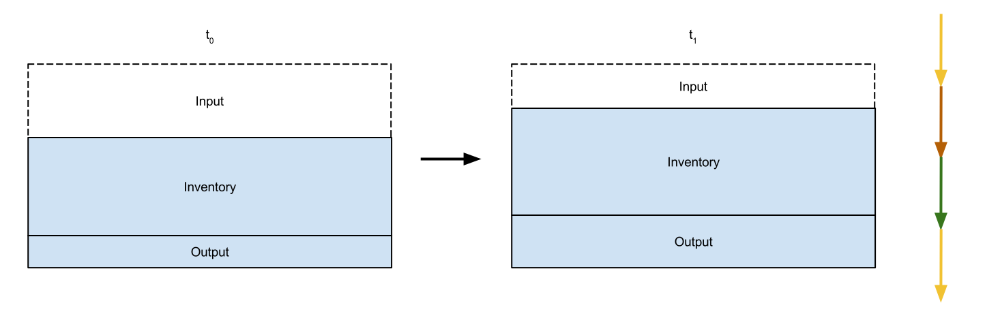

Adding Resource Buffers
=================================================
In this lesson, we will:

1. Add ResBufs to track material inventories
2. Add a notion of total storage capacity

Overview
--------------
Cyclus has a collection of standard patterns that can be used by
archetype developers. There are many advantages to using the toolkit patterns
rather than developing similar functionality yourself, typical of most code
reuse situations:

* robustness - toolkit patterns have been subjected to the Cyclus QA process
* time savings - It will take less time to learn how to use a toolkit than it takes to develop your own
* improvements - You can benefit immediately from any improvements in the performance of the toolkit pattern

Code reuse is a critical best practice in all software development.

One of the toolkit patterns is a ``ResBuf``, providing a way to track an
inventory of ``Resource`` objects.

Add State Variables and Resource Buffers
------------------------------------------
All state variable additions should be included in ``~/tutorial/tut/agents.py`` below the
other state variables added previously in this tutorial.

A ``ResBuf`` is available as a data type in the typesystem. However, to use it
as a state variable, so we instead have to use the ``ResBufMaterialInv`` or
``RefBufProductInv`` classes. These inventories should be added below the other state
variables we have already applied to the storage class.

**~/tutorial/tut/agents.py:**

.. code-block:: python

    from cyclus.agents import Facility
    import cyclus.typesystem as ts

    class Storage(Facility):
        """My storage facility."""
        ...
        # this facility holds material in storage.
        inventory = ts.ResBufMaterialInv()

This creates a state variable named ``inventory`` that is based on the
``ResBuf`` class.  We'll explain how buffers
work in just a moment.  A ResBuf object and its ``ts.Inventory`` state var has special
handling by the Python ``Agent`` class from which ``Facility`` inherits. It will not appear
in the schema and therefore will not appear in the Cycic UI either.

Next, add two additional buffers:

**~/tutorial/tut/agents.py:**

.. code-block:: python

    class Storage(Facility):
        """My storage facility."""
        ...
        # this facility holds material in storage.
        inventory = ts.ResBufMaterialInv()
        # a buffer for incoming material
        input = ts.ResBufMaterialInv()
        # a buffer for outgoing material
        output = ts.ResBufMaterialInv()

Finally, check that everything works by reinstalling like before.
You can also confirm that everything still works with running the simulation:

.. code-block:: console

    ~/tutorial $ cyclus -v 3 input/storage.py
                  :
              .CL:CC CC             _Q     _Q  _Q_Q    _Q    _Q              _Q
            CC;CCCCCCCC:C;         /_\)   /_\)/_/\\)  /_\)  /_\)            /_\)
            CCCCCCCCCCCCCl       __O|/O___O|/O_OO|/O__O|/O__O|/O____________O|/O__
         CCCCCCf     iCCCLCC     /////////////////////////////////////////////////
         iCCCt  ;;;;;.  CCCC
        CCCC  ;;;;;;;;;. CClL.                          c
       CCCC ,;;       ;;: CCCC  ;                   : CCCCi
        CCC ;;         ;;  CC   ;;:                CCC`   `C;
      lCCC ;;              CCCC  ;;;:             :CC .;;. C;   ;    :   ;  :;;
      CCCC ;.              CCCC    ;;;,           CC ;    ; Ci  ;    :   ;  :  ;
       iCC :;               CC       ;;;,        ;C ;       CC  ;    :   ; .
      CCCi ;;               CCC        ;;;.      .C ;       tf  ;    :   ;  ;.
      CCC  ;;               CCC          ;;;;;;; fC :       lC  ;    :   ;    ;:
       iCf ;;               CC         :;;:      tC ;       CC  ;    :   ;     ;
      fCCC :;              LCCf      ;;;:         LC :.  ,: C   ;    ;   ; ;   ;
      CCCC  ;;             CCCC    ;;;:           CCi `;;` CC.  ;;;; :;.;.  ; ,;
        CCl ;;             CC    ;;;;              CCC    CCL
       tCCC  ;;        ;; CCCL  ;;;                  tCCCCC.
        CCCC  ;;     :;; CCCCf  ;                     ,L
         lCCC   ;;;;;;  CCCL
         CCCCCC  :;;  fCCCCC
          . CCCC     CCCC .
           .CCCCCCCCCCCCCi
              iCCCCCLCf
               .  C. ,
                  :
    Experimental Warning: ResBuf is experimental and its API may be subject to change
    Experimental Warning: ResBuf is experimental and its API may be subject to change
    Experimental Warning: ResBuf is experimental and its API may be subject to change
    Experimental Warning: ResBuf is experimental and its API may be subject to change
    Experimental Warning: ResBuf is experimental and its API may be subject to change
    Experimental Warning: ResBuf is experimental and its API may be subject to change
    Experimental Warning: ResBuf is experimental and its API may be subject to change
    Experimental Warning: ResBuf is experimental and its API may be subject to change
    Experimental Warning: ResBuf is experimental and its API may be subject to change
    Experimental Warning: ResBuf is experimental and its API may be subject to change
    Experimental Warning: ResBuf is experimental and its API may be subject to change
    Experimental Warning: ResBuf is experimental and its API may be subject to change
    Experimental Warning: ResBuf is experimental and its API may be subject to change
    Experimental Warning: ResBuf is experimental and its API may be subject to change
    Experimental Warning: ResBuf is experimental and its API may be subject to change
    INFO1(core  ):Simulation set to run from start=0 to end=10
    INFO1(core  ):Beginning simulation
    INFO1(tutori):Hello
    INFO1(tutori):World!
    INFO1(tutori):Hello
    INFO1(tutori):World!
    INFO1(tutori):Hello
    INFO1(tutori):World!
    INFO1(tutori):Hello
    INFO1(tutori):World!
    INFO1(tutori):Hello
    INFO1(tutori):World!
    INFO1(tutori):Hello
    INFO1(tutori):World!
    INFO1(tutori):Hello
    INFO1(tutori):World!
    INFO1(tutori):Hello
    INFO1(tutori):World!
    INFO1(tutori):Hello
    INFO1(tutori):World!
    INFO1(tutori):Hello
    INFO1(tutori):World!

    Status: Cyclus run successful!
    Output location: cyclus.sqlite
    Simulation ID: 9f15b93c-9ab2-49bb-a14f-fef872e64ce8

Add Implementation Logic
-----------------------------
The goal of a storage facility is to ask for material up to some limit, store it
for an amount of time, and then send it on to any interested parties. This can
be implemented in Cyclus by utilizing the Toolkit objects stated above. The buy
and sell policies will automatically fill and empty the input and output
buffers, respectively.  A concept of material flow through the facility is
shown below.

    **Figure:** Material flow through a Storage facility. Green arrows occur
    **before** the DRE (during the Tick). Yellow arrows occur during the
    DRE. Brown arrows occur **after** the DRE (during the Tock).

Buffer Transfer Logic
++++++++++++++++++++++++++++++++
The job of the ``Storage`` archetype developer is to determine and implement
the logic related to transfering material between the input and output buffers
and the middle inventory buffer. Two rules govern buffer transfer logic
in this model:

1. All material in the input buffer is transferred to the inventory buffer
2. Material in the inventory buffer that has been stored for long enough is
   transferred to the output buffer

Because the input buffer transfer should occur *after* the DRE, it must happen
in the ``tock()`` method. Similarly, because the output buffer transfer should
occur *before* the DRE, it must happen in the ``tick()`` method. For each
transfer, care must be taken to update the ``entry_times`` list appropriately.

The input buffer transfer requires the following operation for each object in
the buffer:

1. *Pop* the object from the input buffer
2. *Push* the object to the inventory buffer
3. *Push* the current time to the ``entry_times``

In order to implement this, add or replace the current ``tock()`` implementation in
``agents/py`` with:

**~/tutorial/tut/agents.py:**

.. code-block:: python

    class Storage(Facility):
        """My storage facility."""
        ...
        def __init__(self, ctx):
            """Agents that have an init method must accept a context and must call super
            first thing!
            """
            super().__init__(ctx)
            self.entry_times = []

        def tock(self):
            t = self.context.time
            while not self.input.empty():
                self.inventory.push(self.input.pop())
                entry_times.append(t)

The output buffer transfer requires the following operation so long as the
condition in 1. is met:

1. Check whether enough time has passed since the time at the front of
   ``entry_times`` *and* the inventory is not empty. If so:
2. *pop()* an object from the inventory buffer
3. *push()* that object to the output buffer
4. *pop()* a time from the ``entry_times``

In order to implement this, replace the current ``tick()`` implementation in
``agents.py`` with

**~/tutorial/tut/agents.py:**

.. code-block:: python

    class Storage(Facility):
        """My storage facility."""
        ...
        def tick(self):
            finished_storing = self.context.time - self.storage_time
            while (not self.inventory.empty()) and (self.entry_times[0] <= finished_storing):
                self.output.push(self.inventory.pop())
                del self.entry_times[0]

At this point, please feel free to reinstall and rerun.

Add a State Variable to Define Storage Capcity
-------------------------------------------------------------
A natural extension for the current storage facility implementation is to have a
maximum storage capacity. To do so, first add a capacity state variable to
storage.h . If you still want the input file to work, you have to provide a
``default`` key in the pragma data structure. A sufficiently large value will
do.

**~/tutorial/tut/agents.py:**

.. code-block:: python

    class Storage(Facility):
        """My storage facility."""
        ...
        capacity = ts.Double(
            doc='Maximum storage capacity (including all material in the facility)',
            tooltip='Maximum storage capacity',
            units='kg',
            default=1e200,
            uilabel='Maximum Storage Capacity',
            )

The required implementation is nontrivial. The goal of adding a capacity
member is to guarantee that the amount of material in the facility never exceeds
a certain value. The only way for material to enter the facility is through the
``input`` ResBuff.

    **Figure:** Storage buffers between two time steps. The total capacity is
    represented by the area of all three boxes. The ``input`` buffer's capacity
    must be updated to reflect how much material is in both the ``inventory``
    and ``output`` buffers. The colored arrows on the right match the material
    flows in the previous figure.

To do so, add the following line to the end of the ``tick()`` function (in the
implementation file), which updates capacity of the ``input`` through the
``ResBuf`` ``capacity`` API.

**~/tutorial/tut/agents.py:**

.. code-block:: python

    class Storage(Facility):
        """My storage facility."""
        ...
        def tick(self):
            finished_storing = self.context.time - self.storage_time
            while (not self.inventory.empty()) and (self.entry_times[0] <= finished_storing):
                self.output.push(self.inventory.pop())
                del self.entry_times[0]
            # only allow requests up to the storage capacity
            self.input.capacity = self.capacity - self.inventory.quantity - self.output.quantity

Update Input File and Run
++++++++++++++++++++++++++++++++
You can test that your new capacity capability works by adding the following to
the end of the ``config`` block for ``Storage`` (before the close tag
</Storage>) in ``input/storage.py``

**~/tutorial/input/storage.py:**

.. code-block:: python

    {
    # ...
    'facility': {'config': {'Storage': {
                                'throughput': 10,
                                'storage_time': 1,
                                'incommod': 'fuel',
                                'outcommod': 'stored_fuel',
                                # capacity is optional since it has a default
                                'capacity': 8,
                                }},
                            'name': 'OneFacility'}
    # ...
    }

Note that this capacity is smaller than the throughput! What do you think you
will see in the output logs?

Try it out (don't forget to delete the old sqlite file first)!
