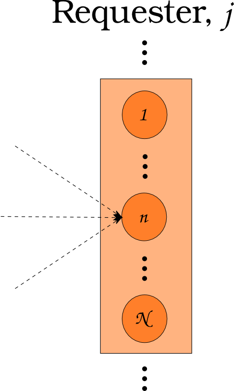

CEP 18 - Dynamic Resource Exchange Procedure
********************************************

:CEP: 18
:Title: Dynamic Resource Exchange Procedure
:Last-Modified: 2013-11-04
:Author: Matthew Gidden
:Status: Accepted
:Type: Standards Track
:Created: 2013-09-02

Abstract
========

An updated procedure for determining dynamic resource exchanges is presented. It
occurs nominally in four phases: a request for bids, a response to the request
for bids, preference assignment, and resolution. The first three phases
encompass an information gathering procedure, providing generic information to
any market exchange solution procedure. The final phase is modular in that any
algorithm can be used to solve the exchange. This modular phase takes the place
of the current implementation of MarketModels. The procedure is informed by
agent-based supply chain modeling literature :cite:`julka_agent-based_2002` with
modifications as required for our nuclear-engineering domain specific
information.

Motivation
==========

The current implementation of Markets in |Cyclus| includes a base MarketModel
class which is intended to be derived from by concrete, dynamically loaded,
user-defined classes. Markets are assigned specific commodities, i.e., there is
no communication across demand for multiple commodities. Markets act in the
simulation during the **resolve** step, which occurs after the **tick** and
before the **tock** for each timestep. 

Markets are communicated with through Messages. Communication to Markets utilize
the Transaction class to define whether the communication is an **offer** or
**request** for the Market's commodity. Communication is initialized by
Facilities, but there is no |Cyclus| core support for this operation. Individual
derived Facilities (e.g., the Sink and Source in Cycamore)
define this functionality during their **HandleTick** functions. This
interaction is invoked during the tick phase in the current facility invocations
purely by practice. There is no requirement for such behavior; for example, one
could send an offer or request during the tock phase, which would be ignored
until the proceeding resolve step. In general lookups for specific markets and
dynamic casts to communicate with those markets are required.

The MarketModel class defines a pure virtual function, **Resolve**, which is
used by derived classes to determine the specific algorithm by which the market
is to be resolved. Markets receive proposed Transactions through their
Communicator class interface, which requires the **ReceieveMessage** function to
be defined by the market. The Resolve function then invokes the derived-class
algorithm to determine matches for the given set of offers and requests.

This class structure and interaction has worked well for a proof-of-prototype
use of |Cyclus| to model simple, once-through fuel cycles. However, an extension
or refactor is necessary to model more complicated fuel cycles for a number of
reasons. First, there is no support for facilities that can offer or request
resources across multiple commodities if a capacity is included. The current
implementation of the market system can only provide this notion by ordering the
markets in some arbitrary manner. Second, and perhaps least important of these
reasons, is that the Transaction class is ambiguous with respect to proposed
offers, requests, and matched offers and requests. This ambiguity can be
addressed during a refactor to provide clarity to future developers. Third,
there is no defined structure to the market-facility interaction. This
interaction is the core purpose of |Cyclus|' Dynamic Resource Exchange concern,
but users and developers are required to define their own interactions (e.g.,
sending offers during the tick phase). The original conception of the tick-tock
paradigm was to define a notion of time before the resource exchange (i.e., a
pre-step) and after the resource exchange (i.e., a post-step). The current
implementation includes the resource exchange concern during both of these
phases, complicating the process and mixing concerns. Finally, there is no
response mechanism for facilities to delineate between resources of a given
commodity. The current implementation places this concern upon the market's
resolution algorithm, rather than on the facility via some communication
mechanism, again muddying the concerns associated with the resource exchange.

Rationale
=========

The proposed refactor addresses each of the issues provided in the previous
section. The notion of market models is redefined, separating the collection of
supply-demand information from the algorithm used to match suppliers with
consumers. The information gathering framework is structured and handled by the
|Cyclus| core (i.e., not adjustable by model developers). It is top-down in the
sense that it queries facilities for their supply and demand rather than
requiring facility-based notifications. Accordingly, concerns are appropriately
separated: the information is gathered by the core at the beginning of the
resolve step, allowing facilities to inform a given market algorithm; market
algorithms determine the set of offers and requests to be matched; and the core
sends out resolved transactions. Message passing to and from markets is
addressed by the framework, providing facilities, institutions, and regions each
with specific, defined agency.

Supply-Demand Framework
-----------------------

Supply-demand determination at any given time step occurs in nominally three
steps, or **phases**, and the associated terminology is taken from previous
supply chain agent-based modeling work
:cite:`julka_agent-based_2002`. Importantly, this information-gathering step is
agnostic as to the actual matching algorithm used, it is concerned only with
querying the current status of supply and demand and facility preference thereof
in the simulation.

The first phase allows consumers of commodities to denote both the quantity of a
commodity they need to consume as well as the target isotopics, or quality, by
**posting** their demand to the market exchange. This posting informs producers
of commodities what is needed by consumers, and is termed the **Request for
Bids** (RFB) phase. Consumers are allowed to over-post, i.e., request more
quantity than they can actually consume, as long as a corresponding capacity
constraint accompanies this posting. Further, consumers are allowed to post
demand for multiple commodities that may serve to meet the same combine
capacity. For example, consider an LWR that can be filled with MOX or UOX. It
can post a demand for both, but must define a preference over the set of
possible commodities it can consume. Another example is that of an advanced fuel
fabrication facility, i.e., one that fabricates fuel partially from separated
material that has already passed through a reactor. Such a facility can choose
to fill the remaining space in a certain assembly with various types of fertile
material, including depleted uranium from enrichment or reprocessed uranium from
separations. Accordingly, it could demand both commodities as long as it
provides a corresponding constraint with respect to total consumption.

At the completion of the RFB phase, the market exchange will have a set of
consumption portfolios, :math:`P`, for each requester in the exchange, shown as
the orange box in Figure 1. Each portfolio consists of a set of requests,
:math:`R`, a cardinal preferential ordering over the requests, :math:`\alpha_R`,
and possibly a set of constraints over the requests, :math:`c_R`. A constraint
can be associated with more than one request. Take the previous example of MOX
and UOX for an LWR. Each is a separate request, but a constraint may be
concerned with the combination of the two. Another example is a repository that
may request many commodities, but has a radiotoxicity constraint over any
commodities it receives for a given time step.

A request consists of a quantity, :math:`q_r`, and a target isotopic vector,
:math:`I_r`. Consumers are allowed to offer the null set of isotopics as their
profile, effectively providing no information. In general, a requester may have
more than one request (nodes in Figure 1) per commodity. A prime example is a
reactor that chooses to requests fuel assemblies, of which they request many.

**Figure 1:** A Requester during the RFB Phase, where a collection of requests 
(as nodes) is shown.

The second phase allows suppliers to **respond** to the set of consumption
portfolios, and is termed the **Response to Request for Bids** (RRFB) phase
(analogous to Julka's Reply to Request for Quote phase). Each consumption
portfolio is comprised of requests for some set of commodities, and suppliers of
those commodities are allowed to respond to demand. Suppliers, like consumers,
are allowed to offer the null set of isotopics. 

A supplier may have its production constrained by more than one parameter. For
example, a processing facility may have both a throughput constraint (i.e., it
can only process material at a certain rate) and an inventory constraint (i.e.,
it can only hold some total material). Further, the facility could have a
constraint on the quality of material to be processed, e.g., it may be able to
handle a maximum radiotoxicity for any given time step which is a function of
both the quantity of material in processes and the isotopic content of that
material. 

At the completion of the RRFB phase, the market exchange will have a set of
supplier responses for each request. The supplier responses define the possible
connections between supplier and producer facilities, i.e., the arcs in a graph
of a matching problem. A response is comprised of a proposed isotopic profile
the supplier is able to provide. Furthermore, constraints can be associated with
the set of responses to be applied by the market matching algorithm. A
constraint must identify the requests that it is associated with, define a
capacity, and define a translation function. The translation function takes a
request as an argument and returns a value in the units of the constraint. A
prime example is an enrichment facility, which may be able to enrich many
orders, but is constrained by the total SWUs it can provide.

.. image:: cep-0018-4.png
    :align: center
    :scale: 50 %

**Figure 2:** A Supplier during the RRFB Phase, where a collection of commodity
supplies (as nodes) is shown.

The final phase of the information gathering procedure allows consumer
facilities to adjust their set of preferences and for managers of consumer
facilities to affect the consumer's set of preferences, as described in the
remaining sections. Accordingly, the last phase is termed the **Preference
Adjustment** (PA) phase. Preference adjustments can occur in response to the set
of responses provided by producer facilities. Consider the example of a reactor
facility that requests two fuel types, MOX and UOX. It may get two responses to
its request for MOX, each with different isotopic profiles of the MOX that can
be provided. It can then assign preference values over this set of potential MOX
providers. Another prime example is in the case of repositories. A repository
may have a defined preference of material to accept based upon its heat load or
radiotoxicity, both of which are functions of the quality, or isotopics, of a
material. In certain simulators, limits on fuel entering a repository are
imposed based upon the amount of time that has elapsed since the fuel has exited
a reactor, which can be assessed during this phase. The time constraint is, in
actuality, a constraint on heat load or radiotoxicity (one must let enough of
the fission products decay). A repository could analyze possible input fuel
isotopics and set the arc preference of any that violate a given rule to 0,
effectively eliminating that arc.

It should be noted that these preferences are requester based. This choice is
based on the current simulation design notion of requesters having a preference
over possible inputs. It is possible that in the future, one would like to model
the notion of supplier preference (i.e., more so than the implicit nature
currently provided by allowing suppliers to set the transaction quality and
whether to respond to the transaction at all). One suggestion may be to allow
suppliers to also have a supply preference, and to use the average of them in
the objective function, but this gets into even murkier modeling/simulation
ground. Another would be to move the paradigm more towards economics and have
the suppliers set the cost of a transaction, which they could tailor to the
requester. However, this draws in a whole other field of bidding that requires
much more rigor and thought as to its validity and implementation.

.. image:: cep-0018-5.png
    :align: center
    :scale: 50 %

**Figure 3:** A supplier-consumer pair with request isotopics, response 
isotopics, and an associated preference.

Institutions and Regions in |Cyclus| are provided in order to add granularity to
the levels of relational modeling available to a user or developer. Both types
of agents or models in |Cyclus| can possibly be allowed to affect preferences
during the PA phase. A slightly longer discussion is included below.

Facility Agency
+++++++++++++++

Facilities in |Cyclus| are abstracted to either consumers or suppliers of
commodities, and some may be both. Supplier agents are provided agency by being
able to communicate to the market-resolution mechanism a variety of production
capacity constraints in second phase of the information gathering
methodology. Consumer agents are provided agency by being able to assign
preferences among possible suppliers based on the supplier's quality of
product. Because this agency is encapsulated for each agent, it is possible to
define strategies that can be attached or detached to the agents at
run-time. Such strategies are an example of the Strategy design pattern
:cite:`vlissides_design_1995`.

Institutional Agency
++++++++++++++++++++

Institutions in |Cyclus| manage a set of facilities. Facility management is
nominally split into two main categories: the commissioning and decommissioning
of facilities and supply-demand association. The goal of including a notion of
institutions is to allow an increased level of detail when investigating
regional-specific scenarios. For example, there exist multi-national
enterprises, such as AREVA, that operate fuel cycle facilities in a variety of
countries, or regions. Furthermore, there are international governmental
organizations, such as the IAEA, have proposed managing large fuel cycle
facilities that service many countries in a given global region. A fuel bank is
an example of such a facility. 

Accordingly, institutions in this proposal are able to augment the preferences
of supplier-consumer pairs that have been established in order to simulate a
mutual preference to trade material within an institution. Of course, situations
arise in real life where an institution has the capability to service its own
facilities, but choose to use an outside provider because of either cost or time
constraints. Such a situation is allowed in this framework as well. It is not
clear how such a relationship should be instantiated and to what degree
institutions should be allowed to affect their managed facilities'
preferences. This issue lies squarely in the realm of simulation design
decisions, part of the **art** of simulation. Accordingly, the strategy of
affecting preferences is encapsulated within the full preference allocation
phase in order to allow for further modularity of relational options between
agents.

Regional Agency
+++++++++++++++

Regions are provided agency by their ability to affect preferences between
supplier-consumer facility pairs in the PA phase, much like institutions. The
ability to perturb arc preferences between a given supplier and a given consumer
allows fuel cycle simulation developers to model relatively complex interactions
at a regional level, such as tariffs and sanctions. Constraints to cross-border
trading can also be applied. For example, a region could place constraints on
the total amount of a given commodity type that is able to flow into it or out
of it into a different region. Such constraints could be applied not only to
bulk quantities of a commodity, but also to the quality of each commodity. Such
a mechanism could be used to model interdiction of highly-enriched uranium
transport, for example.

**Figure 4:** Information Gathering Phase Order.

.. blockdiag code below

    http://interactive.blockdiag.com/?compression=deflate&src=eJztVd1qwyAYvd9TfLjrQVihpJQMmsKgd2n6AMUuX9KAqDMKKyHvXqNbfrbsCexBQY-KcvQc2yeAAktqmD5XShh5_hBMKEiAC45bCBETSZorlWjFsMrwAouL-Nr2w7aQo0F1gxw_DTYaVUPg5e2HPRkpWT2QwyTIFJaW9Ju46kSH1rWB0QuyhOTvGVk-F4C7noQ8R1GcxunStLDgRFm4jKDRi9L9fmEPOIxGs74m-T9eCw2zbEnjeB2Fmi3TQBlzfHDUt5umcZ3tyEy-zWb1ut97Tqgauaa6Ftw-NymUVrTWfo8_30L_Vxx4o6f9HKt-rWf8Kbo7GUM8HQ

    blockdiag {
    default_group_color = none;                                                                                                                    
    default_shape = roundedbox;                                                                                                                    
    
    "Query Requesters" -> "Query Suppliers" -> "Requester Prefs"

    group {
    label = "RFB"
    color="#008B8B"
    "Query Requesters"
    }

    group {
    label = "RRFB"
    color="#B8860B"
    "Query Suppliers"
    }

    group {
    label = "PA"
    color="#9932CC"
    orientation = portrait
    
    "Requester Prefs" -> "Inst Prefs" -> "Region Prefs"
    }
    }

Market Resolution
-----------------

Upon completion of the information gathering step, all information regarding the
exchange is known. Importantly, proposed resource qualities, constraining values
based on the resource quality, and other data such as preferences and/or costs
are known. Given these static values, the exchange can be translated to a graph
with supplier/consumer nodes, arcs defined by bids, supplier and consumer
constraints on those arcs, and consumer-based preferences for those arcs.

The exchange is responsible for translating its gathered information into such a
graph formulation, and various solvers can solve the material flow along the
arcs of that graph. The solutions are then provided to the exchange for
back-translation into resource-specific request-bid pairs. Given such pairings,
the exchange executes the trades.

It is important to note that a generic solver interface is defined and its
constructor is provided a resource exchange graph. Different subclasses can
define solution algorithms given the graph.

Specification \& Implementation
===============================

Each major phase method and associated classes are treated. Method inputs and
outputs are described as well as known issues dealing with their
implementation. The members and methods of proposed classes are also
described. Because the phases utilize new classes and containers, those are
described first.

Constituent Classes and Containers
----------------------------------

The major new data structures required for this proposal are:

* Bids
* BidPortfolios
* CapacityConstraints
* Requests
* RequestPortfolios

Reference implementation (in /src) and tests (in /tests) for each can be found
in the `CEP18 branch`_.

A template approach has been taken, delineating, for instance, a material
request, ``Request<Material>``, from a GenericResource request,
``Request<GenericResource>``. The current behavior (i.e., only using parent
classes and dynamic casting to derived classes) can be invoked by templating on
the ``Resource`` type, i.e., ``Request<Resource>``. See the `capacity constraint
tests`_ for an example of this range of behavior.

Resource Exchange
-----------------

The resource exchange is implemented through coordination of two classes, the
ResourceExchange and the ExchangeContext, both of which are implemented with
tests in the `CEP18 branch`_.

The ExchangeContext retains the current state of the exchange, including
information regarding the players (i.e., requesters and suppliers) as well as
information regarding requests and bids. The ResourceExchange initiates the
various phases and updates the context state. As currently envisioned, an
exchange and context's lifetime is the single resolution of the exchange at a
given time. The exchange is populated with traders as known by the wider
simulation context. Both the ExchangeContext and ResourceExchange are templated
on the Resource being exchanged, as was the case above. An overview of the
exchange implementation follows, noting the state updates of the context at each
phase.

RFB Phase
+++++++++

Note that the ExchangeContext has no state at the beginning of the phases.

ResourceExchange operations:

* Queries each Trader registered with the simulation Context, asking for
  RequestPortfolios

ExchangeContext state at end of phase:

* Requesters
* Requests
* RequestPortfolio

RRFB Phase
++++++++++

ResourceExchange operations:

* Queries each Trader registered with the simulation Context, asking for
  BidPorftolios
* The ExchangeContext is given to each trader in order to determine all Requests
  for a specific commodity

ExchangeContext state at end of phase:

* Bidders
* BidPortfolios
* Default preferences for each Bid-Request pair (provided in the original Request)

PA Procedure
++++++++++++

ResourceExchange operations:

* For each Requester and each parent in the Model child-parent tree of that
  Requester, preferences are allowed to be perturbed, which looks nominally like:

.. code-block:: c++

  /// @brief allows a trader and its parents to adjust any preferences in the
  /// system
  void DoAdjustment(Trader* t) {
    typename PrefMap<T>::type& prefs = ex_ctx_.Prefs(t);
    Model* m = dynamic_cast<Model*>(t);
    while (m != NULL) {
      cyclus::AdjustPrefs(m, prefs);
      m = m->parent();
    }
  };

For full implementation details, please see the `CEP18 branch`_.

ExchangeContext state at end of phase:

* Possibly perturbed preferences for each Bid-Request pair

ExchangeGraph
-------------

An ExchangeGraph is a graph representation of a resource exchange. It provides a
resource-free representation of the exchange, i.e., the quality-specific
constraint and preference values are "baked in". By the nature of the
supplier/requester setup, the graph is bipartite, thus there is a notion of U
(left) and V (right) nodes, and arcs strictly connect a U node to a V
node. Constraints are defined along arcs, where each u-v node pair is associated
with a constraining value. Preferences are also defined along arcs.

ExchangeTranslator
------------------

The ExchangeTranslator is an object responsible for translating a given
ExchangeContext into an ExchangeGraph, and has a pretty simple interface: 

.. code-block:: c++

    template<T>
    struct ExchangePair {
       Request<T>::Ptr r; // request
       Bid<T>::Ptr b; // bid
       double p; // percent of bid to give
    }

    template<T>
    class ExchangeTranslator {
     public:
      ExchangeGraph ToGraph(const ExchangeContext& ec) {
       /* do translation */
      };

      std::set< ExchangePair<T> >  
        FromGraph(const ExchangeGraph& eg) {
         /* do back-translation */
      };
    };

ExchangeSolver
--------------

The ExchangeSolver is a virtual interface for solvers of a resource exchange. A
constrained ExchangeGraph is provided as input, and a solution ExchangeGraph is
provided as output, which satisfies the provided constraints. It too, has a
pretty simple interface

.. code-block:: c++

    class ExchangeSolver {
     public:
      virtual void Solve(const ExchangeGraph& g) = 0;
    };

Backwards Compatibility
=======================

This CEP proposes a number of backwards incompatibilities. 

- The MarketModel is replaced by an information gathering procedure and a
  modular MarketAlgorithm

- Transactions are reduced to accepted offers, rather than proposed offers and
  requests

- The Message and Communicator classes are no longer needed

Document History
================

This document is released under the CC-BY 3.0 license.

References and Footnotes
========================

.. rubric:: References

.. bibliography:: cep-0018-1.bib
   :cited:

.. _CEP18 branch: https://github.com/gidden/cyclus/tree/cep18

.. _capacity constraint tests: https://github.com/gidden/cyclus/blob/cep18/tests/capacity_constraint_tests.cc
