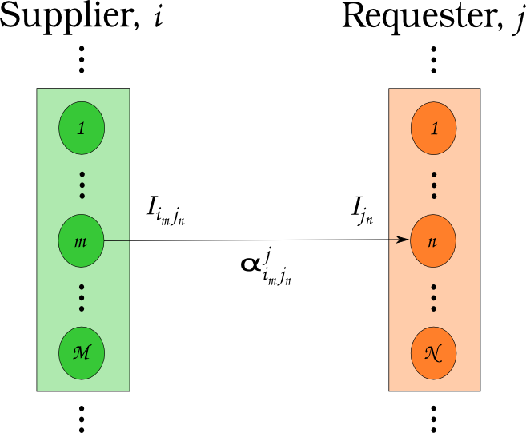

CEP 18 - Dynamic Resource Exchange Procedure
********************************************

:CEP: 18
:Title: Dynamic Resource Exchange Procedure
:Last-Modified: 2013-09-10
:Author: Matthew Gidden
:Status: Draft
:Type: Standards Track
:Created: 2013-09-02

Abstract
========

An updated procedure for determining dynamic resource exchanges is presented. It
occurs nominally in four phases: a request for proposals, a response to the
request for proposals, preference assignment, and resolution. The first three
phases encompass an information gathering procedure, providing generic
information to any market exchange solution procedure. The final phase is
modular in that any algorithm can be used to solve the exchange. This modular
phase takes the place of the current implementation of MarketModels. The
procedure is informed by agent-based supply chain modeling literature
:cite:`julka_agent-based_2002` with modifications as required for our
nuclear-engineering domain specific information.

Motivation
==========

The current implementation of Markets in Cyclus includes a base MarketModel
class which is intended to be derived from by concrete, dynamically loaded,
user-defined classes. Markets are assigned specific commodities, i.e., there is
no communication across demand for multiple commodities. Markets act in the
simulation during the **resolve** step, which occurs after the **tick** and
before the **tock** for each timestep. 

Markets are communicated with through Messages. Communication to Markets utilize
the Transaction class to define whether the communication is an **offer** or
**request** for the Market's commodity. Communication is initialized by
Facilities, but there is no Cyclus core support for this operation. Individual
derived Facilities (e.g., the SinkFacility and SourceFacility in Cycamore)
define this functionality during their **HandleTick** functions. This
interaction is invoked during the tick phase in the current facility invocations
purely by practice. There is no requirement for such behavior; for example, one
could send an offer or request during the tock phase, which would be ignored
until the proceeding resolve step. In general lookups for specific markets and
dynamic casts to communicate with those markets are required.

The MarketModel class defines a pure virtual function, **Resolve**, which is
used by derived classes to determine the specific algorithm by which the market
is to be resolved. Markets receive proposed Transactions through their
Communicator class interface, which requires the **ReceieveMessage** function to
be defined by the market. The Resolve function then invokes the derived-class
algorithm to determine matches for the given set of offers and requests.

This class structure and interaction has worked well for a proof-of-prototype
use of Cyclus to model simple, once-through fuel cycles. However, an extension
or refactor is necessary to model more complicated fuel cycles for a number of
reasons. First, there is no support for facilities that can offer or request
resources across multiple commodities if a capacity is included. The current
implementation of the market system can only provide this notion by ordering the
markets in some arbitrary manner. Second, and perhaps least important of these
reasons, is that the Transaction class is ambiguous with respect to proposed
offers, requests, and matched offers and requests. This ambiguity can be
addressed during a refactor to provide clarity to future developers. Third,
there is no defined structure to the market-facility interaction. This
interaction is the core purpose of Cyclus' Dynamic Resource Exchange concern,
but users and developers are required to define their own interactions (e.g.,
sending offers during the tick phase). The original conception of the tick-tock
paradigm was to define a notion of time before the resource exchange (i.e., a
pre-step) and after the resource exchange (i.e., a post-step). The current
implementation includes the resource exchange concern during both of these
phases, complicating the process and mixing concerns. Finally, there is no
response mechanism for facilities to delineate between resources of a given
commodity. The current implementation places this concern upon the market's
resolution algorithm, rather than on the facility via some communication
mechanism, again muddying the concerns associated with the resource exchange.

Rationale
=========

The proposed refactor addresses each of the issues provided in the previous
section. The notion of market models is redefined, separating the collection of
supply-demand information from the algorithm used to match suppliers with
consumers. The information gathering framework is structured and core-based. It
is top-down in the sense that it queries facilities for their supply and demand
rather than requiring facility-based notifications. Accordingly, concerns are
appropriately separated: the information is gathered by the core at the
beginning of the resolve step, allowing facilities to inform a given market
algorithm; market algorithms determine the set of offers and requests to be
matched; and the core sends out resolved transactions. Message passing to and
from markets is addressed by the framework, providing facilities, institutions,
and regions each with specific, defined agency.

Supply-Demand Framework
-----------------------

Supply-demand determination at any given time step occurs in nominally three
steps, or **phases**, and the terminology of this "phase space" is taken from
previous supply chain agent-based modeling work
:cite:`julka_agent-based_2002`. Importantly, this information-gathering step is
agnostic as to the actual matching algorithm used, it is concerned only with
querying the current status of supply and demand and facility preference thereof
in the simulation.

The first phase allows consumers of commodities to denote both the quantity of a
commodity they need to consume as well as the target isotopics, or quality, by
**posting** their demand to the market exchange. This posting informs producers
of commodities what is needed by consumers, and is termed the **Request for
Proposals** (RFP) phase. Consumers are allowed to over-post, i.e., request more
quantity than they can actually consume, as long as a corresponding capacity
constraint accompanies this posting. Further, consumers are allowed to post
demand for multiple commodities that may serve to meet the same combine
capacity. For example, consider an LWR that can be filled with MOX or UOX. It
can post a demand for both, but must define a preference over the set of
possible commodities it can consume. Another example is that of an advanced fuel
fabrication facility, i.e., one that fabricates fuel partially from separated
material that has already passed through a reactor. Such a facility can choose
to fill the remaining space in a certain assembly with various types of fertile
material, including depleted uranium from enrichment or reprocessed uranium from
separations. Accordingly, it could demand both commodities as long as it
provides a corresponding constraint with respect to total consumption.

At the completion of the RFB phase, the market exchange will have a set of
consumption portfolios, :math:`P`, for each requester in the exchange, shown as
the orange box in Figure 1. Each portfolio consists of a set of requests,
:math:`R`, a cardinal preferential ordering over the requests, :math:`\alpha_R`,
and possibly a set of constraints over the requests, :math:`c_R`. A constraint
can be associated with more than one request. Take the previous example of MOX
and UOX for an LWR. Each is a separate request, but a constraint may be
concerned with the combination of the two. Another example is a repository that
may request many commodities, but has a radiotoxicity constraint over any
commodities it receives for a given time step.

A request consists of a quantity, :math:`q_r`, and a target isotopic vector,
:math:`I_r`. Consumers are allowed to offer the null set of isotopics as their
profile, effectively providing no information. In general, a requester may have
more than one request (nodes in Figure 1) per commodity. A prime example is a
reactor that chooses to requests fuel assemblies, of which they request many.

**Figure 1:** A Requester during the RFB Phase, where a collection of requests 
(as nodes) is shown.

The second phase allows suppliers to **respond** to the set of consumption
portfolios, and is termed the **Response to Request for Proposals** (RRFP) phase
(analogous to Julka's Reply to Request for Quote phase). Each consumption
portfolio is comprised of requests for some set of commodities, and suppliers of
those commodities are allowed to respond to demand. Suppliers, like consumers,
are allowed to offer the null set of isotopics. 

A supplier may have its production constrained by more than one parameter. For
example, a processing facility may have both a throughput constraint (i.e., it
can only process material at a certain rate) and an inventory constraint (i.e.,
it can only hold some total material). Further, the facility could have a
constraint on the quality of material to be processed, e.g., it may be able to
handle a maximum radiotoxicity for any given time step which is a function of
both the quantity of material in processes and the isotopic content of that
material. 

At the completion of the RRFP phase, the market exchange will have a set of
supplier responses for each request. The supplier responses define the possible
connections between supplier and producer facilities, i.e., the arcs in a graph
of a matching problem. A response is comprised of a proposed isotopic profile
the supplier is able to provide. Furthermore, constraints can be associated with
the set of responses to be applied by the market matching algorithm. A
constraint must identify the requests that it is associated with, define a
capacity, and define a translation function. The translation function takes a
request as an argument and returns a value in the units of the constraint. A
prime example is an enrichment facility, which may be able to enrich many
orders, but is constrained by the total SWUs it can provide.

**Figure 2:** A Supplier during the RRFP Phase, where a collection of commodity
supplies (as nodes) is shown.

The final phase of the information gathering procedure allows consumer
facilities to adjust their set of preferences and for managers of consumer
facilities to affect the consumer's set of preferences, as described in the
remaining sections. Accordingly, the last phase is termed the **Preference
Adjustment** (PA) phase. Preference adjustments can occur in response to the set
of responses provided by producer facilities. Consider the example of a reactor
facility that requests two fuel types, MOX and UOX. It may get two responses to
its request for MOX, each with different isotopic profiles of the MOX that can
be provided. It can then assign preference values over this set of potential MOX
providers. Another prime example is in the case of repositories. A repository
may have a defined preference of material to accept based upon its heat load or
radiotoxicity, both of which are functions of the quality, or isotopics, of a
material. In certain simulators, limits on fuel entering a repository are
imposed based upon the amount of time that has elapsed since the fuel has exited
a reactor, which can be assessed during this phase. The time constraint is, in
actuality, a constraint on heat load or radiotoxicity (one must let enough of
the fission products decay). A repository could analyze possible input fuel
isotopics and set the arc preference of any that violate a given rule to 0,
effectively eliminating that arc.

**Figure 3:** A supplier-consumer pair with request isotopics, response 
isotopics, and an associated preference.

Institutions and Regions in Cyclus are provided in order to add granularity to
the levels of relational modeling available to a user or developer. Both types
of agents or models in Cyclus can possibly be allowed to affect preferences
during the PA phase. A slightly longer discussion is included below.

Facility Agency
+++++++++++++++

Facilities in Cyclus are abstracted to either consumers or suppliers of
commodities, and some may be both. Supplier agents are provided agency by being
able to communicate to the market-resolution mechanism a variety of production
capacity constraints in second phase of the information gathering
methodology. Consumer agents are provided agency by being able to assign
preferences among possible suppliers based on the supplier's quality of
product. Because this agency is encapsulated for each agent, it is possible to
define strategies that can be attached or detached to the agents at
run-time. Such strategies are an example of the Strategy design pattern
:cite:`vlissides_design_1995`.

Institutional Agency
++++++++++++++++++++

Institutions in Cyclus manage a set of facilities. Facility management is
nominally split into two main categories: the commissioning and decommissioning
of facilities and supply-demand association. The goal of including a notion of
institutions is to allow an increased level of detail when investigating
regional-specific scenarios. For example, there exist multi-national
enterprises, such as AREVA, that operate fuel cycle facilities in a variety of
countries, or regions. Furthermore, there are international governmental
organizations, such as the IAEA, have proposed managing large fuel cycle
facilities that service many countries in a given global region. A fuel bank is
an example of such a facility. 

Accordingly, institutions in this proposal are able to augment the preferences
of supplier-consumer pairs that have been established in order to simulate a
mutual preference to trade material within an institution. Of course, situations
arise in real life where an institution has the capability to service its own
facilities, but choose to use an outside provider because of either cost or time
constraints. Such a situation is allowed in this framework as well. It is not
clear how such a relationship should be instantiated and to what degree
institutions should be allowed to affect their managed facilities'
preferences. This issue lies squarely in the realm of simulation design
decisions, part of the **art** of simulation. Accordingly, the strategy of
affecting preferences is encapsulated within the full preference allocation
phase in order to allow for further modularity of relational options between
agents.

Regional Agency
+++++++++++++++

Regions are provided agency by their ability to affect preferences between
supplier-consumer facility pairs in the PA phase, much like institutions. The
ability to perturb arc preferences between a given supplier and a given consumer
allows fuel cycle simulation developers to model relatively complex interactions
at a regional level, such as tariffs and sanctions. Constraints to cross-border
trading can also be applied. For example, a region could place constraints on
the total amount of a given commodity type that is able to flow into it or out
of it into a different region. Such constraints could applied not only to bulk
quantities of a commodity, but also to the quality of each commodity. Such a
mechanism could be used to model interdiction of highly-enriched uranium
transport, for example.

**Figure 4:** Information Gathering Phase Order.

.. blockdiag code below

    http://interactive.blockdiag.com/?compression=deflate&src=eJztVd1qwyAYvd9TfLjrQVihpJQMmsKgd2n6AMUuX9KAqDMKKyHvXqNbfrbsCexBQY-KcvQc2yeAAktqmD5XShh5_hBMKEiAC45bCBETSZorlWjFsMrwAouL-Nr2w7aQo0F1gxw_DTYaVUPg5e2HPRkpWT2QwyTIFJaW9Ju46kSH1rWB0QuyhOTvGVk-F4C7noQ8R1GcxunStLDgRFm4jKDRi9L9fmEPOIxGs74m-T9eCw2zbEnjeB2Fmi3TQBlzfHDUt5umcZ3tyEy-zWb1ut97Tqgauaa6Ftw-NymUVrTWfo8_30L_Vxx4o6f9HKt-rWf8Kbo7GUM8HQ

    blockdiag {
    default_group_color = none;                                                                                                                    
    default_shape = roundedbox;                                                                                                                    
    
    "Query Requesters" -> "Query Suppliers" -> "Requester Prefs"

    group {
    label = "RFP"
    color="#008B8B"
    "Query Requesters"
    }

    group {
    label = "RRFP"
    color="#B8860B"
    "Query Suppliers"
    }

    group {
    label = "PA"
    color="#9932CC"
    orientation = portrait
    
    "Requester Prefs" -> "Inst Prefs" -> "Region Prefs"
    }
    }

Market Resolution
-----------------

Upon completion of the information gathering step, the market resolution
function will be called. The current "null market" behavior is defined as a
"greedy matching" algorithm. Such an algorithm as currently implemented naively
matches consumers with suppliers without particular regard for preference of
commodity or resource. Accordingly, a similar algorithm will be implemented that
greedily matches supplier and requester based on the requester's highest
preference, accounting for multiple commodity markets and associated production
capacities. The matching algorithm used by a market is modular, and replaces the
notion of the MarketModel.

Specification \& Implementation
===============================

Each major phase method and associated classes are treated. Method inputs and
outputs are described as well as known issues dealing with their
implementation. The members and methods of proposed classes are also
described. Because the phases utilize new classes and containers, those are
described first.

Constituent Classes and Containers
----------------------------------

Request
+++++++

A Request encapsulates the information required to analyze commodity requests
from facilities in a dynamic manner. A facility may have more than one Request
associated with it at any given time step.

1. A commodity

2. A target resource, i.e., its quantity and quality. 

3. A preference for that resource/commodity pairing

4. A requester

.. code-block:: c++

   /// A Request encapsulates all the information required to communicate the 
   /// needs of an agent in the Dynamic Resource Exchange, including the 
   /// commodity it needs as well as a resource specification for that commodity
   class Request {
    public:
     /// @return the commodity associated with this request
     std::string commodity();

     /// @return the target resource for this request
     cyclus::Material::Ptr target();
     
     /// @return the preference value for this request
     double preference();

     /// @return the model requesting the resource
     cyclus::FacilityModel* requester();
   };

RequestResponse
+++++++++++++++

A RequestResponse encapsulates the information required to analyze responses to
requests for a commodity, and includes:

1. A reference request

2. A response resource, i.e., its quantity and quality. 

3. A responder

.. code-block:: c++

   /// A RequestResponse encapsulates all the information required to 
   /// communicate a response to a request for a resource, including the 
   /// resource response and the responder.
   class RequestResponse {
    public:
     /// @return the request this response is associated with
     cyclus::Request& request();

     /// @return the target resource for this request
     cyclus::Material::Ptr response();

     /// @return the model responding to the request
     cyclus::FacilityModel* responder();
   };

RequestConstraint
+++++++++++++++++

A RequestConstraint provides an ability to determine constraints on a facility's
series of requests. Some constraints may require conversion functions which
convert a given resource specification into a measurable value related to a
constraint. At present, two types of RequestConstraints are provided, given the
available use cases.

First, a capacity constraint, which is comprised of:

1. A constraining value

2. A conversion function, whose function signature is
   
3. The set of requests associated with the constraint, which may be a subset of
   the total requests provided by the facility.

Repositories in Cyclus provide a use case for this feature. In general,
repositories could request many different commodities, e.g., "Used LWR Fuel",
"Separated TRU", "Recycled Uranium", etc. There is a limit, though, on what can
be accepted at any given timer period, be it of total quantity, heat load, or
some other metric.

.. code-block:: c++

   typedef double (*Converter)(cyclus::Material::Ptr)

   /// A CapacityConstraint provides an ability to determine an agent's 
   /// constraints on resource allocation given a capacity.
   class CapacityConstraint {
    public:
     /// @return a pointer to a conversion function that converts a request 
     /// into the units of this constraint
     Converter CapacityConverter();
     
     /// @return the capacity associated with this constraint
     double capacity();

     /// @brief add a request that's associated with this constraint
     void AddRequest(Request&);
   }

Second, an exclusivity constraint, which is comprised of:

1. The set of requests which must be satisfied exclusively

Reactors that can be fueled by more than one fuel source provide a use case for
this feature. Take for example a reactor that can be fuel with UOX or MOX. It
requires the ability to tell any solution mechanism to provide it with one fuel
type *or* the other, but not both.

.. code-block:: c++

   /// A ExclusiveConstraint provides an ability to determine an agent's 
   /// constraints on resource allocation given exclusivity among requested 
   /// resources, i.e., if some resource is provided, it cannot accept other 
   /// resources. An example is a reactor that could take MOX or UOX, but can 
   /// not take both.
   class ExclusiveConstraint {
    public:
     /// @brief add a request that's associated with this constraint
     void AddRequest(Request&);
   }

ResponseConstraint
++++++++++++++++++

A ResponseConstraint provides an ability to determine constraints on a
facility's ability to supply resources. A constraint is generally associated
with a single commodity, and there may be one or more constraints associated
with a commodity. An example is an enrichment facility which has a process
constraint, i.e., it can only process a certain SWU amount per time step, and an
inventory constraint, i.e., it can only process orders up to its amount of
natural uranium on hand. A ResponseConstraint is very similar to the previously
described CapacityConstraint and has the following members:

1. A constraining value

2. A conversion function, whose function signature is
   
3. The set of responses associated with the constraint.

.. code-block:: c++

   typedef double (*Converter)(cyclus::Material::Ptr)

   /// A ResponseConstraint provides an ability to determine an agent's 
   /// constraints on resource allocation given a capacity.
   class ResponseConstraint {
    public:
     /// @return a pointer to a conversion function that converts a response 
     /// into the units of this constraint
     Converter ResponseConverter();
     
     /// @return the capacity associated with this constraint
     double capacity();

     /// @brief add a response that's associated with this constraint
     void AddResponse(Response&);
   }

RequestPortfolio
++++++++++++++++

A request portfolio is a container for information related to an agent's set of
requests for the given timestep, having the following members:

1. A requester

2. A set of Requests

3. A set of CapacityConstraints

4. A set of ExclusiveConstraints

.. code-block:: c++

   /// A RequestPortfolio contains all the information corresponding to a 
   /// requester of resources in the exchange
   struct RequestPortfolio {
    public:
     /// @return the model associated with the portfolio
     cyclus::FacilityModel* requester;

     /// @return the set of requests in the portfolio
     std::set<Request> requests;

     /// @return the set of constraints over the requests based on request 
     /// capacity
     std::set<CapacityConstraint> cap_constraints;

     /// @return the set of constraints over the requests based on request 
     /// exclusivity
     std::set<ExclusiveConstraint> excl_constraints;
   };

ResponsePortfolio
+++++++++++++++++

A response portfolio is a container for information related to an agent's set of
responses for the given timestep. A response portfolio is provided for each
commodity an agent offers and has the following members:

1. A responder

2. The commodity associated with the responses

3. A set of Responses

4. A set of ResponseConstraints

.. code-block:: c++

   /// A ResponsePortfolio contains all the information corresponding to a 
   /// responder of resources in the exchange
   struct ResponsePortfolio {
    public:
     /// @return the model associated with the portfolio
     cyclus::FacilityModel* responder;

     /// @return the commodity associated with the portfolio
     std::string commodity();

     /// @return the set of responses in the portfolio
     std::set<Response> responses;

     /// @return the set of constraints over the responses
     std::set<ResponseConstraint> constraints;
   };

RFP Procedure
-------------

Input 
++++++

The set of facilities requesting/demanding one or more commodities at the given
time step.

Output
+++++++

A Set of RequestPortfolios.

Unknown 
++++++++

How to construct the input list; some different options exist. 

1. A naive approach would be to query every facility to determine demand at each
   time step.

2. A less naive approach would be to have facilities register with an entity
   that they generally demand some commodity. The set of demanding facilities
   could then be queried.

3. Facilities could register with an entity at the end of their tick step if
   they demand a commodity.

Approach 1 is the easiest to implement but the least efficient. Approach 2 is
unlikely to provide much more efficiency in simulations where the majority of
facilities consume resources. Approach 3 provides the most efficiency of the 3
in that it is guaranteed to query only those facilities that presently demand a
commodity. It requires a slight overhead for module developers in that they must
notify the core that their facility has a demand rather than the core explicitly
querying it.

RRFP Procedure
--------------

Input 
++++++

The set of facilities supplying one or more commodities and the set of requests
for commodities at the given time step.

Output
+++++++

A set of ResponsePortfolios.

Unknown
+++++++

The RRFP procedure has the same unknown as the RFP procedure.

PA Procedure
------------

At the beginning of the Preference Assignment procedure, possible connections
between supplier and consumer facilities are known. It is useful to think of
these connections as arcs on a graph, where each arc represents a request that
could be met by a supplier. The RequestPortfolios associated with a facility
represent nodes in this graph with constraints associated with one or more of
the arcs. The ResponsePortfolios represent supplier nodes with constraints over
all incoming request arcs.

Input 
++++++

The set of ResponsePortfolios, providing the arcs on the supply-demand graph.

Output
+++++++

Requester-based preferences for each supply-demand pair, with possible
modifications made by the managers of the requester.

Unknown
+++++++

The interaction of the manager perturbation of the the requester preferences
does not have many well-defined used cases. The primary use case to date is
regional preference modeling. The primary question concerning this algorithm is
the timing of the perturbation. Two choices exist:

1. Apply perturbations immediately after the requester assigns a preference.

2. Apply perturbations after all managed requesters assign their preferences.

The second approach allows decision making given the aggregate of possible
connections, i.e., it provides more information. However, its implementation
will be more complicated and is perhaps unnecessary if a use case is not known.

MarketAlgorithm
---------------

The MarketAlgorithm is a virtual base class for possible algorithms to solve the
supply-demand matching algorithm. 

Input
+++++

The set of ResponsePortfolios with associated preferences.

Output
++++++

The set of chosen supply-demand pairs to execute.

MarketExecution
---------------

The final step of the market resolution phase, the execution of the market
provides suppliers with the full list of requests to be met. Suppliers are then
asked to return a resource for each of the provided requests. Requesters are
then notified of all orders that have been filled.

Backwards Compatibility
=======================

This CEP proposes a number of backwards incompatibilities. 

- The MarketModel is replaced by an information gathering procedure and a
  modular MarketAlgorithm

- Transactions are reduced to accepted offers, rather than proposed offers and
  requests

- The Message and Communicator classes are no longer needed

Document History
================

This document is released under the CC-BY 3.0 license.

References and Footnotes
========================

.. rubric:: References

.. bibliography:: cep18/cep-0018-1.bib
   :cited:
