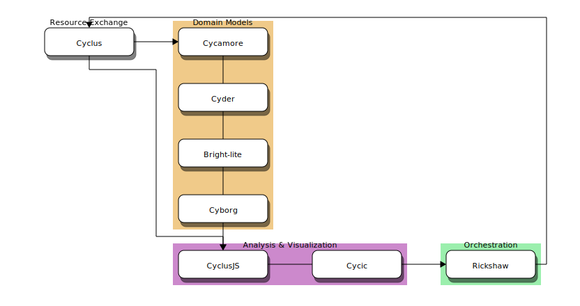

CEP 2 - Separation of Concerns in the |cyclus| Ecosystem
********************************************************

:CEP: 2
:Title: Separation of Concerns in the |cyclus| Ecosystem, or Where Do I Put My Code?
:Last-Modified: 2013-08-27
:Author: Anthony Scopatz
:Status: Accepted
:Type: Process
:Created: 2013-08-05

Abstract
========
The purpose of this CEP is to clearly delineate the purpose -- technical and 
cultural -- of the various projects which make up the |cyclus| ecosystem.  
Projects, for purposes here, are unique entities which have independent lifetimes
and central concerns. Many projects may try to tackle the same concern but no 
single project may tackle more than one concern.  Concerns, like projects, may 
be dependent upon one another.

The central concerns in the |cyclus| ecosystem are 
**dynamic resource exchange simulation** (DRES),  **domain models** (DM), and 
**analysis & visualization** (A&V).

Concerns
========
A rich fuel cycle simulator solution has three primary organizational pieces that 
must have robust implementations.  These pieces are a mechanism for solving for 
resource exchange in the fuel cycle, relevant and interesting  models for the 
domains of interest (physics, economics, policy, etc.), and a 
programmatic method for parsing, slicing, aggregating, and displaying 
simulation results. As an effectively designed suite of software, these concerns 
should be completely separated from one another 
and interact only through well-defined interfaces [1]_.  This 
independence allows both users and developers to reason about each concern 
without needing to consider upstream effects.  Coupled with a stable interface 
or API, this independence also allows users and developers to ignore downstream 
effects in most cases.

The domain model concern is dependent only on the resource exchange concern.  
However, the analysis & visualization concern is directly dependent on both the 
resource exchange and the domain model concerns.  These relationships may be seen 
in Figure 1.

.. figure:: cep-0002-1.svg
    :align: center

    **Figure 1:** Dependencies Between Concerns

.. blockdiag code below

    http://interactive.blockdiag.com/?compression=deflate&src=eJxNjstqQkEMQPfzFcFFd37BxYJQl9200I0WiTNRA5nkMg-5Kv57p9fnbsg5k5wzOIBAW6xS1rtktV97E0swAzWl7oXmPfbU5k3SQGFjQ-caTpRp8LAU3JDMJh9HxcgevihbTZ5Wuhj8HnVH8M2xChY2nfyOiy1GC8-fFpEVPi2Q5KuBKgc-PYy5ohwzZ3hb6Q_nisKnx76mj_1wbi8AS0xaRtqae0slIZcR3Yqn77eC_0sX9wxq4Hq4c6_yfeYuf_KbZsM

    { 
      default_group_color = none;
      default_shape = roundedbox;

      resexc [label="Dynamic Resource\nExchange Simulation"];
      dommod [label="Domain Models"];
      anlviz [label="Analysis &\nVisualization"];

      group {
        orientation = portrait
        resexc -> dommod;
      }

      dommod -> anlviz;
      resexc -> anlviz;

    }

Dynamic Resource Exchange Simulation
------------------------------------
The dynamic resource exchange simulation concern is the basis for all other fuel 
cycle concerns.  This dictates and manages how resources flow through a system and 
the time paradigm used to model the system.  A number of possible representations of 
system elements exist.  Two main options stand out: 1) *individual-based* models in 
which every actor receives its own instance, and 2) *fleet-based* models where
like actors are grouped together and act identically.  Resource exchange may be 
implemented using a strict *agent-based* modeling [2]_ approach or strict 
*system dynamics* methods [3]_.  However, these two paradigms are not restrictive
and implementations may pull from a variety of algorithms as needed.

Furthermore, the choice of how to represent time evolution may fall into one 
of the following categories:

* **Equilibrium** - initial transients are ignored or discarded in favor of a steady 
  state solution.
* **Quasi-static** - initial transients are computed but natural time (sec, min, etc) 
  are replaced with an easier to compute number of passes through a given 
  actor.
* **Discrete time** - natural time is implemented but discretized to some minimum 
  and constant dt.  
* **Adaptive time** - natural time is implemented and discretized, but the value of 
  dt may change from time step to time step, allowing for finer resolution only 
  when needed.
* **Continuous time** - natural time is implemented as a continuous variable.

It is important to note that this concern is a solely mathematical endeavor 
and should not implement any domain-specific calculations. However, the 
implementation may be *domain-aware* in that it may know about certain sub-type
specializations.  For example, materials and U.S. Dollars are both sub-types of 
resources.  Still, the dynamic resource exchange simulation concern is not allowed 
to discriminate between any of these specializations nor perform domain-specific 
computations (such as transmuting a material or pricing a derivative).

The dynamic resource exchange simulation concern is also responsible for all 
optimizations of the  fuel cycle.  This includes optimizing resource exchange 
between multiple actors as well as finding the initial conditions which optimize 
a value function subject to some constraints.  

Domain Models
-------------
The purpose of the domain models concern is to provide interesting, accurate, and 
relevant models of various aspects of the fuel cycle.  These aspects are often the
technical meat of the fuel cycle analysis.  However, they may be mathematically 
separated from resource exchange.  This concern ensures that those mathematical
separations remain distinct in the software.  There are a number of domain models 
which are pertinent to fuel cycle calculations:

* Physics
* Chemistry
* Health Physics
* Economics
* Public Policy
* and more!

The implementation of specific domain computations should rely on the system dynamics
for all systematic flow and timing needs.  The implementation of the domain 
calculations should be completely separated from the system dynamics concern.
This establishes a clean interface between these two concerns.

For example, take an enrichment facility which is asked to compute product and tails 
enrichments.  In the initialization of this calculation, the dynamic resource 
exchange simulation concern hands off the simulation time (t), the time delta (dt), 
and the initial feed material to the underlying physics model.  The physics model 
then computes the desired outputs without further interaction with the resource 
exchange model.  Lastly, the outputs are returned to the DRES model.

Analysis & Visualization
------------------------
The purpose of the analysis & visualization concern is to supply aggregation and 
introspection into the simulation outputs.  The analysis may take place at both
high and low levels, common aggregations should be easy to perform, and static 
and interactive visualization should be provided as a mechanism for easy human 
consumption.  All post-processing of simulation data falls under this concern.

The analysis & visualization concern is dependent directly on both the dynamic 
resource exchange simulation concern and the domain models concern.  This is because 
meaningful inspection of simulation data requires parameters from both concerns.  
Note that these dependencies are independent.  The analysis & visualization tools 
must handle the case where only DRES models are used.  However, if domain models 
are used and the analysis & visualization is aware of these domain models, 
all DRES parameters are guaranteed to also be present.

The |Cyclus| Ecosystem
======================
While many fuel cycle simulators may choose to implement all of the above concerns 
in a single project, each concern in the |cyclus| ecosystem is implemented in
its own project.  Many projects may satisfy the needs of a concern.  However, no 
project may try to address multiple concerns. This provides a clear guideline 
for which projects should accept which kinds of code.  

If for some reason ambiguities exist, first attempt to refactor the code at hand
with these concerns in mind.  If this fails because of a fundamental ambiguity
or mixing of multiple concerns, place the code with the most dependent concern.  
For example, if it is not clear if a class belongs with domain models or with the
resource exchange put it with the domain models to be safe.

The |cyclus| development team currently provides and supports three projects, 
one for each concern:

* `Cyclus`_ - Dynamic Resource Exchange Simulation (individual actors, discrete time)
* `Cycamore`_ - Domain Models
* `Cyclist`_ -  Analysis & Visualization

The dependency graph for these projects is similar to the graph of the concerns.
Figure 2 displays this graph along with other projects which implement or may 
in the future implement this concern ('?').

    **Figure 2:** Dependencies Between Projects is |Cyclus| Ecosystem.

.. blockdiag code below

    http://interactive.blockdiag.com/?compression=deflate&src=eJyNUbFOwzAQ3fMVJ1dCMCB1bBUFVEzZWBhYEKqu9jWx5Pgi20Fpq_47JklpKha2u_fevXtnHzMATTtsbdyUnttmo9iyhwIcO8onbKiwoYQnkdOkt9zlWaL7IfAUqFNwTAAAe0MuYjTskr5hHz2amPecxS3ZQrxR4NYrgnWnKnQliYGWe2XbMNSni73mumY92o8Wz1yjcfDKmmwYx8_ZxexlLleL5cUVa_Z07jT5oRRP3pRVvH28E392orNf5vD_k1YO7T6YADfwbkKL1hx6_TRaIWZSLpZSTs41If42Rk1iDG8B9w9X-a_Qn2EY0V4xxT92bNNHfebZ6RsduJIm

    {
      default_group_color = none;
      default_shape = roundedbox;

      group resexc {
        orientation = portrait;
        label="Resource Exchange";
        Cyclus;
        }

      group dommod {
        label="Domain Models";
        color = "#F0CA89";
        Cycamore;
        Cyder;
        "Bright(?)";
        }

      group anlviz {
        orientation = portrait;
        label="Analysis & Visualization";
        color="#CC89CC";
        Cyclist;
        Cycic;
        }

      Cyclus -> Cycamore;
      Cyclus -> Cyclist ;
      Cycamore -> Cyclist [folded];
    }

Toolkits
--------
In any real system, there is glue code which holds the projects together in a 
cohesive manner.  A collection of such utilities is called a *toolkit*.  While 
toolkits are critically important to well functioning software their components
are united only in that "should be useful."  There need not be underlying concept
tying them together.  For this reason, toolkits are not a top-level concern on 
par with resource exchange, domain models, and analysis & visualization.

Instead, each project may have its own toolkit which contains utilities that 
corresponds most closely with its concern.  The toolkit provides a layer on top of 
the concern implementation.  Thus the toolkit will be aware of other parts of the 
project but the concern implementation should not call into elements from the toolkit.

For example, resources are part of the primary concern of |cyclus|.  Thus 
a ResourceBuffer class would be part of the |cyclus| toolkit.  This is because 
resource exchange can be implemented without a ResourceBuffer but such a class 
is useful to provide to domain model developers.  Furthermore, the buffer
applies to all resources is not specific to any domain. Thus this class should be 
included next to the resource exchange implementation.

Summary
=======
Many other ecosystems and projects model the fuel cycle and make their own choices
about how to separate -- or not -- the concerns of resource exchange, domain models, 
and analysis and visualization.  The |cyclus| ecosystem places all concerns in 
separate projects.  This allows a high degree of modularity between software and
developers.  Such an ecosystem enables experts to contribute their specific 
knowledge base in a way that is independent from other parts of the ecosystem
while simultaneously integrating well with the rest of the ecosystem.  Finally, 
this document provides instructions on where to implement tasks based on the task's
primary concern.

Document History
================
This document is released under the CC-BY 3.0 license.

References and Footnotes
========================

.. [1] http://en.wikipedia.org/wiki/Separation_of_concerns
.. [2] http://en.wikipedia.org/wiki/Agent-based_model
.. [3] http://en.wikipedia.org/wiki/System_dynamics

.. _Cyclus: https://github.com/cyclus/cyclus
.. _Cycamore: https://github.com/cyclus/cycamore
.. _Cyclist: https://github.com/cyclus/cyclist2
