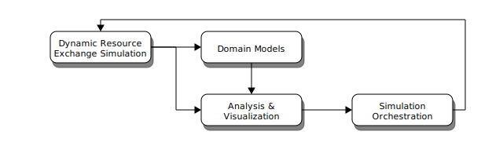

CEP 2 - Separation of Concerns in the *Cyclus* Ecosystem
********************************************************

:CEP: 2
:Title: Separation of Concerns in the *Cyclus* Ecosystem, or Where Do I Put My Code?
:Last-Modified: 2013-08-05
:Author: Anthony Scopatz
:Status: Draft
:Type: Process
:Created: 2013-08-05

Abstract
========
The purpose of this CEP is to clearly deliniate the purpose -- technical and 
cultural -- of the various projects which make up the *Cyclus* ecosystem.  
Projects, for purposes here, are unique entities which have independent lifetimes
and central concerns. Many projects may try to tackle the same concern but no 
single project may tackle more than one concern.  Concerns, like projects, may 
be dependent upon one another.

The central concerns in the *Cyclus* ecosystem are **system dynamics**, 
**domain models**, and **analysis & visulaization**.

Concerns
========
A rich fuel cycle simulator solution has three primary organizational pieces that 
must have robust implmentations.  These pieces are a mechanism for solving for 
resource exchange in the fuel cycle (system dynamics), relevant and interesting 
models for the domain of interest (physics, economics, policy, etc.), and a 
programatic method for parsing, slicing, aggregatiting, and displaying 
simulation results (analysis & visulaization). As an effectively designed suite of 
software, these concerns should be completely separated from one another [#1]_.  This 
independence allows both users and developers to reason about each concern 
without needing to consider upstream effects.  Coupled with a stable interface 
or API, this independence also allows users and developers to ignore downstrem 
effects in most cases.

The domain model concern is dependent only on the system dynamics' concern.  
However, the analysis & visualization concern is directly dependent on both the 
system dynamics and the domain model concerns.  These relationships may be seen 
in Figure 1.

    **Figure 1:** Dependencies Between Concerns

.. blockdiag code below

    http://interactive.blockdiag.com/?compression=deflate&src=eJxNjsEKwjAMQO_9iuDBm18wFIRdPQleVEZmqwbaZLSd2A3_3W7O6S3kPZLXgwLQ5oqtjdXNS9tUF7HiYQ0sbIo_Gu7YmLzPEmuja3kWKuOQgk4MR4u1sevFPoVoHJSJ0dElLM7jCXFO9OyU4pAYdqKNnQxk-6BuNraMNgUKsDzxgUKLljqMJDzYWR9Loc8TgHgyHEea6xrx0SPFEU1tq81UMHx6qV9QBp_HhfqXvzv1Um_g616r

    {
      default_group_color = none;
      default_shape = roundedbox;

      sysdyn [label="System Dynamics"];
      dommod [label="Domain Models"];
      anlviz [label="Analysis &\nVisualization"];

      group {
        orientation = portrait
        sysdyn -> dommod;
      }

      dommod -> anlviz;
      sysdyn -> anlviz;

    }

include optimizations

Other Ecosystems
================

Document History
================
This document is released under the CC-BY 3.0 license.

References and Footnotes
========================

.. [#1] http://en.wikipedia.org/wiki/Separation_of_concerns
