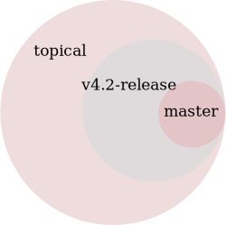

CEP 3 - |Cyclus| Release Procedure
********************************************************

:CEP: 3
:Title: |Cyclus| Release Procedure
:Last-Modified: 2014-09-11
:Author: Anthony Scopatz
:Status: Accepted
:Type: Process
:Created: 2013-10-25

Abstract
========
The purpose of this document is to act as a guideline and checklist for how 
to release the |cyclus| core code base and the supported projects in the ecosystem.

The |Cyclus| Ecosystem
======================
The very first thing to do when preparing for an upcoming release is to elect 
a release manager.  This person has the special responsibility of making sure 
all of the following tasks are implemented.  Therefore, their judgment for the 
placement of issues and code stability must be adhered to.  

The |cyclus| ecosystem has a few projects which are all released together. 
(This may change in the future a development diverges and the core becomes more 
stable.)  The projects that are under the release manager's purview are:

* `Cyclus`_ 
* `Cycamore`_ 
* `Cycstub`_ - copy the files from |cyclus| core's ``stub/`` dir into the 
  cycstub's ``src/`` dir.

The projects which are not yet under the release managers purview are:

* `Cyclist`_ 
* `CIclus`_

Release Candidates & Branches
=============================
All projects should have a release candidate ('-rc1') that comes out 2 - 5 days
prior to the scheduled release.  During this time, no changes should occur to 
a special release branch ('vX.X.X-release').  

The release branch is there so that development can continue on the 
develop branch while the release candidates (rc) are out and under review.  
This is because otherwise any new developments would have to wait until 
post-release to be merged into develop to prevent them from accidentally 
getting released early.    

As such, the 'vX.X.X-release' branch should only exist while there are 
release candidates out.  They are akin to a temporary second level of staging 
to be used to keep master clean and safe.  As such, everything that is in this 
branch should also be part of develop.  Graphically, 

    **Figure 1:** Branch hierarchy under release.

Every time a new release candidate comes out the vX.X.X-release should be 
tagged with the name 'X.X.X-rcX'.  There should be a 2 - 5 day period of time 
in between release candidates.  When the full and final release happens, the 
'vX.X.X-release' branch is merged into master and then deleted.

If you have a new fix that needs to be in the next release candidate, you should 
make a topical branch and then pull request it into the release branch.  After this 
has been accepted, the topical branch should be merged with develop as well.

The release branch must be quiet and untouched for 2 - 5 days prior to the full 
release.

Project Checklist
=================
When releasing a |cyclus| project, make sure to do the following items in order:

1. Review **ALL** issues in the issue tracker, reassigning or closing them as needed.
2. Ensure that all issues in this release's milestone have been closed.  Moving issues
   to the next release's milestone is a perfectly valid strategy for completing this
   milestone. 
3. Perform maintainence tasks for this project, see below.
4. Write and commit the release notes.
5. Review the current state of documentation and make approriate updates.
6. Bump the version (in code, documentation, etc.) and commit the change.
7. If this is a release candidate, tag the release branch with a name that matches 
   that of the release: 

   * If this is the first release candidate, create a release branch called
     'vX.X.X-release' off of develop.  Tag this branch with the name 'X.X.X-rc1'.
   * If this is the second or later release candidate, tag the release branch 
     with the name 'X.X.X-rcX'.

8. If this is the full and final release (and not a release candidate), 
   merge the release branch into the master branch.  Next, tag the master branch 
   with the name 'X.X.X'.  Finally, delete the release branch.
9. Push the tags upstream
10. Create a DOI. See :doc:`CEP4 <./cep4>` for details.
11. Update release information on the website.

.. note:: 

    To distingush them, branch names have a ``v`` prefix (``vX.X.X``) while tag
    names lack this prefix (``X.X.X``).

Maintainence Tasks
==================
Each project may have associate maintenance tasks which may need to be performed at 
least as often as every micro release.

|Cyclus|
--------
**Update Pyne:**  PyNE source code is included and shipped as part of |cyclus|. As pyne
evolves, we'll want to have our version evolve as well. Here are the steps to do so.
These assume that in your HOME dir there are both the pyne and |cyclus| repos.  Remember 
to check in the changes afterwards.

.. code-block:: bash

    $ cd ~/pyne
    $ ./amalgamate.py -s pyne.cc -i pyne.h
    $ cp pyne.* ~/cyclus/src
    
**Update Nuclear Data:** PyNE also provides a nuclear data library generator which we use for 
our source data.  Occassionally, this needs to be updated as updates to pyne itself come out.
The command for generating |cyclus| specific nuclear data is as follows:

.. code-block:: bash

   $ cd ~/pyne
   $ nuc_data_make -o cyclus_nuc_data.h5 \
    -m atomic_mass,scattering_lengths,decay,simple_xs,materials,eaf,wimsd_fpy,nds_fpy

Once the file is generated it must be put onto rackspace.

**Update Gtest:** We include a copy of the fused Gtest source code within our 
source tree located in the ``tests/GoogleTest`` directory.  To keep up with 
Gtest's natural evolution cycle, please download the latest release of Google Tests 
and follow `the fused source directions here`_.  If we go too long without doing this, 
it could be very painful to update.

**Verify & Update API Stability:** Since Cyclus v1.0 we promise API stability. 
Luckily, we have a tool for keeping track of this mostly automatically.  
Every release please run the following command to verify that the release 
branch is stable:

.. code-block:: bash

    $ cd cyclus/release
    $ ./smbchk.py --update -t HEAD --no-save --check

If cyclus only has API additions, it is considered stable and the command will 
tell you so. If cyclus also has API deletions, then cyclus is considered 
unstable and a diff of the symbols will be prinited. 
**You cannot release cyclus if it is unstable!** Please post the diff to 
either the mailing list or the issue tracker and work to resolve the removed
symbols until it this command declares that cyclus is stable. It is 
probably best to do this prior to any release candidates if possible.

Once stable and there are no more code changes to be made, add the symbols
in this release to the database with the following command:

.. code-block:: bash

    $ cd cyclus/release
    $ ./smbchk.py --update -t X.X.X

where ``X.X.X`` is the version tag. This should alter the ``symbols.json`` 
file.  Commit this and add it to the repo.  

Cycamore
------------

On each new release (major, minor, micro), the release manager is responsible
for updating the regression test databases updated.

First, add the actual releases as tags (this can be done through the GitHub
interface).

Next, generate the new databases:

.. code-block:: bash

  $ cd ~/cycamore/tests
  $ python ref.py gen

Next, rename the databases:

.. code-block:: bash

  $ rename 's/^[^_]*_[^_]*_(.*)/<cyclus version>_<cycamore version>_$1/' *.h5

where

* <cyclus version> is replaced by the current version tag name for cyclus
  (e.g. v0.1)
* <cycamore version> is replaced by the current version tag name for cycamore
  (e.g. v0.1)

so that, using the above examples, the command is

.. code-block:: bash

  $ rename 's/^[^_]*_[^_]*_(.*)/v0.1_v0.1_$1/' *.h5

At this point, you will need to get a credentials file, which exists in the
metadata document in the Cyclus-CI shared folder on Google drive. If you have
questions, please email cyclus-ci@googlegroups.com. The file must be named
`rs.cred`.

Now, update (add) them on the regression test server

.. code-block:: bash

  $ python ref.py add *.h5

Next, add the reflist file you just altered:

.. code-block:: bash

  $ git add reflist.json
  $ git commit -m "updated reflist.json"
  $ git push upstream develop

Finally, feel free to clean up after yourself

.. code-block:: bash

  $ rm *.h5

Cycstub
--------
Every release the relevant files from |cyclus| should be copied over to cyclus.
Use the following BASH commands to do so:

.. code-block:: bash

   $ cp ~/cyclus/tests/input/stub_example.xml ~/cycstub/input/example.xml && \
     cp ~/cyclus/stubs/stub_* ~/cycstub/src/

Document History
================
This document is released under the CC-BY 3.0 license.

.. _Cyclus: https://github.com/cyclus/cyclus
.. _Cycamore: https://github.com/cyclus/cycamore
.. _Cycstub: https://github.com/cyclus/cycstub
.. _Cyclist: https://github.com/cyclus/cyclist2
.. _CIclus: https://github.com/cyclus/ciclus
.. _the fused source directions here: https://code.google.com/p/googletest/wiki/V1_6_AdvancedGuide#Fusing_Google_Test_Source_Files
