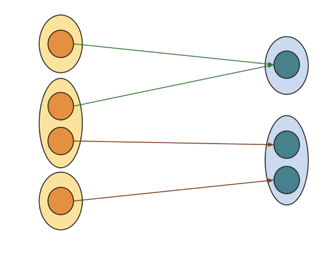
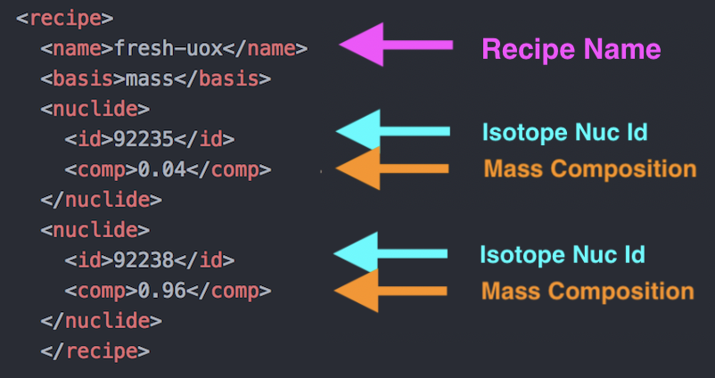

Understanding Commodities
-------------------------

Concept: Commodities
++++++++++++++++++++

|Cyclus| exchanges resources between facilities using a market-like mechanism
called the `dynamic resource exchange (DRE) <https://fuelcycle.org/arche/dre.html>`_.  
The concept of a **commodity** is
used to simply indicate which facilities may be interested in trading with
each other through the DRE. A commodity is therefore nothing more than a
unique name that is used to define a set of producers and consumers of a
common resource.  A commodity does not necessarily have a specific
composition; this will be determined by the agents during the simulation.
Suppliers then respond to the series of requests with a **bid**. A bid
supplies a notion of the quantity and quality of a resource to match a
request. Suppliers may add an arbitrary number of constraints to
accompany bids. For example, an enriched UOX supplier may be constrained
by its current inventory of natural uranium or its total capacity to
provide enrichment in Separative Work Units (SWUs).

Any potential resource transfer (i.e., a bid or a request) may be
denoted as **exclusive**. An exclusive transfer excludes partial fulfillment;
it must either be met fully or not at all. This mode supports concepts
such as the trading of individual reactor assemblies. In combination
with the notion of mutual requests (one request that can be met through multiple 
commodities), complex instances of supply and
demand are enabled. 

Finally, requesting facilities may apply **preferences** to each potential request-bid pairing
based on the proposed resource transfer. Facilities can apply arbitrary
complex logic to **rank the bids** that they have received, whether based on
the quantity available in each bid or on the quality of each bid, and
the consequent implications of the physics behavior of that facility. 

For example, the flow graph below shows three suppliers (left) and two
consumers (right), and the potential flows of various commodities among
them. The second consumer makes two different requests. Meanwhile, the
second supplier can supply the commodities requested by both consumers
and provides two bids accordingly.

|Cyclus| does not require commodities to be defined explicitly in the input file. 
Commodities are instead defined implicitly by facilities when they choose to trade. 
For more details, reference the `Commodity Priority <../input_specs/commodity.html>`_ page.

Understanding Recipes
---------------------

Concept: Recipes
++++++++++++++++

Most commodities are materials, which have a quantity and an
isotopic composition.
Recipes are the isotopic composition of a certain material. 
The recipe section of a |Cyclus| input file is
typically located at the end of the input and is of the form:

.. code-block:: XML

    <recipe>
      <name>[string]</name>
      <basis>[string]</basis>
      <nuclide>
        <id>[int] OR [string]</id>
        <comp>[double]</comp>
      </nuclide>
      <nuclide>
        <id>[int] OR [string]</id>
        <comp>[double]</comp>
      </nuclide>
      ...
    </recipe>

where basis can be ``mass`` or ``atom``, ``id`` is the Nuc Id of the isotope in form ZZAAA, and ``comp`` is the
composition of that isotope in the recipe. Other isotope formats for ``id`` are
also acceptable, such as those used by `pyne <http://pyne.io/theorymanual/nucname.html>`_. 
For example, :math:`^{235}`\ U can be expressed as:

* 922350 (ZZAAAM)
* 92235 (ZZAAA)
* U235 (name)
* U-235 (name)

For more details, reference the `Recipe definition
<../input_specs/recipe.html>`_ page.

Activity: Creating a Recipe
++++++++++++++++++++++++++++

For this input file, we need to define three recipes: natural uranium, fresh fuel, 
and spent fuel. We'll be using simple mass basis recipes to define the isotopic 
composition of these materials.
Using the tables below, fill out three recipe
templates for natural uranium, fresh fuel, and spent fuel.

+---------------------+--------------------+--------------------+
| Natural Uranium Composition                                   |
+---------------------+--------------------+--------------------+
| Nuclide             | ``id``             |  ``comp``          |
+=====================+====================+====================+
| :math:`^{235}`\ U   | 92235              | 0.00711            |
+---------------------+--------------------+--------------------+
| :math:`^{238}`\ U   | 92238              | 0.99289            |
+---------------------+--------------------+--------------------+

+---------------------+--------------------+--------------------+
| Fresh Fuel Composition                                        |
+---------------------+--------------------+--------------------+
| Nuclide             | ``id``             |  ``comp``          |
+=====================+====================+====================+
| :math:`^{235}`\ U   | 92235              | 0.04               |
+---------------------+--------------------+--------------------+
| :math:`^{238}`\ U   | 92238              | 0.96               |
+---------------------+--------------------+--------------------+

+---------------------+--------------------+--------------------+
| Spent Fuel Composition                                        |
+---------------------+--------------------+--------------------+
| Nuclide             | ``id``             |  ``comp``          |
+=====================+====================+====================+
| :math:`^{235}`\ U   | 92235              | 0.011              |
+---------------------+--------------------+--------------------+
| :math:`^{238}`\ U   | 92238              | 0.94               |
+---------------------+--------------------+--------------------+
| :math:`^{239}`\ Pu  | 94239              | 0.009              |
+---------------------+--------------------+--------------------+
| :math:`^{137}`\ Cs  | 55137              | 0.04               |
+---------------------+--------------------+--------------------+

Once complete, append these recipes under the archetypes section of your input file [#f1]_.

Let's take a look at the ``fresh_uox`` fuel recipe (note that ``-`` is an illegal character for
names in cyclus and ``_`` should be used instead):

The recipe name ``fresh_uox`` is specified, as are the isotope nuclide IDs and the 
corresponding mass fraction of each nuclide. The ``fresh_uox`` is composed of 4% U-235 and 96% U-238.

Check: Complete Recipe block
+++++++++++++++++++++++++++++++++++++++++++++++

The recipe section of you input file should now look like:

.. code-block:: XML

      <recipe>
        <name>nat_u</name>
        <basis>mass</basis>
        <nuclide>
          <id>92235</id>
          <comp>0.00711</comp>
        </nuclide>
        <nuclide>
          <id>92238</id>
          <comp>0.99289</comp>
        </nuclide>
      </recipe>
      <recipe>
        <name>fresh_uox</name>
        <basis>mass</basis>
        <nuclide>
          <id>92235</id>
          <comp>0.04</comp>
        </nuclide>
        <nuclide>
          <id>92238</id>
          <comp>0.96</comp>
        </nuclide>
      </recipe>
      <recipe>
        <name>spent_uox<name>
        <basis>mass</basis>
        <nuclide>
          <id>92235</id>
          <comp>0.011</comp>
        </nuclide>
        <nuclide>
          <id>92238</id>
          <comp>0.94</comp>
        </nuclide>
        <nuclide>
          <id>94239</id>
          <comp>0.009</comp>
        </nuclide>
        <nuclide>
          <id>55137</id>
          <comp>0.04</comp>
        </nuclide>
      </recipe>

.. rubric:: Footnotes
.. [#f1] The exact order of the sections in a |Cyclus| input file are of minor consequence. The ``control`` sequence must go first, but the other sequences can go in any order that makes sense to the user. The traditional organization  of an input file is: control, archetypes, commodities, facilities,   regions/institutions, and recipes. 
