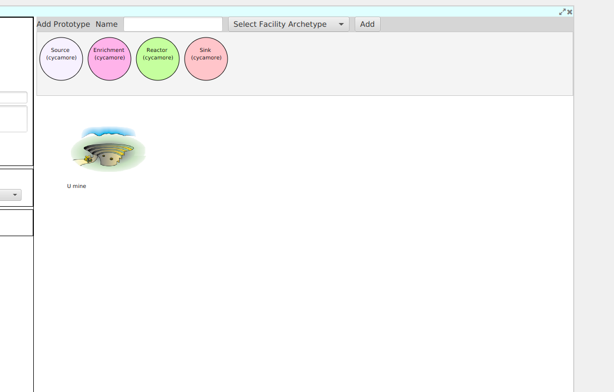
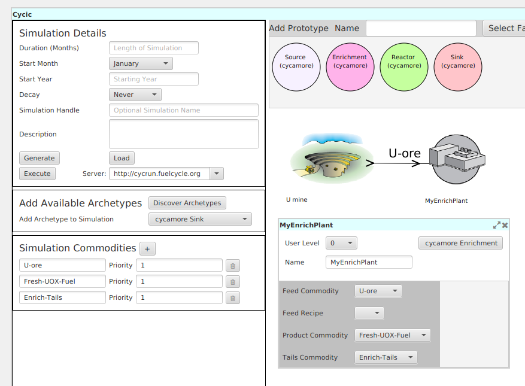
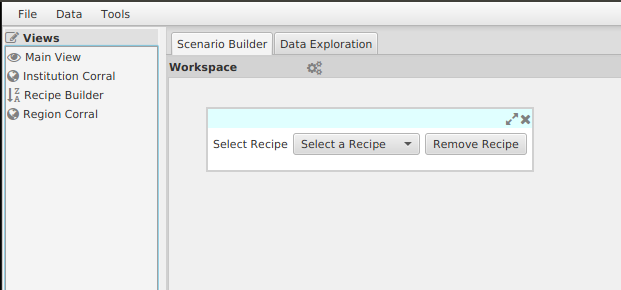
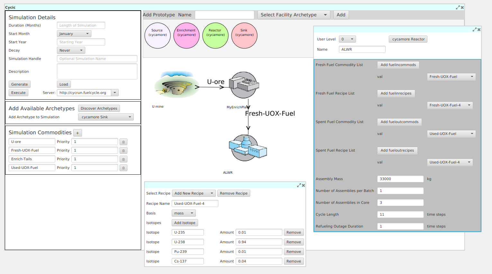
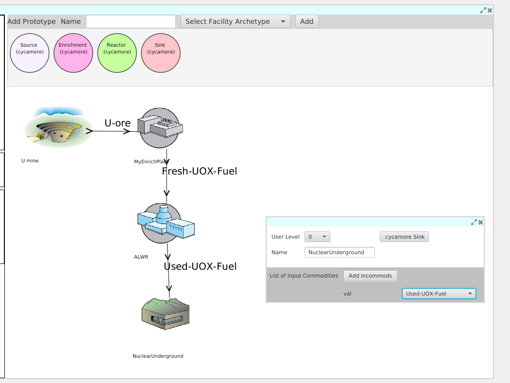
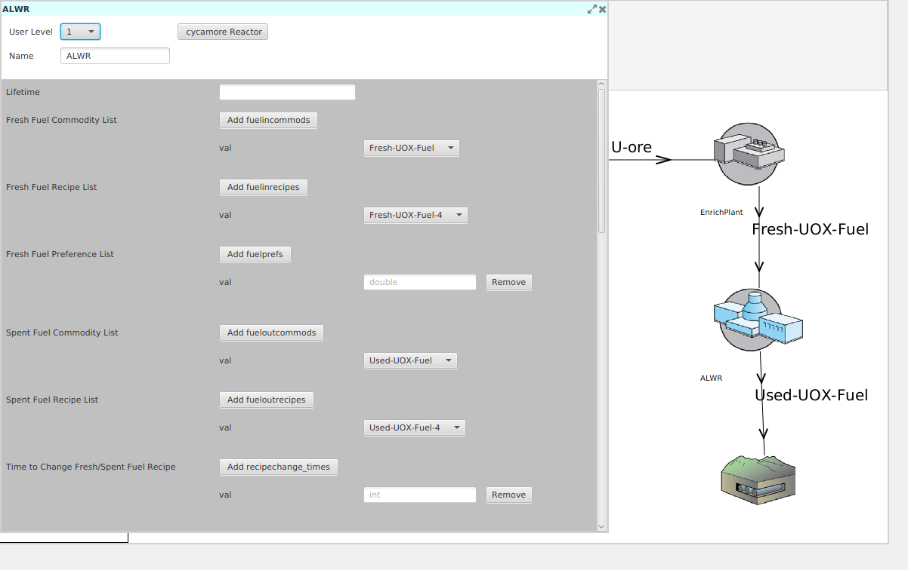
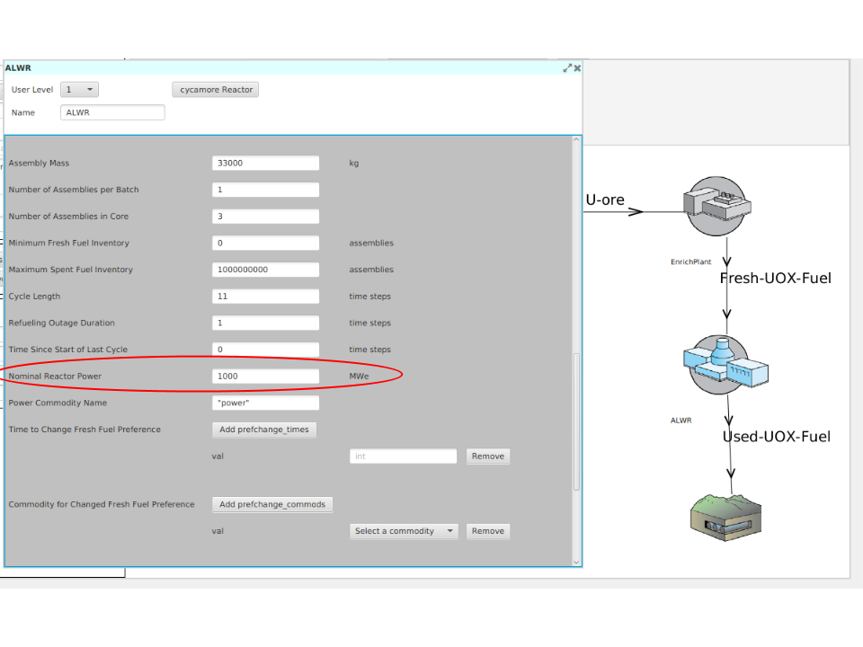

Adding Prototypes to your Simulation
====================================

Concept: Configuring an Archetype to Create a Prototype
---------------------------------------------------------

While the archetype describes the form of the model used to represent a
facility, a variety of parameters are generally available to configure the
specific behavior.   For the example of a reactpr, the developer will probably
allow the user to define the power level of the reactor, independent of the
specific model chosen to represent the behavior of the model.  Other common
reactor paramters are fuel loading parameters such as cycle length and batch
size. 

In |Cyclus|, when an archetype has been configured with a
specific set of parameters, it is called a *prototype*.

Activity: Configure your first prototype
+++++++++++++++++++++++++++++++++++++++++

The first facility in our fuel cycle will be a mine, using the Cycamore Source
archetype.

1. Drag the cycamore Source archetype from the ribbon to the fuel cycle design pane.
2. Right-click on the Source facility to show its context menu, and choose
   "Facility Documentation".  Close the documentation when finished.
3. Double click on the Source facility that you just dropped to open its configuration window.
4. Choose a name for your Source prototype, e.g. "U Mine".

*Bonus: From the Source facility's context menu (right-click) choose "Change
Niche" and type "mine" as the New Niche.  The only purpose of the niche is to
allow different visualization in the fuel design pane.  Other niches include:
"fuel fabriaction", "reactor", "abr", "repository", "reprocessing",
"separations".*

Your fuel cycle design should now look like this:

Concept: Commodities
----------------------

|Cyclus| exchanges resources between facilities using a market-like mechanism
called the dynamic resource exchange (DRE).  The concept of a commodity is
uses to simply indicate which facilities may be interested in trading with
each other through the DRE.  A commodity is therefore nothing more than a
unique name that is used to define a set of producers and consumers of a
common resource.  A commodity does not necessarily have a specific
composition; this will be determined by the agents during the simulation.

Activity: Add a commodity to the mine
++++++++++++++++++++++++++++++++++++++

1. Add a commodity in the commodity list of the main view: "U-ore" (For now,
   you can ignore the priority setting)
2. In the configuration window for the mine, select "U-ore" from the Output Commodity dropdown menu

.. image:: mine_commod.png
    :align: center
    :alt: A first commodity and its use in the mine.

Activity: Add an enrichment facility
+++++++++++++++++++++++++++++++++++++

1. Drag the cycamore Enrichmnent archetype from the ribbon to the fuel cycle design pane.
2. Double-click to add the following configuration:
     * Name: MyEnrichPlant
     * Feed Commodity: U-ore
   Notice that when you specify the feed commodity as "U-ore", a line is
   automatically drawn to indicate possible trading of material between the mine
   and the enrichment facility.

.. image:: u-ore-enrich.png
    :align: center
    :alt: Uranium ore can now flow from the mine to the enrichment facility.

3. Use what you learned above to add two new commodities:
     * Fresh-UOX-Fuel
     * Enrich-Tails
4. Modify the Enrichment facility to use these commodities:
     * Product Commodity: Fresh-UOX-Fuel
     * Tails Commodity: Enrich-Tails

Concept: Material recipes
--------------------------

Materials area a fundamental type of resource in |Cyclus|.  Each material
object consists of a quantity (typically in kg) and a quality, ie. an isotopic
composition.  The isotopic composition is referred to as a recipe.  Some
archetypes may want to specify recipes for their input and/or output, as
a list of isotope with either mass or atom fractions.

Activity: Add a recipe for natural uranium
+++++++++++++++++++++++++++++++++++++++++++

Our enrichment facility will request natural uranium.

1. Drag the **Recipe Builder** *tool* into the *workspace* and drop it on an
   empty location.

2. Select "Add New Recipe"
3. Give your recipe a name: Nat-U
4. Choose either the mass or atom basis.  In this case a mass basis is more straightforward.
5. Click on the "Add Isotope" button
6. Enter the information for U-235.  |Cyclus| uses a robust system that allows
   users to refer to isotopes in a multitude of formats.  For U-235, you can
   enter either "U-235" or "92235".  The mass fraction is 0.007.

.. image:: recipe-natU-235-only.png
    :align: center
    :alt: The natural uranium recipe after adding only U-235.

7. Repeat steps 5 & 6 for U-238.
8. Return to the configuration window for the enrichment plant
9. Select "Nat-U" recipe as the feed recipe

.. image:: recipe-natU-finished-assigned.png
    :align: center
    :alt: The natural uranium recipe is complete and assigned to the
          Enrichment facility's feed recipe.

   
Activity: Completing your Prototype Configurations
++++++++++++++++++++++++++++++++++++++++++++++++++

For each of the following prototypes, drag it into the fuel cycle design pane
and configure it with the following information.

1. Reactor
     * Name: ALWR
     * Fresh Fuel Commodity List: Fresh-UOX-Fuel
     * Fresh Fuel Recipe List:
         * Fresh-UOX-Fuel-4: create a recipe with a mass basis with 4% U-235 *(you'll need to add this)*
     * Spent Fuel Commodity List: Used-UOX-Fuel *(you'll need to add this)*
     * Spent Fuel Recipe List:
         * Used-UOX-Fuel-4: create a recipe with a mass basis with:
               * 1% U-235, 94% U-238, 1% Pu-239, 4% Cs-137 *(you'll need to add this)*
     * Assembly Mass: 33000 kg
     * Number of Assemblies per Batch: 1
     * Number of Assemblies in Core: 3
     * Cycle Length: 11
     * Refueling Outage Duration: 1

2. Repository (using the Sink module)
   * Change the niche to "repository"
    * Name: UndergroundFacility
    * Input commodity: Used-UOX-Fuel

Advanced Input Options
----------------------

In order to streamline input for users, some advanced input quantities are
hidden by default.  These input quantities will always have default values, so
users aren't required to set them.  In theory, the archetype developers can
create many layers with increasing numbers of input quantities.  These deeper
levels of inputs are accesible using the "User Level" option on each form.

Activity: Set the Reactor Power
++++++++++++++++++++++++++++++++

1. Open the configuration form for the "ALWR" reactor
2. Change the "User Level" to 1

3. Scroll down to find the input for "Power" and set it to 1000 MWe

Activity: Set the Maximum Inventory of Feed at the Reactor
+++++++++++++++++++++++++++++++++++++++++++++++++++++++++++

1. Open the configuration form for the "EnrichPlant"
2. Chnage to "User Level: 1
3. Find the "Maximum Feed Inventory" entry and set it to: 1000000

.. image:: enrich-max-inv-annotated.png
    :align: center
    :alt: First look at user level 1 for the reactor
