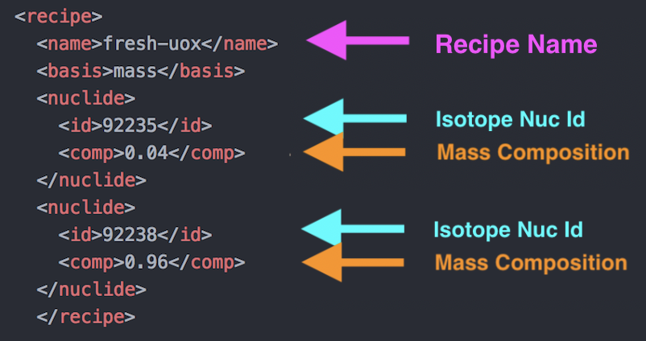

Concept: Commodities
--------------------

|Cyclus| exchanges resources between facilities using a market-like mechanism
called the **dynamic resource exchange (DRE)**.  The concept of a commodity is
uses to simply indicate which facilities may be interested in trading with
each other through the DRE.  **A commodity is therefore nothing more than a
unique name that is used to define a set of producers and consumers of a
common resource**.  A commodity does not necessarily have a specific
composition; this will be determined by the agents during the simulation.
Suppliers then respond to the series of requests with a bid . A bid
supplies a notion of the quantity and quality of a resource to match a
request. Suppliers may add an arbitrary number of constraints to
accompany bids. For example, an enriched UOX supplier may be constrained
by its current inventory of natural uranium or its total capacity to
provide enrichment in Separative Work Units (SWUs).

Any potential resource transfer (i.e., a bid or a request) may be
denoted as exclusive. **An exclusive transfer excludes partial fulfillment;
it must either be met fully or not at all**. This mode supports concepts
such as the trading of individual reactor assemblies. In combination
with the notion of mutual requests, complex instances of supply and
demand are enabled. Finally, requesting facilities, institutions and
regions may apply **preferences** to each potential request-bid pairing
based on the proposed resource transfer. Facilities can apply arbitrary
complex logic to **rank the bids** that they have received, whether based on
the quantity available in each bid or on the quality of each bid, and
the consequent implications of the physics behavior of that facility. In
addition, an institution can apply a higher preference to a partner to
which it is congenial; similarly, a region may negate any transfers of
material which have a higher uranium enrichment than is allowable.

For example, the flow graph below shows three suppliers (left) and two
requesters (right), and the potential flows of various commodities between
them. The second consumer makes two different requests. Meanwhile, the
second supplier can supply the commodities requested by both consumers
and provides two bids accordingly.

.. image:: trade.png
    :align: center
    :alt: Commodity trade flowchart

Activity: Create fuel commodities
+++++++++++++++++++++++++++++++++++++++++++++++++++++

Let's build ``u-ore``, ``fresh-uox``, ``spent-uox``, and ``tails``,
four commodities that will be traded in our simulation.
* ``u-ore`` : natural uranium that is mined
* ``tails`` : waste from the enrichment process
* ``fresh-uox``: fresh 4.0% enriched Uranium Oxide fuel that enters the reactor
* ``spent-uox``: spent Uranium Oxide fuel that leaves the reactor after depletion

Whenever |CYCLUS| needs
to know the isotopic composition of a material, it looks at the recipe for that
material given in the input file. Until now, ``recipe`` has been used to
refer to fuel recipes, but the ``recipe`` section of the input file can
include the recipe for natural uranium, spent fuel, fresh fuel, or any
other material where the isotopic composition needs to be tracked.

The commodities section is located right under the ``archetype`` section
and is of the form:

::

    <commodity>
        <name>com1</name>
        <solution_priority>1.0</solution_priority>
      </commodity>
      <commodity>
        <name>com2</name>
        <solution_priority>1.0</solution_priority>
      </commodity>
      <commodity>
        <name>com3</name>
        <solution_priority>1.0</solution_priority>
      </commodity>
      <commodity>
        <name>com4</name>
        <solution_priority>1.0</solution_priority>
      </commodity>

where:
* name: name of the commodity
* solution priority: number defining the relative priority for resolution in the dynamic
resource exchange.

 We will model four commodities: u-ore, fresh-uox,
spent-uox, and tails.

Activity: Building commodities
++++++++++++++++++++++++++++++++++++++++++

Using the table below and the commodities template above, fill out the commodities
template.

+-------------+-------------+---------------------+
| Commodity   | Name        | Solution Priority   |
+=============+=============+=====================+
| com1        | u-ore       | 1.0                 |
+-------------+-------------+---------------------+
| com2        | fresh-uox   | 1.0                 |
+-------------+-------------+---------------------+
| com3        | spent-uox   | 1.0                 |
+-------------+-------------+---------------------+
| com4        | tails       | 1.0                 |
+-------------+-------------+---------------------+

1. Let's start with ``u-ore``. In the ``<name>`` line replace ``com1`` with ``u-ore``.
::

    <commodity>
        <name>u-ore</name>

2. In the ``<solution_priority>`` section replace ``val1`` with ``1.0``.
::

    <commodity>
        <name>u-ore</name>
        <solution_priority>1.0</solution_priority>

3. Now, finalize this commodity by closing it with ``</commodity>``. Your ``u-ore`` commodity section should be:
::

    <commodity>
        <name>u-ore</name>
        <solution_priority>1.0</solution_priority>
      </commodity>

4. Repeat this process for the other three commodities. Your final result should look like:
::

  <commodity>
      <name>u-ore</name>
      <solution_priority>1.0</solution_priority>
    </commodity>
    <commodity>
      <name>fresh-uox</name>
      <solution_priority>1.0</solution_priority>
    </commodity>
    <commodity>
      <name>tails</name>
      <solution_priority>1.0</solution_priority>
    </commodity>
    <commodity>
      <name>spent-uox</name>
      <solution_priority>1.0</solution_priority>
  </commodity>

Once complete append the commodities section under the archetypes section.

Concept: Recipes
----------------

Recipes are the isotopic composition of a certain material. For
example, u-ore has an isotropic composition of 0.711% uranium-235 and
99.284% uranium-238. The recipe section of a CYCLUS input file is
located at the bottom and is of the form:

::

     <recipe>
      <name>nat-u</name>
      <basis>mass</basis>
      <nuclide>
        <id>92235</id>
        <comp>0.00711</comp>
      </nuclide>
      <nuclide>
        <id>92238</id>
        <comp>0.99289</comp>
      </nuclide>
     </recipe>

where ``id`` is the Nuc Id of the isotope in form ZZAAA and ``comp`` is the
composition of that isotope in the recipe.

First, we can declare the isotopic compositions of the fresh and spent
fuel. We'll be using simple recipes: fresh fuel is 4.0% U-235 by mass,
remainder U-238. Spent fuel is 1.1% U-235, 94.0% U-238, 0.9% Pu-239, and
4.0% Cs-137.

Activity: Creating a Recipe
++++++++++++++++++++++++++++

Using the tables below, fill out the recipe
template for natural uranium, fresh fuel, and spent fuel.

+---------------------+--------------------+--------------------+
| Natural Uranium Composition                                   |
+---------------------+--------------------+--------------------+
| Nuclide             | Spent ids          |  Mass composition  |
+=====================+====================+====================+
| :math:`^{235}`\ U   | 92235              | 0.00711            |
+---------------------+--------------------+--------------------+
| :math:`^{238}`\ U   | 92238              | 0.99289            |
+---------------------+--------------------+--------------------+

+---------------------+--------------------+--------------------+
| Fresh Fuel Composition                                        |
+---------------------+--------------------+--------------------+
| Nuclide             | Spent ids          |  Mass composition  |
+=====================+====================+====================+
| :math:`^{235}`\ U   | 92235              | 0.04               |
+---------------------+--------------------+--------------------+
| :math:`^{238}`\ U   | 92238              | 0.96               |
+---------------------+--------------------+--------------------+

+---------------------+--------------------+--------------------+
| Spent Fuel Composition                                        |
+---------------------+--------------------+--------------------+
| Nuclide             | Spent ids          |  Mass composition  |
+=====================+====================+====================+
| :math:`^{235}`\ U   | 92235              | 0.011              |
+---------------------+--------------------+--------------------+
| :math:`^{238}`\ U   | 92238              | 0.94               |
+---------------------+--------------------+--------------------+
| :math:`^{239}`\ Pu  | 94239              | 0.009              |
+---------------------+--------------------+--------------------+
| :math:`^{137}`\ Cs  | 55137              | 0.04               |
+---------------------+--------------------+--------------------+

1. Let's start with the Natural Uranium recipe. Start by placing the ``<recipe>`` tag as the header to signify that this is a recipe and tab in and place the fill ``<name>`` tag such as:
::

  <recipe>
    <name>nat-u</name>

2. To signify that the composition of this recipe is in terms of Mass, fill the ``<basis>`` tag with ``mass``.
::

  <recipe>
    <name>nat-u</name>
    <basis>mass</basis>

3. To add a nuclide to this recipe, call the ``nuclide`` tag, tab in, add the ``<id>`` and ``<comp>`` tags:
::

  <recipe>
    <name>nat-u</name>
    <basis>mass</basis>
    <nuclide>
      <id>id1</id>
      <comp>comp1</comp>
    </nuclide>

4. We will fill the ``<id>`` tag with the Uranium-235 ``Nuc Id``, ``92235``, and fill the composition tag with its mass composition, ``0.00711``.
::

  <recipe>
    <name>nat-u</name>
    <basis>mass</basis>
    <nuclide>
      <id>92235</id>
      <comp>0.00711</comp>
    </nuclide>

5. Following the same procedure, we can add Uranium-238 to this recipe such as:
::

  <recipe>
    <name>nat-u</name>
    <basis>mass</basis>
    <nuclide>
      <id>92235</id>
      <comp>0.00711</comp>
    </nuclide>
    <nuclide>
      <id>92238</id>
      <comp>0.99289</comp>
      </nuclide>
  </recipe>

6. After closing this recipe with the ``</recipe>`` tag, we can add other recipes. The recipe section of this tutorial is placed below.
::

  <recipe>
      <name>nat-u</name>
      <basis>mass</basis>
      <nuclide>
        <id>92235</id>
        <comp>0.00711</comp>
      </nuclide>
      <nuclide>
        <id>92238</id>
        <comp>0.99289</comp>
      </nuclide>
    </recipe>

    <recipe>
      <name>fresh-uox</name>
      <basis>mass</basis>
      <nuclide>
        <id>92235</id>
        <comp>0.04</comp>
      </nuclide>
      <nuclide>
        <id>92238</id>
        <comp>0.96</comp>
      </nuclide>
    </recipe>

    <recipe>
      <name>spent-uox</name>
      <basis>mass</basis>
      <nuclide>
        <id>92235</id>
        <comp>0.011</comp>
      </nuclide>
      <nuclide>
        <id>92238</id>
        <comp>0.94</comp>
      </nuclide>
      <nuclide>
        <id>94239</id>
        <comp>0.009</comp>
      </nuclide>
      <nuclide>
        <id>55137</id>
        <comp>0.04</comp>
      </nuclide>
    </recipe>

Let's take a look at the ``fresh-uox`` fuel recipe:

Concept: Archetype configuration to Prototype
-------------------------------------------------------

One of the features of |CYCLUS| is its ability to switch between
different models of the facilities within the fuel cycle. These models,
called **archetypes**, may change how the facility interacts with other
facilities or how the physics of the facility are represented. For
example, reactor archetypes determine the reactor's fresh and spent fuel
compositions and how the reactor experiences fuel burn-up. A reactor
model can have three varying fidelity levels:
* A very simple model that uses recipe to deplete fuel
* A more complex model may tabulate reactor performance and
physics parameters, and interpolate its input and output recipes.
* The most complex model could perform a full depletion calculation each time
new fuel enters the reactor.

A simple set of archetypes have been created in `Cycamore <http://fuelcycle.org/user/cycamoreagents.html>`__. 
While the archetype describes the form of the model used to represent a
facility, a variety of parameters are generally available to configure the
specific behavior.   For the example of a reactor, the developer will probably
allow the user to define the power level of the reactor, independent of the
specific model chosen to represent the behavior of the model.  Other common
reactor parameters are fuel loading parameters such as cycle length and batch
size.

In |Cyclus|, when an archetype has been configured with a
specific set of parameters, it is called a *prototype*.

Activity: Configure your first prototype
++++++++++++++++++++++++++++++++++++++++

Now let's model the reactor this fuel will go through! In this simple example, let's model a single PWR in the United States. It has a power capacity of 1178 MWe, and there is only one of them in the region.
The template for the reactor is given below:
::

    <facility>
      <name>Reactor</name>
      <config>
        <Reactor>
          <fuel_incommods> <val>[VALUE]/val> </fuel_incommods>
          <fuel_inrecipes> <val>[VALUE]</val> </fuel_inrecipes>
          <fuel_outcommods> <val>[VALUE]</val> </fuel_outcommods>
          <fuel_outrecipes> <val>[VALUE]</val> </fuel_outrecipes>
          <cycle_time>[VALUE]</cycle_time>
          <refuel_time>[VALUE]</refuel_time>
          <assem_size>[VALUE]</assem_size>
          <n_assem_core>[VALUE]</n_assem_core>
          <n_assem_batch>[VALUE]</n_assem_batch>
          <power_cap>[VALUE]</power_cap>
        </Reactor>
      </config>
    </facility>

Where:
* ``fuel_incommods``: input fuel commodity
* ``fuel_inrecipes``" input fuel recipe
* ``fuel_outcommods``: output fuel commodity
* ``fuel_outrecipes``: output fuel recipe.
* ``cycle_time``: amount of time the reactor operates between refueling outages
* ``refuel_time``: duration of refueling outage
* ``assem_size``" size of a single assembly
* ``n_assem_core`` : number of assemblies in the core
* ``n_assem_batch``: number of batches replaced per refueling.
* ``power_cap``: amount of electricity the reactor generates.

Using the template above and the table below, generate the input reactor prototype for this reactor.

+-----------------------+---------------------------+
| Variable              | Value                     |
+=======================+===========================+
| ``name``              | ``1178MWe BRAIDWOOD-1``   |
+-----------------------+---------------------------+
| ``Archetype``         | ``Reactor``               |
+-----------------------+---------------------------+
| ``fuel_incommods``    | ``fresh-uox``             |
+-----------------------+---------------------------+
| ``fuel_inrecipes``    | ``fresh-uox``             |
+-----------------------+---------------------------+
| ``fuel_outcommods``   | ``spent-uox``             |
+-----------------------+---------------------------+
| ``fuel_outrecipes``   | ``spent-uox``             |
+-----------------------+---------------------------+
| ``cycle_time``        | 18                        |
+-----------------------+---------------------------+
| ``refuel_time``       | 1                         |
+-----------------------+---------------------------+
| ``assem_size``        | ``33000``                 |
+-----------------------+---------------------------+
| ``n_assem_core``      | ``1``                     |
+-----------------------+---------------------------+
| ``n_assem_batch``     | ``3``                     |
+-----------------------+---------------------------+
| ``power_cap``         | ``1178``                  |
+-----------------------+---------------------------+

Once completed, your prototype should look like:

::

    <facility>
        <name>1178MWe BRAIDWOOD-1</name>
        <config>
          <Reactor>
            <fuel_incommods> <val>fresh-uox</val> </fuel_incommods>
            <fuel_inrecipes> <val>fresh-uox</val> </fuel_inrecipes>
            <fuel_outcommods> <val>spent-uox</val> </fuel_outcommods>
            <fuel_outrecipes> <val>spent-uox</val> </fuel_outrecipes>
            <cycle_time>18</cycle_time>
            <refuel_time>1</refuel_time>
            <assem_size>33000</assem_size>
            <n_assem_core>3</n_assem_core>
            <n_assem_batch>1</n_assem_batch>
            <power_cap>1178</power_cap>
          </Reactor>
        </config>
      </facility>

Once complete, append this facility under the commodity section of your input file.

Activity: Creating the Source
+++++++++++++++++++++++++++++
Our source, ``UraniumMine``, will provide the natural uranium ore for our enrichment facility.
This facility takes two inputs, ``name`` and ``outcommd``. Using the Source Archetype and the table below, create the UraniumMine prototype.

+-----------------------+---------------------------+
| Variable              | Value                     |
+=======================+===========================+
| ``name``              | ``UraniumMine``           |
+-----------------------+---------------------------+
| ``Archetype``         | ``Source``                |
+-----------------------+---------------------------+
| ``out_commod``        | ``fresh-uox``             |
+-----------------------+---------------------------+

1. The template for the Source archetype is of the form:
::

  <facility>
    <name>name</name>
    <config>
      <Source>
        <outcommod>outcommod</outcommod>
      </Source>
    </config>
  </facility>

2. Filling in the variables ``name``, ``Archetype``, and ``out_commod`` as ``UraniumMine``, ``Source``, and ``fresh-uox`` leads to:
::

  <facility>
    <name>UraniumMine</name>
    <config>
      <Source>
        <outcommod>u-ore</outcommod>
      </Source>
    </config>
  </facility>

Once complete, append this facility under the commodity section of your input file.

Activity: Creating the Enrichment facility
++++++++++++++++++++++++++++++++++++++++++
The enrichment facility, ``EnrichmentPlant`` will intake the natural ``u-ore`` from ``UraniumMine`` and create ``fresh-uox`` and ``tails`` as its products.
The template for the Enrichment archetype is of the form:
::

  <facility>
    <name>enrichment_plant_name</name>
    <config>
      <Archetype>
        <feed_commod>feed_commodity</feed_commod>
        <feed_recipe>feed_recipe</feed_recipe>
        <product_commod>product_commodity</product_commod>
        <tails_commod>tails_commodity</tails_commod>
        <max_feed_inventory>1000000</max_feed_inventory>
      </Archetype>
    </config>
  </facility>

Using the template above and the table below, generate the input reactor prototype for this enrichment facility.

+-------------------------+---------------------------+
| Variable                | Value                     |
+=========================+===========================+
| ``name``                | ``EnrichmentPlant``       |
+-------------------------+---------------------------+
| ``Archetype``           | ``Enrichment``            |
+-------------------------+---------------------------+
| ``feed_commod``         | ``u-ore``                 |
+-------------------------+---------------------------+
| ``feed_recipe``         | ``nat-u``                 |
+-------------------------+---------------------------+
| ``product_commod``      | ``fresh-uox``             |
+-------------------------+---------------------------+
| ``tails_commod``        | ``tails``                 |
+-------------------------+---------------------------+
| ``max_feed_inventory``  | 1000000                   |
+-------------------------+---------------------------+

After filling in these variables, your enrichment facility prototype will look like:
::

  <facility>
    <name>EnrichmentPlant</name>
    <config>
      <Enrichment>
        <feed_commod>u-ore</feed_commod>
        <feed_recipe>nat-u</feed_recipe>
        <product_commod>fresh-uox</product_commod>
        <tails_commod>tails</tails_commod>
        <max_feed_inventory>1000000</max_feed_inventory>
      </Enrichment>
    </config>
  </facility>

Once complete, append this facility under the Source prototype of your input file.

Activity: Creating the Sink facility
++++++++++++++++++++++++++++++++++++
Our sink, ``NuclearRepository``, will store the ``spent-uox`` and ``tails`` after
their use in the fuel cycle. Using the Sink Archetype template and the table below,
create the UraniumMine prototype.

+-------------------------+---------------------------+
| Variable                | Value                     |
+=========================+===========================+
| ``name``                | ``NuclearRepository``     |
+-------------------------+---------------------------+
| ``Archetype``           | ``Sink``                  |
+-------------------------+---------------------------+
| ``val``                 | ``spent-uox``             |
+-------------------------+---------------------------+
| ``val``                 | ``tails``                 |
+-------------------------+---------------------------+

The sink facility archetype is:
::

  <facility>
    <name>Sink_name</name>
    <config>
      <Sink>
        <in_commods>
          <val>input_commodity</val>
          <val>input_commodity</val>
        </in_commods>
      </Sink>
    </config>
  </facility>

1. After filling in these variables, your enrichment facility prototype will look like:
::

  <facility>
    <name>NuclearRepository</name>
    <config>
      <Sink>
        <in_commods>
          <val>spent-uox</val>
          <val>tails</val>
        </in_commods>
      </Sink>
    </config>
  </facility>

Once complete, append this facility under the Reactor prototype of your input file.
The facility section of your input file should be of the form:
::

  <facility>
    <name>UraniumMine</name>
    <config>
      <Source>
        <outcommod>u-ore</outcommod>
      </Source>
    </config>
  </facility>

  <facility>
    <name>EnrichmentPlant</name>
    <config>
      <Enrichment>
        <feed_commod>u-ore</feed_commod>
        <feed_recipe>nat-u</feed_recipe>
        <product_commod>fresh-uox</product_commod>
        <tails_commod>tails</tails_commod>
        <max_feed_inventory>1000000</max_feed_inventory>
      </Enrichment>
    </config>
  </facility>

  <facility>
    <name>1178MWe BRAIDWOOD-1</name>
    <config>
      <Reactor>
        <fuel_incommods> <val>fresh-uox</val> </fuel_incommods>
        <fuel_inrecipes> <val>fresh-uox</val> </fuel_inrecipes>
        <fuel_outcommods> <val>spent-uox</val> </fuel_outcommods>
        <fuel_outrecipes> <val>spent-uox</val> </fuel_outrecipes>
        <cycle_time>18</cycle_time>
        <refuel_time>1</refuel_time>
        <assem_size>33000</assem_size>
        <n_assem_core>3</n_assem_core>
        <n_assem_batch>1</n_assem_batch>
        <power_cap>1178</power_cap>
      </Reactor>
    </config>
  </facility>

  <facility>
    <name>NuclearRepository</name>
    <config>
      <Sink>
        <in_commods>
          <val>spent-uox</val>
          <val>tails</val>
        </in_commods>
      </Sink>
    </config>
  </facility>
