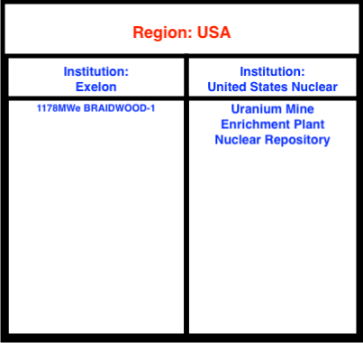

Adding Regions and Institutions
===============================

Concept: Regions & Institutions
-------------------------------

|Cyclus| establishes a hierarchy of agents: Facility agents are managed by
Institution agents that exist within a Region agent.  This series of ownership
allow for control of the interaction behavior
between agents.  For example, two facilities 
may not be allowed to trade if they are in two different regions.

Every |Cyclus| simulation needs at least one Region and one Institution, and
in this case, we'll use the simplest options:

* a Null Institution (*NullInst*) that holds a set of facilities that are
  deployed at the start of a simulation.
* a Null Region (*NullRegion*) that holds a set of Institutions.

Concept: Regions
----------------

Regions tie together a fuel cycle as they designate what facilities are
in the region's fuel cycle. Regions may apply preferences to each
potential request-bid pairing based on the proposed resource transfer.
The basic structure of a region is:

.. code-block:: XML

    <region>
      <name>Region_name</name>
      <config>
        <NullRegion/>
      </config>
      <institution>
      ...
      ...
      </institution>

    </region>

Where:

* ``name``: name of the region
* ``config``: Region archetype to use

In between the two dotted lines
is where the institution and facility information goes. The
institution block is the form:

.. code-block:: XML

      <institution>
        <initialfacilitylist>
          <entry>
            <prototype>Prototype_name</prototype>
            <number>number_of_prototype_names</number>
          </entry>
          </initialfacilitylist>
        <name>Inst_name</name>
        <config>
          <NullInst/>
        </config>
      </institution>

Where:

* ``prototype``:  prototype that is initially in the region
* ``number``: the number of the prototype initially in the institution
* ``name``: name of the institution.

There can be multiple ``entry`` blocks.

Putting it all together, a complete region template is of the form:

.. code-block:: XML

    <region>
      <name>Region_name</name>
      <config>
        <NullRegion/>
      </config>
        <institution>
          <initialfacilitylist>
              <entry>
                <prototype>Prototype_name</prototype>
                <number>number_of_prototype_names</number>
              </entry>
          </initialfacilitylist>
        <name>Inst_name</name>
        <config>
          <NullInst/>
        </config>
       </institution>
    </region>

Concept: Institution
-----------------------------------------------------------------------
In |CYCLUS| input files, each institution block defines an agent that
acts as an institution in the simulation. An institution block can only
appear within a region block. Each institution block has the following
sections in any order:

-  ``name`` (required, once) - a name for the prototype
-  ``lifetime`` (optional, once) - a non-negative integer indicating the
   number of time steps that this region agent will be active in the
   simulation
-  ``config`` (required, once) - the archetype-specific configuration
-  ``initialfacilitylist`` (optional, may appear multiple times) - a
   list of facility agents operating at the beginning of the simulation

Each ``initialfacilitylist`` block contains one or more ``entry`` blocks
that each contain the following sections, in the following order:

-  ``prototype`` - the name of a facility prototype defined elsewhere in
   the input file
-  ``number`` - the number of such facilities that are operating at the
   beginning of the simulation

The example below
introduces two institution agents (the region section that encloses them
is not shown). The first institution has the name *SingleInstitution*,
and is configured from the archetype with the name
``NullInst``. 
The ``NullInst`` has no defined archetype-specific data.
This institution begins the simulation with two
facility agents, one based on the ``FacilityA`` prototype and another
based on the ``FacilityB`` prototype. The second institution has the
name *AnotherInstitution*, is also configured from the archetype with
the name (or alias) ``NullInst``. This institution has no initial
facilities.

.. code-block:: XML

      <institution>
        <initialfacilitylist>
          <entry>
            <prototype>FacilityA</prototype>
            <number>1</number>
          </entry>
          <entry>
            <prototype>FacilityB</prototype>
            <number>1</number>
          </entry>
          </initialfacilitylist>
        <name>SingleInstitution</name>
        <config>
          <NullInst/>
        </config>
      </institution>

      <institution>
        <name>AnotherInstitution</name>
        <config>
          <NullInst/>
        </config>
      </institution>

Activity: Write the Region template
+++++++++++++++++++++++++++++++++++

Using the template below, let's create the region section of our input file.

.. code-block:: XML

    <region>
      <name>[VALUE]</name>
      <config>
        <NullRegion/>
      </config>
      <institution>
        <initialfacilitylist>
          <entry>
            <prototype>[VALUE]</prototype>
            <number>[VALUE]</number>
          </entry>
          </initialfacilitylist>
        <name>[VALUE]</name>
        <config>
          <NullInst/>
        </config>
      </institution>
    </region>

Now the next part of the region template is the other facilities in the
region's fuel cycle. In our example, these facilities are
``UraniumMine``, ``EnrichmentPlant``, and ``NuclearRepository``. Using
the above exercise and the table below, fill out the rest of the region
template.

+-----------------+-----------------------------+----------+
| Variable        | Name                        | Amount   |
+=================+=============================+==========+
| ``prototype``   | ``UraniumMine``             | ``1``    |
+-----------------+-----------------------------+----------+
| ``prototype``   | ``EnrichmentPlant``         | ``1``    |
+-----------------+-----------------------------+----------+
| ``prototype``   | ``NuclearRepository``       | ``1``    |
+-----------------+-----------------------------+----------+
| ``name``        | ``United States Nuclear``   | ``1``    |
+-----------------+-----------------------------+----------+

Check: Complete Region block
+++++++++++++++++++++++++++++++++++

.. code-block:: XML

  <region>
    <name>region1</name>
    <config>
      <NullRegion/>
    </config>
    <institution>
      <initialfacilitylist>
        <entry>
          <prototype>UraniumMine</prototype>
          <number>1</number>
        </entry>
        <entry>
          <prototype>EnrichmentPlant</prototype>
          <number>1</number>
        </entry>
        <entry>
          <prototype>NuclearRepository</prototype>
          <number>1</number>
        </entry>
      </initialfacilitylist>
      <name>United States Nuclear</name>
      <config>
        <NullInst/>
      </config>
    </institution>
  </region>

Activity: Save your input file
++++++++++++++++++++++++++++++

Save your input file as ``cyclus_intro_file.xml``

Activity: Add an extra insitution into the Region
++++++++++++++++++++++
Having multiple insitutions help organize facilities and their affiliation.
Let's create region, ``USA``, that contains two institutions, ``Exelon`` and ``United States Nuclear``.
``Exelon`` is the institution that holds the ``1178MWe BRAIDWOOD-1`` reactor and ``United States Nuclear`` holds the ``UraniumMine``, ``EnrichmentPlant``, and ``NuclearRepository``.

Using the template above and the table below, let's build the region.

1. Since there are two institutions, ``Exelon`` and ``United States Nuclear``, we will split the region into two parts.
Let's first build the ``Exelon`` institution. This institution has one ``1178MWe BRAIDWOOD-1`` prototype. Using this information we can write this institution as:

.. code-block:: XML

  <region>
    <name>USA</name>
    <config>
      <NullRegion/>
    </config>
    <institution>
      <initialfacilitylist>
        <entry>
          <prototype>1178MWe BRAIDWOOD-1</prototype>
          <number>1</number>
        </entry>
        </initialfacilitylist>
      <name>Exelon</name>
      <config>
        <NullInst/>
      </config>
    </institution>

2. Now let's build the second institution, ``United States Nuclear``. This institution has one ``UraniumMine`` prototype, ``EnrichmentPlant`` prototype, and one ``NuclearRepository`` prototype. Using this information we can write this institution as:

.. code-block:: XML

    <institution>
        <initialfacilitylist>
          <entry>
            <prototype>UraniumMine</prototype>
            <number>1</number>
          </entry>
          <entry>
            <prototype>EnrichmentPlant</prototype>
            <number>1</number>
          </entry>
          <entry>
            <prototype>NuclearRepository</prototype>
            <number>1</number>
          </entry>
        </initialfacilitylist>
        <name>United States Nuclear</name>
        <config>
          <NullInst/>
        </config>
      </institution>

3. We will close the region section by appending the two sections together and appending a ``</region>`` tag to the end of the section. Once complete, your region prototype should look like:

.. code-block:: XML

  <region>
    <name>USA</name>
    <config>
      <NullRegion/>
    </config>
    <institution>
      <initialfacilitylist>
        <entry>
          <prototype>1178MWe BRAIDWOOD-1</prototype>
          <number>1</number>
        </entry>
        </initialfacilitylist>
      <name>Exelon</name>
      <config>
        <NullInst/>
      </config>
    </institution>

    <institution>
      <initialfacilitylist>
        <entry>
          <prototype>UraniumMine</prototype>
          <number>1</number>
        </entry>
        <entry>
          <prototype>EnrichmentPlant</prototype>
          <number>1</number>
        </entry>
        <entry>
          <prototype>NuclearRepository</prototype>
          <number>1</number>
        </entry>
      </initialfacilitylist>
      <name>United States Nuclear</name>
      <config>
        <NullInst/>
      </config>
    </institution>
  </region>

Activity: Save your Input File
+++++++++++++++++++++++++++++++++++++++++++++++

You are now ready to generate a full |Cyclus| input file.

1. Save your input file as 'cyclus_intro_file.xml'
