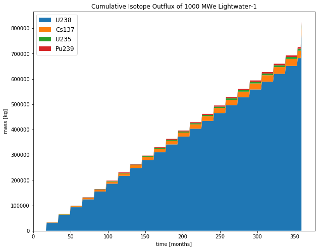
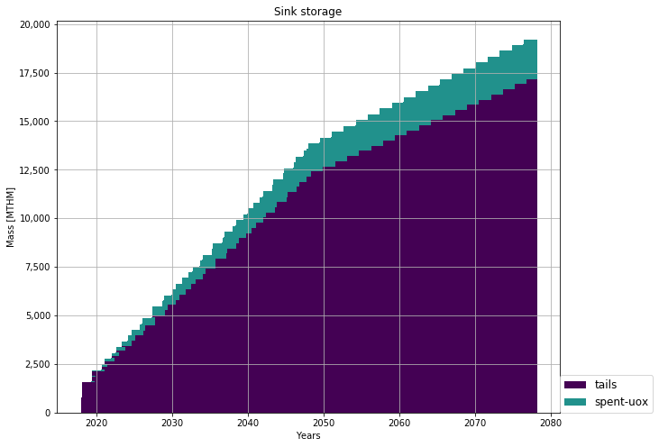

Adding a second reactor
=======================

We will now add a second reactor, ``1000We Lightwater-1``, to our
simulation. This reactor will have a lifetime of 360 months (30 years),
cycle time of 15 months, assembly size of 30160, and power capacity 1000
MWe. Using this information, let's construct the facility input section
of this reactor.

Activity: Second Reactor
++++++++++++++++++++++++

Using the reactor facility archetype and the table below, create the reactor
prototype.

+-----------------------+---------------------------+
| Variable              | Value                     |
+=======================+===========================+
| ``name``              | ``1000We Lightwater-1``   |
+-----------------------+---------------------------+
| ``lifetime``          | ``360``                   |
+-----------------------+---------------------------+
| ``Archetype``         | ``Reactor``               |
+-----------------------+---------------------------+
| ``fuel_incommods``    | ``fresh-uox``             |
+-----------------------+---------------------------+
| ``fuel_inrecipes``    | ``fresh-uox``             |
+-----------------------+---------------------------+
| ``fuel_outcommods``   | ``spent-uox``             |
+-----------------------+---------------------------+
| ``fuel_outrecipes``   | ``spent-uox``             |
+-----------------------+---------------------------+
| ``cycle_time``        | ``15``                    |
+-----------------------+---------------------------+
| ``refuel_time``       | ``1``                     |
+-----------------------+---------------------------+
| ``assem_size``        | ``33000``                 |
+-----------------------+---------------------------+
| ``n_assem_core``      | ``3``                     |
+-----------------------+---------------------------+
| ``n_assem_batch``     | ``1``                     |
+-----------------------+---------------------------+
| ``power_cap``         | ``1000``                  |
+-----------------------+---------------------------+

Once complete, your reactor prototype should look like:
.. code-block:: xml

  <facility>
    <name>1000We Lightwater-1</name>
    <lifetime>360</lifetime>
    <config>
      <Reactor>
        <fuel_incommods> <val>fresh-uox</val> </fuel_incommods>
        <fuel_inrecipes> <val>fresh-uox</val> </fuel_inrecipes>
        <fuel_outcommods> <val>spent-uox</val> </fuel_outcommods>
        <fuel_outrecipes> <val>spent-uox</val> </fuel_outrecipes>
        <cycle_time>15</cycle_time>
        <refuel_time>1</refuel_time>
        <assem_size>33000</assem_size>
        <n_assem_core>3</n_assem_core>
        <n_assem_batch>1</n_assem_batch>
        <power_cap>1000</power_cap>
      </Reactor>
    </config>
  </facility>

Append this prototype right after the ``1178MWe BRAIDWOOD-1`` prototype.

Activity: Second reactor Institution
++++++++++++++++++++++++++++++++++++

We must add this second reactor into the region and facility section of
our CYCLUS input file. To do so, go to the ``entry`` header under the
``initialfacilitylist`` section of the region block of the input file
and add

.. code-block:: xml

  <entry>
    <prototype>1000We Lightwater-1</prototype>
    <number>1</number>
  </entry>

below the ``1178MWe BRAIDWOOD-1`` entry block. The Reactor section
of the region block should now look like,

.. code-block:: xml

    <region>
        <name>USA</name>
        <config>
          <NullRegion/>
        </config>
        <institution>
          <initialfacilitylist>
            <entry>
              <prototype>1178MWe BRAIDWOOD-1</prototype>
              <number>1</number>
            </entry>
            <entry>
              <prototype>1000We Lightwater-1</prototype>
              <number>1</number>
            </entry>
          </initialfacilitylist>
          <name>Exelon Reactors</name>
          <config>
            <NullInst/>
          </config>
        </institution>

    </region>

Note: the blank space between ``</institution>`` and ``</region>`` is
for additional institutions in the future.

Save your input file as input_file2.xml and run the cyclus simulation.

Activity: Analysis
++++++++++++++++++

Following what we've done in `Data Exploration <data_explorer.html>`_,
we will now analyze the output:

.. code:: ipython3

    cur = analysis.cursor('cyclus.sqlite')

.. code:: ipython3

    plt.rcParams['figure.figsize'] = [10, 8]
    plt.rcParams['legend.fontsize'] = 12
    facility = '1000We Lightwater-1'
    title = 'Cumulative Isotope Outflux of 1000 MWe Lightwater-1'
    analysis.plot_out_flux_cumulative(cur, facility,title)

Ask
---

-  Why does 'Cumulative Isotope Outflux of 'Lightwater-1' plot only go
   for 360 months ?
-  Why is there a spike in isotope outflux at the end of the lifetime of
   the 'Lightwater-1' ?

Share
-----

-  What are some other reactor differences between this plot and the
   'Cumulative Isotope Outflux of '1178MWe BRAIDWOOD-1' reactor.

Let's take a look at the total mass of spent nuclear fuel stored at the
Nuclear Waste Repository. To plot, use the
``analysis.plot_in_flux_cumulative(cur, facility, title)`` function.

.. raw:: html

   

Using the table below, create the following
variables. Include appropriate comments.

.. raw:: html

   

+----------------+----------------------------------------------------+------------------------+
| Variable       | Value                                              | Purpose                |
+================+====================================================+========================+
| ``facility``   | ``'NuclearRepository'``                            | facility of interest   |
+----------------+----------------------------------------------------+------------------------+
| ``title``      | ``'Cumulative Isotope Inventory of Repository'``   | title of plot          |
+----------------+----------------------------------------------------+------------------------+

.. code:: ipython3

    facility = 'NuclearRepository' # facility of interest
    title  = 'Cumulative Isotope Inventory of Repository'  # title of plot

    analysis.plot_commodities(cur,archetype='sink',facility_commodity=['tails','spent-uox'],title = 'Sink storage',
                              filename='sink_two',is_cum=True,is_outflux=False)
    from IPython.display import Image
    Image(filename='sink_two.png')

As seen in the above plot, the rate at which ``tails`` and ``spent-uox``
is stored at the ``Sink`` decreases considably around the year 2050 as
the ``Lightwater-1`` reactor shuts down in the year 2048.
