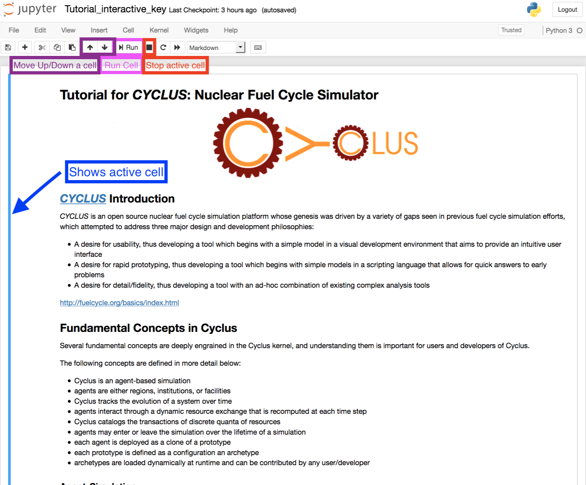

A Tour of the Cyclus User Interface with IPython Notebook
=========================================================

An IPython notebook has four main areas:

* A **Run** button that runs the cell you're in
* A **Up and Down** buttons that move the cell up or down
* A vertical blue line that shows what cell you're currently active in
* A **Stop** button that stops running the cell you're in

The Github Repository that holds this tutorial is at https://github.com/arfc/cyclus-tutorial
