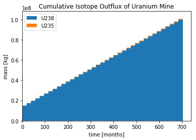

An Introduction to Data Exploration
=====================================

The ``analysis`` package provides a way to fluidly explore the
data that arises from a |cyclus| simulation. A variety of metrics, plots, and information can be
manipulated and viewed in a straightforward and interactive way to develop a thorough
understanding of the features that matter the most.

Concept: Cyclus Output file
=========================================
*CYCLUS* creates a .sqlite file as its output. SQL is a database file
type that consists of a series of tables. A few functions have been
included in ``analysis.py`` to pull information from the sqlite
database and create figures.

An sqlite database can be opened and its
contents viewed, but these database browsers often aren't helpful.
Importing the data into an external function and manipulating it would
provide more useful information. However, it can still be helpful to
open and view the tables.

.. image:: sql1.png
    :align: center

This a view of the tables within the database
(using DB browser for SQLite). However, to view the data within these
tables, switch to the Browse Data tab: And select the table of interest.
Some tables have data that may need to be manipulated or used alongside
other data in other tables, which is why using a python script is often
ideal.

.. image:: sql2.png
    :align: center

First, a cursor that points to the sqlite file is created to the output file. A cursor points to the cyclus output file you wish to use and its commonly used when running analysis functions as it 'bookmarks' the file you wish to analyze.

1. To make a cursor, use the ``analysis.cursor(output_filename)`` function where output_filename is the output filename of the cyclus output file.

.. code:: ipython3

    output_filename = 'singlereactortutorial.sqlite'
    cur = analysis.cursor(output_filename)

Activity: How much :math:`^{235}`\ U left the 1178MWe BRAIDWOOD-1?
++++++++++++++++++++++++++++++++++++++++++++++++++++++++++++++++++

Now let's see how much :math:`^{235}`\ U left the 1178MWe BRAIDWOOD-1? To find out,
lets use the ``total_isotope_traded`` function! The
``total_isotope_traded`` takes three input arguments:

* cur (cursor to *CYCLUS* output file)
* facility (facility of interest)
* flux (direction of isotope transaction)
* nucid (nuclide id)

+----------------+-----------------------------+----------------------------------+
| Variable       | Value                       | Purpose                          |
+================+=============================+==================================+
| ``cur``        | ``cur``                     | cursor to *CYCLUS* output file   |
+----------------+-----------------------------+----------------------------------+
| ``facility``   | ``'1178MWe BRAIDWOOD-1'``   | facility of interest             |
+----------------+-----------------------------+----------------------------------+
| ``flux``       | ``'out'``                   | isotope transaction direction    |
+----------------+-----------------------------+----------------------------------+
| ``nucid``      | ``922350000``               | nuclide id                       |
+----------------+-----------------------------+----------------------------------+

Using the table above, let's find out how much :math: `^{235}`\ U left the 1178MWe BRAIDWOOD-1?
1. In your IPython notebook create the variables:

* ``facility`` that is equal to ``'1178MWe BRAIDWOOD-1'``
* ``flux`` that is equal to ``'out'``
* ``nucid``  that is equal to ``922350000``

.. code:: ipython3

    facility = '1178MWe BRAIDWOOD-1' # facility of interest
    flux = 'out' # isotope transaction direction
    nucid = 922350000 # nuclide id
    print('Total amount of U235 that left the '+ str(facility) +' reactor:')
    analysis.total_isotope_traded(cur,facility,flux,nucid)

2. When ready, click the ``run`` button.

3. As you see the answer was:

.. parsed-literal::

    Total amount of U235 that left the 1178MWe BRAIDWOOD-1 reactor:

.. parsed-literal::

    107448.0

Activity: Plot the cumulative mass of the spent nuclear fuel that is taken out of the 1178MWe BRAIDWOOD-1
+++++++++++++++++++++++++++++++++++++++++++++++++++++++++++++++++++++++++++++++++++++++++++++++++++++++++
Now let's plot the cumulative mass of the spent nuclear fuel that is
taken out of the 1178MWe BRAIDWOOD-1. Again, let's use the handy
``analysis.plot_out_flux_cumulative``\ function which takes input
arguments:

* cur (cursor to *CYCLUS* output file)
* facility (facility of interest)
* title (title of plot)

+----------------+-----------------------------------------------------------+----------------------------------+
| Variable       | Value                                                     | Purpose                          |
+================+===========================================================+==================================+
| ``cur``        | ``cur``                                                   | cursor to *CYCLUS* output file   |
+----------------+-----------------------------------------------------------+----------------------------------+
| ``facility``   | ``'1178MWe BRAIDWOOD-1'``                                 | facility of interest             |
+----------------+-----------------------------------------------------------+----------------------------------+
| ``title``      | ``'Cumulative Isotope Outflux of 1178MWe BRAIDWOOD-1'``   | title of plot                    |
+----------------+-----------------------------------------------------------+----------------------------------+

Using the ``analysis.plot_out_flux_cumulative`` function with the inputs:

* cur
* facility = ``'1178MWe BRAIDWOOD-1'``
* title = ``'Cumulative Isotope Outflux of 1178MWe BRAIDWOOD-1'``

.. code:: ipython3

    facility = '1178MWe BRAIDWOOD-1'
    title = 'Cumulative Isotope Outflux of 1178MWe BRAIDWOOD-1'
    analysis.plot_out_flux_cumulative(cur, facility,title)

We receive the plot:

Activity: Examine Your First Data Exploration Session
+++++++++++++++++++++++++++++++++++++++++++++++++++++

1. Click on the "QuantityInventory" table to selecct it.
2. Right-click on the "QuantityInventory" table and select "Plot"

.. image:: plot-01-01.png
    :align: center
    :alt: A blank plot window

3. Select a "Time" as the x-axis by dragging it from the "Fields" pane and
   dropping it in X-axis entry-box.
4. Do the same for "Quantity" on the y-axis.

.. image:: plot-01-02.png
    :align: center
    :alt: A first inventory plots

This shows a plot of the total inventory in the system as a function of time.

5. Drag the "Protoype" field into the "Group by" entry to see the results
   split up by the prototype that contained that inventory.

.. image:: plot-01-03.png
    :align: center
    :alt: Inventory plots shown by protoype

7. Use the "Axis" menu at the top right of the plot to adjust the y-axis to be logarithmic.

8. Add "NucID" as an addition "Group by" field to see the total mass of each
   nuclide that was resident in each type of facility in the system as a
   function of time.

.. image:: plot-01-04.png
    :align: center
    :alt: Inventory plots shown by prototype and by nuclide.

This image is becoming somewhat busy, so we can add some filters.

9. Drop the "Prototype" field to the middle of the title bar for the plot.  A
   new control panel opens on the right to control the filters.  Select only
   the enrichment plant (EnrichPlant) and the repository (NuclearUnderground).

.. image:: plot-01-05-annotated.png
    :align: center
    :alt: Inventory plots with filters to help select data.

10. We can combine this with another filter: drop the "NucID" field in the
    title bar next to the "Prototype" filter.  Select all the facilities
    protypes only "U235" and "Pu239" to examine the inventory of fissile
    material in diferent facilities throughout the system.

.. image:: plot-01-06.png
    :align: center
    :alt: Inventory plots with filters to help select data.

11. Notice the fluctations at the beginning! Let's zoom in a little by adding
    the "Time" field as yet another filter. Notice how it appears as a slider
    bar with entries for a time window.  Use the sliders, or the text entry to
    choose a window between time steps 0 and 60 (the first 5 years).

.. image:: plot-01-07.png
    :align: center
    :alt: The first 50 years of inventory plots with filters to help select data.

Some observations:

* The enrichment plant began enriching in the first time step and was then
  able to provide enough fuel for a full core loading in the second time step.
  At that time we see the inventory of both U-235 and U-238 drop.
* The enerichment plant's inventory then oscillates as it build up enough
  material for an additional reactor to come online.  Once all reactors have
  full core loadings (100 tonnes each), the total reactor inventory reaches
  eqilibirum.
* After 1 full core loading cycle (12 time steps), the first material appears
  at the repository as spent fuel and begins accumulating.

12. Finally, remove "Time" from the x-axis and move "Protoype" from the Group
    By to the x-axis, select all the nuclides in the filter, and expand the
    time filter to include the whole simulation.  This has quickly become a
    bar chart showing the relative nuc8lide amounts in each facility type.

.. image:: plot-01-08.png
    :align: center
    :alt: A bar chart comparing nuclide concentrations.
