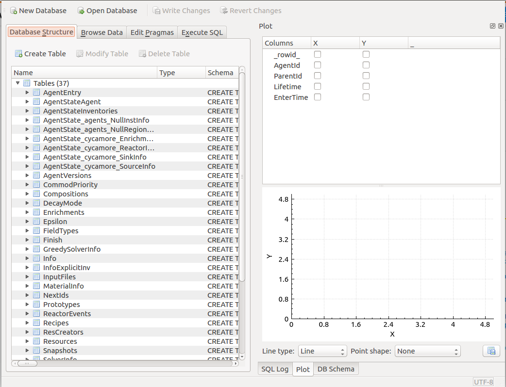
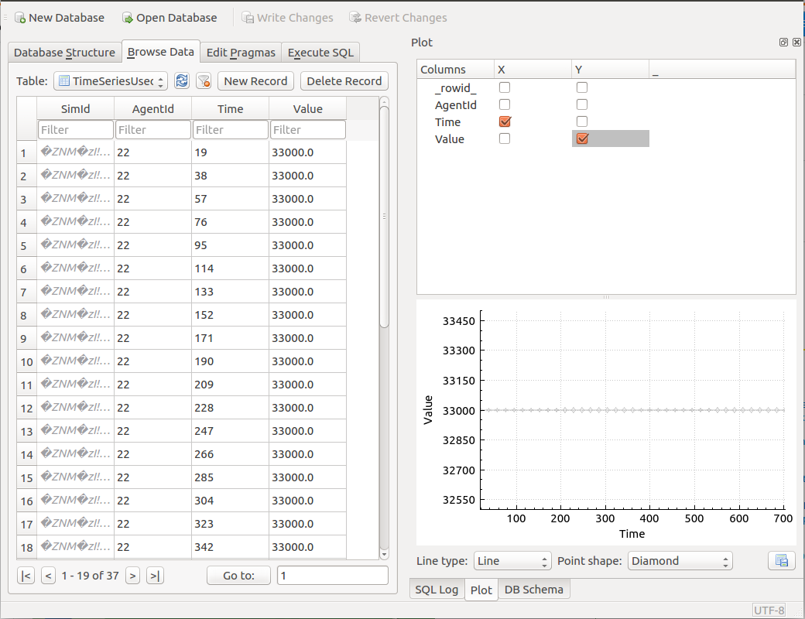
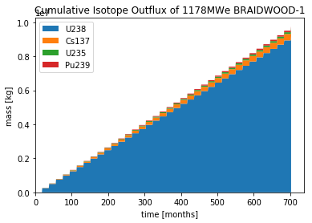
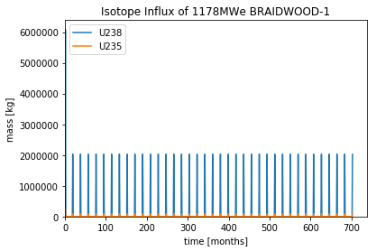
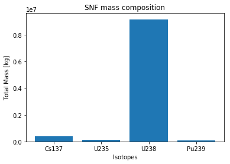

An Introduction to Data Exploration
=====================================

The ``analysis`` package provides a way to fluidly explore the
data that arises from a |cyclus| simulation. A variety of metrics, plots, and information can be
manipulated and viewed in a straightforward and interactive way to develop a thorough
understanding of the features that matter the most.

Concept: Cyclus Output file
=========================================
*CYCLUS* creates a .sqlite file as its output. SQL is a database file
type that consists of a series of tables. A few functions have been
included in ``analysis.py``, a file in downloaded github repository of this tutorial, to pull information from the sqlite
database and create figures.

An sqlite database can be opened and its
contents viewed, but these database browsers often aren't helpful.
Importing the data into an external function and manipulating it would
provide more useful information. However, it can still be helpful to
open and view the tables.

This is a view of the tables within the database
(using DB browser for SQLite). To view the data within these
tables, switch to the **Browse Data** tab and select the table of interest.
Some tables have data that may need to be manipulated or used alongside
other data in other tables, which is why using a python script is often
ideal.

First, a *cursor* that points to the sqlite file is created to the output file. A *cursor* points to the cyclus output file you wish to use and its commonly used when running analysis functions as it 'bookmarks' the file you wish to analyze.

1. To make a cursor, use the ``analysis.cursor(output_filename)`` function where output_filename is name of the cyclus output file.

.. code:: ipython3

    output_filename = 'singlereactortutorial.sqlite'
    cur = analysis.cursor(output_filename)

Activity: Track Uranium
+++++++++++++++++++++++

Now let's see how much :math:`^{235}`\ U left the 1178MWe BRAIDWOOD-1? To find out,
lets use the ``total_isotope_traded`` function! The
``total_isotope_traded`` takes three input arguments:

* cur (cursor to *CYCLUS* output file)
* facility (facility of interest)
* flux (direction of isotope transaction)
* nucid (nuclide id)

+----------------+-----------------------------+----------------------------------+
| Variable       | Value                       | Purpose                          |
+================+=============================+==================================+
| ``cur``        | ``cur``                     | cursor to *CYCLUS* output file   |
+----------------+-----------------------------+----------------------------------+
| ``facility``   | ``'1178MWe BRAIDWOOD-1'``   | facility of interest             |
+----------------+-----------------------------+----------------------------------+
| ``flux``       | ``'out'``                   | isotope transaction direction    |
+----------------+-----------------------------+----------------------------------+
| ``nucid``      | ``922350000``               | nuclide id                       |
+----------------+-----------------------------+----------------------------------+

Using the table above, let's find out how much :math:`^{235}`\ U left the 1178MWe BRAIDWOOD-1?
1. In your IPython notebook create the variables:

* ``facility`` that is equal to ``'1178MWe BRAIDWOOD-1'``
* ``flux`` that is equal to ``'out'``
* ``nucid``  that is equal to ``922350000``

.. code:: ipython3

    facility = '1178MWe BRAIDWOOD-1' # facility of interest
    flux = 'out' # isotope transaction direction
    nucid = 922350000 # nuclide id
    print('Total amount of U235 that left the '+ str(facility) +' reactor:')
    analysis.total_isotope_traded(cur,facility,flux,nucid)

2. When ready, click the ``run`` button.

3. As you see the answer is:

.. parsed-literal::

    Total amount of U235 that left the 1178MWe BRAIDWOOD-1 reactor:

.. parsed-literal::

    107448.0

Activity: Plot SNF Mass
+++++++++++++++++++++++
Now let's plot the cumulative mass of the spent nuclear fuel that is
taken out of the 1178MWe BRAIDWOOD-1. Again, let's use the handy
``analysis.plot_out_flux_cumulative``\ function which takes input
arguments:

* cur (cursor to *CYCLUS* output file)
* facility (facility of interest)
* title (title of plot)

+----------------+-----------------------------------------------------------+----------------------------------+
| Variable       | Value                                                     | Purpose                          |
+================+===========================================================+==================================+
| ``cur``        | ``cur``                                                   | cursor to *CYCLUS* output file   |
+----------------+-----------------------------------------------------------+----------------------------------+
| ``facility``   | ``'1178MWe BRAIDWOOD-1'``                                 | facility of interest             |
+----------------+-----------------------------------------------------------+----------------------------------+
| ``title``      | ``'Cumulative Isotope Outflux of 1178MWe BRAIDWOOD-1'``   | title of plot                    |
+----------------+-----------------------------------------------------------+----------------------------------+

Using the ``analysis.plot_out_flux_cumulative`` function with the inputs:

* cur
* facility = ``'1178MWe BRAIDWOOD-1'``
* title = ``'Cumulative Isotope Outflux of 1178MWe BRAIDWOOD-1'``

.. code:: ipython3

    facility = '1178MWe BRAIDWOOD-1'
    title = 'Cumulative Isotope Outflux of 1178MWe BRAIDWOOD-1'
    analysis.plot_out_flux_cumulative(cur, facility, title)

We receive the plot:

Activity: Plot Fresh Fuel Mass
++++++++++++++++++++++++++++++
   Now let's plot the cumulative mass of the fresh nuclear fuel that is
   put into the 1178MWe BRAIDWOOD-1. Again, let's use
   ``analysis.plot_in_flux`` which takes the arguments:

   * cur
   * facility = ``'1178MWe BRAIDWOOD-1'``
   * title = ``'Cumulative Isotope Influx of 1178MWe BRAIDWOOD-1'``

.. code:: ipython3

       facility = '1178MWe BRAIDWOOD-1'
       title = 'Cumulative Isotope Influx of 1178MWe BRAIDWOOD-1'
       analysis.plot_in_flux(cur, facility, title)

We receive the plot:

We can also find the total amount [kg] of an isotope that was used/sent
from a facility using the ``total_isotope_used`` function. For example,
if we wanted to find out how much :math:`^{235}`\ U and
:math:`^{238}`\ U was mined from the Uranium Mine, we can call:

.. code:: ipython3

    uranium_mined = analysis.total_isotope_used(cur, 'UraniumMine')
    print("Total amount of U-235 mined:" + ' '  + str(uranium_mined['U235']) + ' ' + 'kg')
    print("Total amount of U-238 mined:" + ' '  + str(uranium_mined['U238']) + ' ' + 'kg')

.. parsed-literal::

   Total amount of U-235 mined: 732797.080292 kg
   Total amount of U-238 mined: 102332896.35 kg

Let's say we wanted to see the composition of the spent nuclear fuel
from the reactor. We could call ``total_isotope_used`` with ``facility``
= ``'1178MWe BRAIDWOOD-1'`` to find out!

.. code:: ipython3

    facility = '1178MWe BRAIDWOOD-1' # facility of interest
    snf_comp = analysis.total_isotope_used(cur, facility)
    snf_comp
    isotopes = [item[0] for item in snf_comp.items()]
    masses = [item[1] for item in snf_comp.items()]
    plt.bar(isotopes,masses)
    plt.xlabel('Isotopes')
    plt.ylabel('Total Mass [kg]')
    plt.title('SNF mass composition')

We receive the plot:

