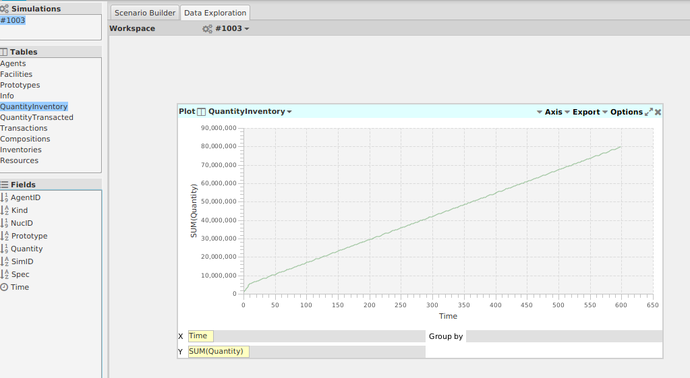
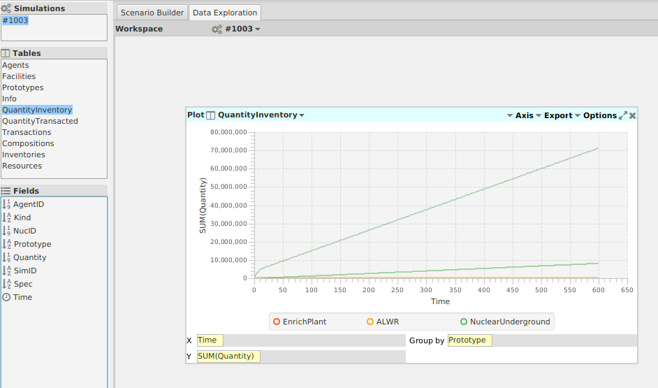
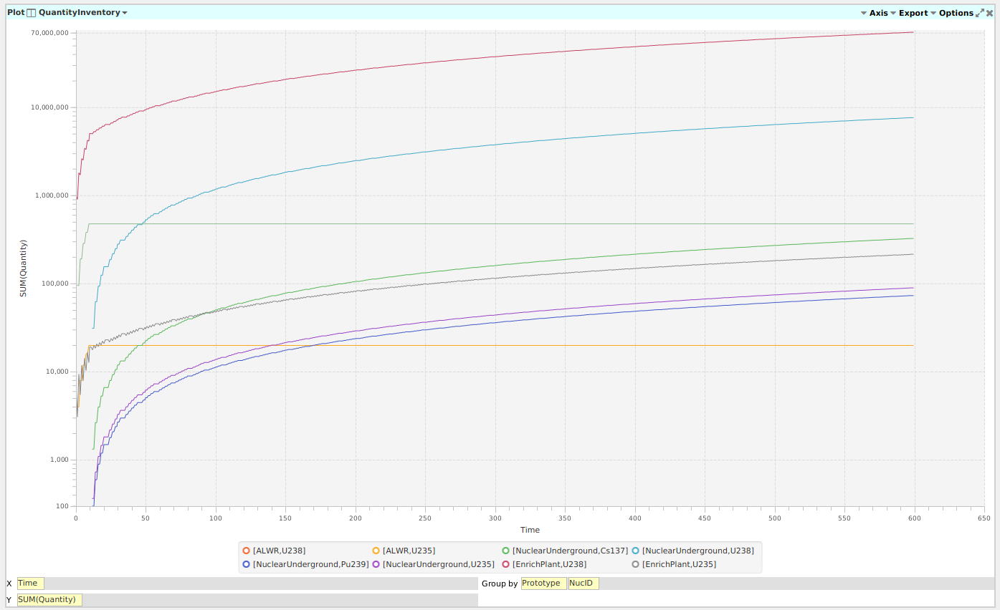
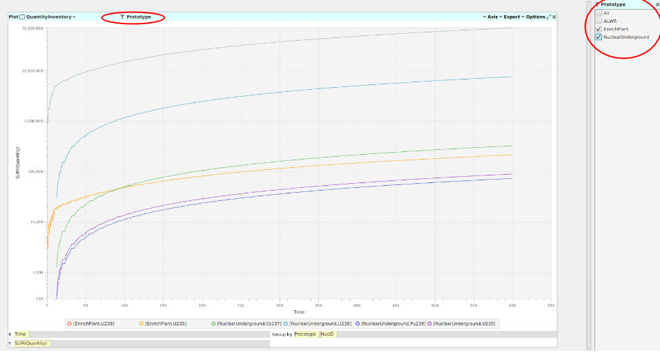
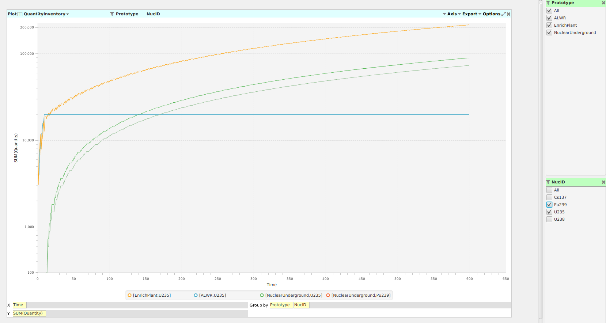
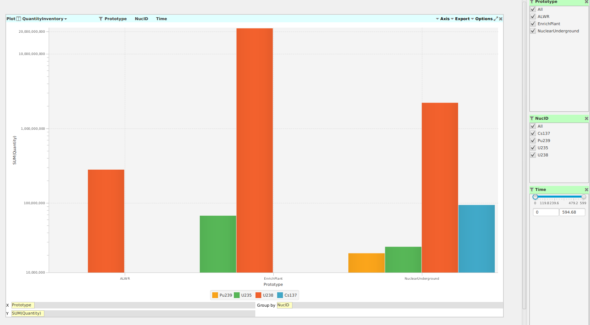

An Introduction to Data Exploration
=====================================

The "Data Exploration" tab in Cyclist provides a way to fluidly explore the
data that arises from a |cyclus| simulation. A variety of views can be
manipulated in a straightforward and interactive way to develop a thorough 
understanding of the features that matter the most.

.. image:: data-explore-annotated.png
    :align: center
    :alt: Introduction to the data exploration view.

1. Simulations: A user can load multiple simulations and easily work with
   multiple simulations, either switching between them or viewing them side-by-side.
2. Tables: This highlights the most important output tables, both those that
   are the raw outpu of |Cyclus| and some derived tables.  A user can draw
   data from these tables into the different views to create a visual story
   from the data.
3. Fields: These represent the columns of data in each table and can be used
   for a variety of roles in the views:
     * define which data will be plotted on axes
     * aggregate and group data together according to the fields
     * filter or select subsets of data
4. Filters: TBD!!

Activity: Examine Your First Data Exploration Session
+++++++++++++++++++++++++++++++++++++++++++++++++++++

1. Click on the "QuantityInventory" table to selecct it.
2. Right-click on the "QuantityInventory" table and select "Plot"

.. image:: plot-01-01.png
    :align: center
    :alt: A blank plot window

3. Select a "Time" as the x-axis by dragging it from the "Fields" pane and
   dropping it in X-axis entry-box.
4. Do the same for "Quantity" on the y-axis.

This shows a plot of the total inventory in the system as a function of time.

5. Drag the "Protoype" field into the "Group by" entry to see the results
   split up by the prototype that contained that inventory.

7. Use the "Axis" menu at the top right of the plot to adjust the y-axis to be logarithmic.

8. Add "NucID" as an addition "Group by" field to see the total mass of each
   nuclide that was resident in each type of facility in the system as a
   function of time.

This image is becoming somewhat busy, so we can add some filters.

9. Drop the "Prototype" field to the middle of the title bar for the plot.  A
   new control panel opens on the right to control the filters.  Select only
   the enrichment plant (EnrichPlant) and the repository (NuclearUnderground).

10. We can combine this with another filter: drop the "NucID" field in the
    title bar next to the "Prototype" filter.  Select all the facilities
    protypes only "U235" and "Pu239" to examine the inventory of fissile
    material in diferent facilities throughout the system.

11. Notice the fluctations at the beginning! Let's zoom in a little by adding
    the "Time" field as yet another filter. Notice how it appears as a slider
    bar with entries for a time window.  Use the sliders, or the text entry to
    choose a window between time steps 0 and 60 (the first 5 years).

.. image:: plot-01-07.png
    :align: center
    :alt: The first 50 years of inventory plots with filters to help select data.

Some observations:

* The enrichment plant began enriching in the first time step and was then
  able to provide enough fuel for a full core loading in the second time step.
  At that time we see the inventory of both U-235 and U-238 drop.
* The enerichment plant's inventory then oscillates as it build up enough
  material for an additional reactor to come online.  Once all reactors have
  full core loadings (100 tonnes each), the total reactor inventory reaches
  eqilibirum.
* After 1 full core loading cycle (12 time steps), the first material appears
  at the repository as spent fuel and begins accumulating.

12. Finally, remove "Time" from the x-axis and move "Protoype" from the Group
    By to the x-axis, select all the nuclides in the filter, and expand the
    time filter to include the whole simulation.  This has quickly become a
    bar chart showing the relative nuc8lide amounts in each facility type.

