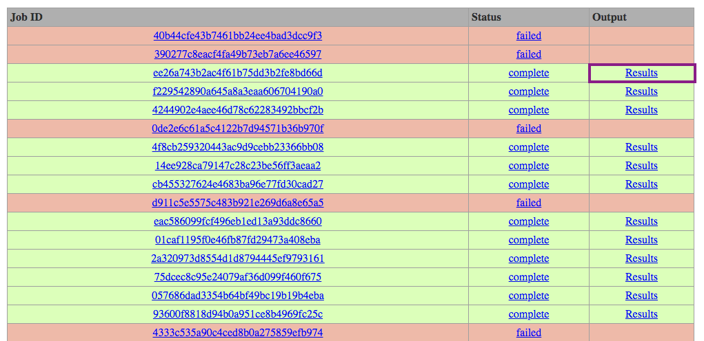

Working with Cyclus in the Cloud
=================================

Choosing Where to Run
-----------------------

The Cyclist user interface can be used to run simulations on your local
machine, if you have |Cyclus| installed, or in an appropriately configured
cloud resource.  The advantage of using a local machine is that you can
control which archetypes are available.  The advantage of using a remote
machine is that you don't have to install the entire |Cyclus| toolset on your
local machine.

For today's tutorial, a cloud resource has been made available at
cycrun.fuelcycle.org.  This is the same resources that is used to run |Cyclus|
from the |Cyclus| home page.

Activity: Execute your Scenario in the Cloud
++++++++++++++++++++++++++++++++++++++++++++

1. Find the your input file (.xml) on your computer
2. Go to the Server: http://cycrun.fuelcycle.org
3. Copy and paste the file's information into the window
4. Click the "Submit" button
5. This will launch a job and show you the "Job Id"

.. image:: cycrun.png
    :align: center
    :alt: Job status is shown when executing in the cloud

Activity: Retrieve your Results for Analysis
++++++++++++++++++++++++++++++++++++++++++++++

1. When your simulation in the cloud has finished, it will indicate in the
   Jobs pane.

2. Right-click on the job number's Output result and download the output file.

Backup: Files for Success
++++++++++++++++++++++++++

In case your run did not succeed, you can retrieve these files to continue:

* `Successful input file <http://cnergdata.engr.wisc.edu/cyclus/cyclist/tutorial/cycic-tutorial.xml>`_
* `Successful output db file <http://cnergdata.engr.wisc.edu/cyclus/cyclist/tutorial/cycic-tutorial.sqlite>`_
