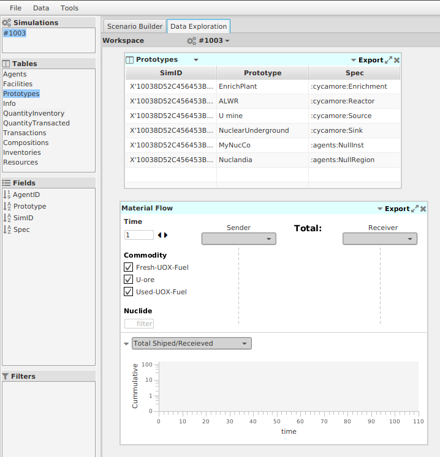
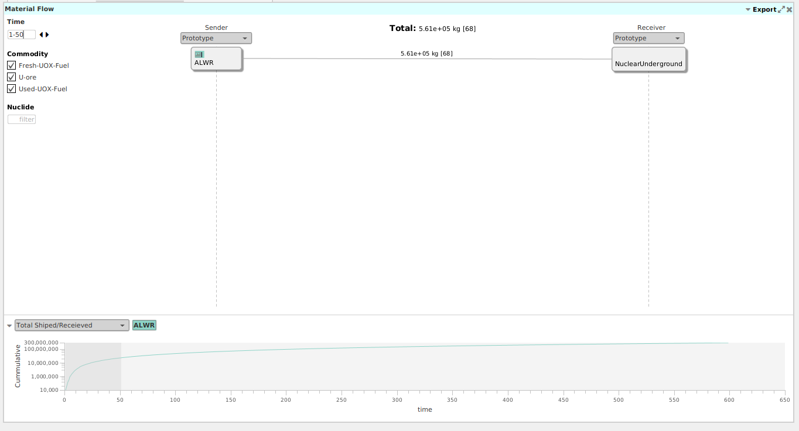
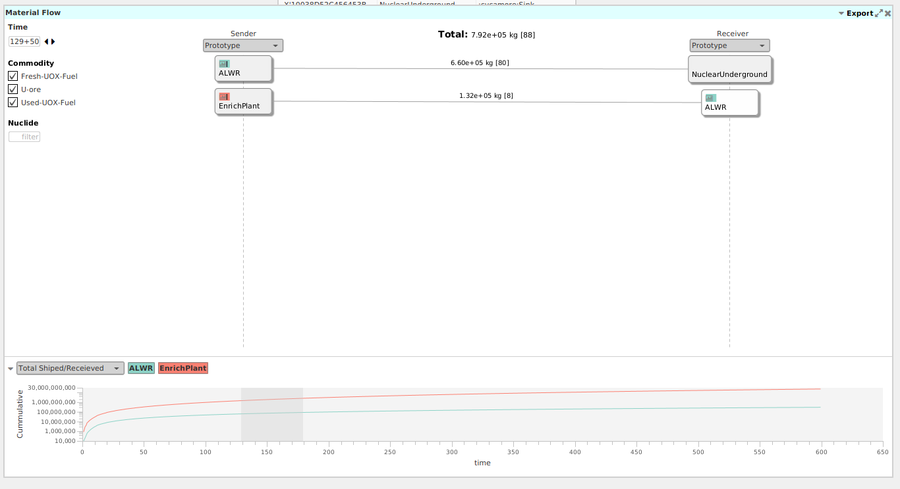
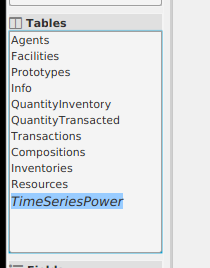

Advanced Data Exploration Topics
=================================

|Cyclus|-specific Views
-------------------------

The previous session allowed you to explore data in conventional views.  The
Flow view has been designed specifically for |Cyclus| to visualize the amount
of material flowing between pairs or collections of facilities.

1. Drag the "Prototypes" table into the workspace.
2. From the "Tools" menu, click on "Flow"

3. Select the "ALWR" prototype in the Prototypes table, and drag it to the
   Material Flow view and drop it on the vertical line under "Sender".
4. Repeat this process to drop "NuclearUnderground" on the "Receiver".
5. Change the "Time" in the Material Flow from a single time (1) step to a
   range (1-50).

.. image:: flow-01-02.png
    :align: center
    :alt: First flow in a flow view.

This shows the total amount of material that flowed from all ALWR agents to
all NuclearUnderground agents during the time from 0-50 time steps.

6. When hovering the mouse over the ALWR block, a small chart icon appears.
   Click it to see details in the strip chart below.  

7. Notice that the first 50 time steps of that strip chart are highlighted in
   gray. You can slide it to the left and right to see how the total, shown at
   the top, changes.

.. image:: flow-01-04-annotated.png
    :align: center
    :alt: Moving window in a flow view

8. You can add additional flows, e.g. by dragging the EnrichPlant to the
   Sender column.  Turn on the chart data for the EnrichPlant and compare to
   the ALWRs, noting the accumulation of depleted uranium tails at the
   enrichment plant.

Table to Loading Custom Tables
----------------------------------

Be default, Cyclist only loads the most common tables, but you are able to
load any table that is in the database.

1. Select "Datatable" from the "Data" menu.
2. Choose the database that was loaded for this session and click on "Connect:"

.. image:: timeseries-01.png
    :align: center
    :alt: Adding a new datatable

3. Scroll down to find the "TimeSeriesPower" and click "Ok".  Note that it
   adds this table to the tool bar on the left.

4. As a custom table, you need to tell Cyclist a little more about this
   data. Select the TimeSeriesPower table and right-click on the "Time" field,
   choosing IntTime.

5. Right-click on the TimeSeriesPower Table and select "Plot".

6. Drag the "Time" field to the x-axis and the "Value" field to the y-axis.

.. image:: timeseries-03.png
    :align: center
    :alt: A plot of reactor power vs time.

Here we can see the periodic refueling outages of the reactors, with each one
offline for 1 month of each year.  They are not synchronized because sthere
were delays in starting the reactors due to constraints in the acquisition of
U ore by the EnrichPlant.

7. Right-click on the "AgentID" field and select "Dimension".  Then drag this
   field first to the "Group By" box and also to become a filter at the top of
   the plot.

.. image:: timeseries-04-annotated.png
    :align: center
    :alt: Power curves for each reactor

8. Turn on & off different agents to compare their profiles.

