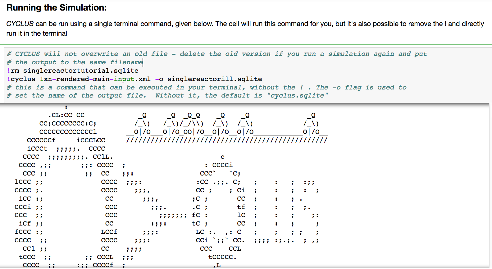

Working with Cyclus in on your machine
======================================

Choosing Where to Run
---------------------

|Cyclus| can be used to run simulations on your local
machine, if you have |Cyclus| installed, or in an appropriately configured
cloud resource.  The advantage of using a local machine is that you can
control which archetypes are available.  The advantage of using a remote
machine is that you don't have to install the entire |Cyclus| toolset on your
local machine.

For this tutorial, |Cyclus| has been installed natively so it can be
run from either the IPython notebook or in the command prompt:

.. image:: cyclus_in_IP.png
    :align: center
    :alt: Running CYCLUS in an IPython Notebook

Brief Introduction to Jupyter Notebook
--------------------------------------
A user can input the code required to run the simulation and analyze 
its output in one **Jupyter Notebook** with clear descriptions.

A tutorial on how to get Jupyter Notebook set up on your computer is available 
`here <https://jupyter.readthedocs.io/en/latest/install.html>`_ 

A Jupyter notebook has four main areas:

* A **Run** button that runs the cell you're in
* A **Up and Down** buttons that move you up or down a cell
* A vertical blue line that shows what cell you're currently in
* A **Stop** button that stops running the cell you're in

.. image:: ipython_tour.png
    :align: center
    :width: 100%
    :alt: Annotated view of an Jupyter notebook upon loading

Jupyter Notebook Scenario Execution 
--------------------------------------------
1. Go to the Jupyter notebook, making sure you are in the same folder as the input file
2. Remove any old cyclus output files by: ``!rm tutorial.sqlite``
3. Run CYCLUS by: ``!cyclus input.xml -o tutorial.sqlite``

.. image:: cyclus_in_IP.png
    :align: center
    :alt: Running CYCLUS in an IPython Notebook

Activity: Execute your Scenario in an IPython Notebook
++++++++++++++++++++++++++++++++++++++++++++++++++++++

1. Go to the IPython notebook
2. Remove any old cyclus output files by: ``!rm tutorial_singlerx.sqlite``
3. Run CYCLUS by: ``!cyclus cyclus_intro_file.xml -o tutorial_singlerx.sqlite``

Activity: Retrieve your Results for Analysis
++++++++++++++++++++++++++++++++++++++++++++

When your simulation has finished, a file of the name ``tutorial_singlerx.sqlite`` will be in your file folder. Your Jupyter 
Notebook can then be used with `Cymetric <https://fuelcycle.org/user/cymetric/index.html>` to analyze your data. Examples of 
how to use Cymetric can be found in the `GitHub <https://github.com/cyclus/cymetric/tree/examples>`.

Backup: Files for Success
+++++++++++++++++++++++++

In case your run did not succeed, you can retrieve these files to continue:

* `Successful input file <http://cnergdata.engr.wisc.edu/cyclus/cyclist/tutorial/cycic-tutorial.xml>`_
* `Successful output db file <http://cnergdata.engr.wisc.edu/cyclus/cyclist/tutorial/cycic-tutorial.sqlite>`_
