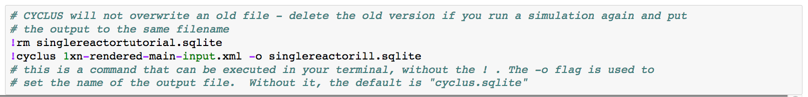
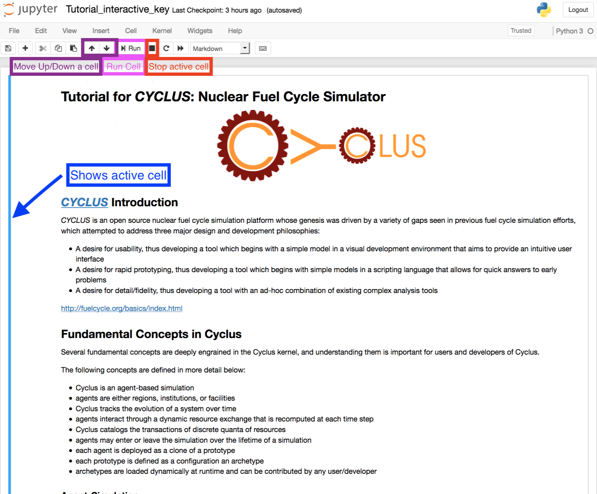

Working with |Cyclus| in on your machine
======================================

For this tutorial, |Cyclus| has been installed on your local machine so it can be
run from either the IPython notebook or in the command prompt:

Command Line Execution
----------------------
Running Cyclus from the command line requires running the command 

.. code-block:: bash 
    $ cyclus 

You can view all of the input flags for this command by running

.. code-block:: bash 
    $ cyclus -h 

Some of the common input flags include:
* ``-i arg`` to identify the input file name 
* ``-o arg`` to specify the name of the output file to write to (default is ``cyclus.sqlite``)
* ``-v arg`` to specify log verbosity fromm 0 (quiet, default) to 11 (verbose)

Brief Introduction to Jupyter Notebook
--------------------------------------
A user can input the code required to run the simulation and analyze 
its output in one **Jupyter Notebook** with clear descriptions.

A tutorial on how to get Jupyter Notebook set up on your computer is available 
`here <https://jupyter.readthedocs.io/en/latest/install.html>`_ 

A Jupyter notebook has four main areas:

* A **Run** button that runs the cell you're in
* A **Up and Down** buttons that move you up or down a cell
* A vertical blue line that shows what cell you're currently in
* A **Stop** button that stops running the cell you're in

Jupyter Notebook Scenario Execution 
--------------------------------------------
1. Go to the Jupyter notebook, making sure you are in the same folder as the input file
2. Remove any old |Cyclus| output files by: ``!rm tutorial.sqlite``
3. Run |Cyclus| by: ``!cyclus input.xml -o tutorial_singlerx.sqlite``

When your simulation has finished, a file of the name ``tutorial_singlerx.sqlite`` 
will be in your file folder. Your Jupyter Notebook can then be used with 
`Cymetric <https://fuelcycle.org/user/cymetric/index.html>`_ to analyze your 
data. Examples of how to use Cymetric can be found in the `GitHub 
<https://github.com/cyclus/cymetric/tree/main/examples>`_.

Backup: Files for Success
+++++++++++++++++++++++++

If your run did not succeed, you can retrieve correct input and output files `here 
<https://doi.org/10.5281/zenodo.4557613>`_ under ``input_oncethrough.xml`` 
or ``ouput_oncethrough.sqlite``. This link contains input and 
output files for each of the examples in this tutorial.
