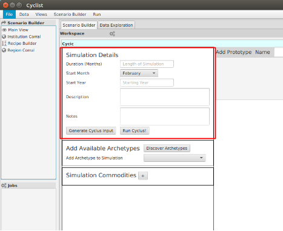

Starting a New Scenario
============================

Problem Definition
--------------------

We will start with a new scenario representing a simplified once-through fuel
cycle.  For the purpose of this tutorial, the scenario will include:

* mine of natural uranium
* enrichment facility producing 4% enriched uranium oxide fuel
* LWR reactor consuming fresh fuel and producing used fuel
* repository to house all spent fuel

More details about each of these facilities will discussed when we are
required to provide that input.

Activity: Open the Main View
++++++++++++++++++++++++++++++

To begin a new scenario:

1. Select the **Scenario Builder** tab in the *workspace*.
2. Drag the **Main View** *tool* and drop it into the *workspace*.

This view has the following sections:

1. Simulation details
2. Archetype discovery
3. Commodity List
4. Archetype ribbon
5. Fuel cycle design pane

Concept: Simulation Time Steps
--------------------------------

|Cyclus| uses a time-step approach to march through time and determine what
actions are taken by each agent at each point in time.  Each time step
includes the following phases:

* new agents may enter the system (deployment)
* each agent prepares for exchange of material
* agents engage in material trades
* each agent acts after the exchange of material
* agents may leave the system (decommissioning)

Users do not have to manage these phases, but must provide the following
information for all simulations:

1. Duration: the number of months to be simulated
2. Start Month: the first month of the simulation
3. Start Year: the first year of the simulation
4. Decay treatment: Turn off all decay ("never") or allow individual archetypes to implement it
5. Simulation Handle: An optional unique identifier for this particular simulation.
6. Description: A brief discription for your benefit.

We'll return later to the topics of generating, loading and executing an input file.

Activity: Set Simulation Parameters
++++++++++++++++++++++++++++++++++++

The top level simulation parameters are shown in the **Simulation Details** pane (see below).

Enter the following data:

1. Duration: 600
2. First Month: June
3. First Year: 2015
4. Decay: Never
5. Simulation Handle: leave blank for default simulation handle
6. Description: ANS 2015 Tutorial

.. image:: sim_detail.png
    :align: center
    :alt: Annotated view of the Cycic Main View

